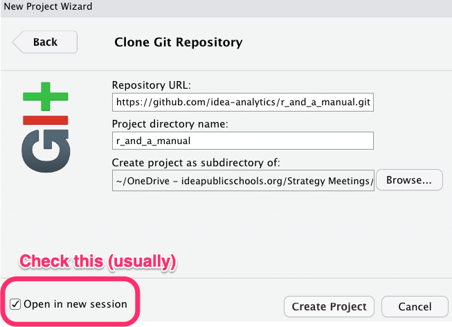

# Projects

Some *significant* applications are demonstrated in this chapter.

## Version control with Github {#section-github}

All analysis projects need to be saved via Git (on your local computer) and pushed to Github. Doing so has several benefits to both you, to your future self, and to your teammates:

-   Since Git is a version control system, you get to save and track changes in your work (data, source code, reports, PowerPoint decks, Shiny dashboards) incrementally.
-   Incremental saving means you can recover from any accidental plunders. It's like Track Changes in Word, but for multiple files and folders. Spill a Diet Coke on your laptop in the middle of a big analysis? No big deal (if you've been pushing commits to Github, it'll all be there!)
-   Collaboration is much more structured, with powerful tools for asynchronous work and managing versions.
-   Referencing and reviewing code, tracking issues, and sharing what you've done is seamless, which means ...
-   Your work will be reproducible: anyone from R&A can pull your repo from Github, run your analyses, add to or edit what you've done, and share those changes back in a way that is communicative and documented.
-   setting up web documentation for any R packages you build become seamless.

But enough on the **why** let's get to **how** (if you do want to know more on the why, [check out this excellent article by Jenny Bryan](https://doi.org/10.7287/peerj.preprints.3159v2))

### Getting Started with Git, Github, and RStudio

Here's a quick overview of what you'll need to do, with details to follow:

-   Dedicate a directory (a.k.a "folder") to it.

-   Make it an RStudio Project.

-   Make it a Git repository.

-   Go about your usual business. But instead of only saving individual files, periodically you make a commit, which takes a multi-file snapshot of the entire project.

-   Push commits to GitHub periodically.

    -   This is like sharing a document with colleagues on OneDrive or DropBox or sending it out as an email attachment.

#### First steps {#first-steps}

**These steps are borrowed with some light editing from [Happy git with R](https://happygitwithr.com/) by Jenny Bryan.**

1.  [Register for GitHub account.](https://happygitwithr.com/github-acct.html#github-acct)
2.  [Install or update R and RStudio](https://happygitwithr.com/install-r-rstudio.html#install-r-rstudio)
3.  [Install Git](https://happygitwithr.com/install-git.html#install-git)
4.  Those on Windows will want [to do these steps as well](https://happygitwithr.com/shell.html#windows-shell-hell)
5.  [Introduce yourself to Git.](https://happygitwithr.com/hello-git.html#hello-git)
6.  [Prove local Git can talk to GitHub.](https://happygitwithr.com/push-pull-github.html#push-pull-github)
7.  [Cache your username and password](https://happygitwithr.com/credential-caching.html#credential-caching) so you don't need to authenticate yourself to GitHub interactively *ad nauseum*.
8.  Create and save a [GitHub Personal Access Token (PAT)](https://happygitwithr.com/credential-caching.html#credential-caching).
9.  [Prove RStudio can find local Git and, therefore, can talk to GitHub](https://happygitwithr.com/rstudio-git-github.html#rstudio-git-github).

### Feature Branch Worklow

There are [many workflows using Git and remote repositories like Github](https://www.atlassian.com/git/tutorials/comparing-workflows). All of thenm boil down to the following steps:

1.  Pull or fetch or clone a repo on Github to your local machine. If you are starting a new project, then you'll need to create a new repo on Github (but you can also start one on your machine). **This is usually called the main (formerly master) branch.**
2.  Create a new branch that you will work on.\
3.  Do some analysis, coding, writing.
4.  Periodically save a snapshot of your entire project (all the files and folders, except those that you explicitly ignore). This is called \*committing changes\*\*.
5.  Every once ins while **push your commits** to the remote repo. Congrats! You've just backed up your remotely and made it easy to share.
6.  **Merge** your new analysis and code back into the main branch. This is usually initiated by something called a *pull request* (which is admittedly a little confusing).

The specific workflow we use on IDEA's R&A team is the [Feature Branch workflow](https://www.atlassian.com/git/tutorials/comparing-workflows/feature-branch-workflow), which has the benefit of being both simple, while minimizing merge conflicts. The core idea behind the Feature Branch Workflow is that all feature development should take place in a dedicated branch instead of the main branch. This encapsulation makes it easy for multiple analysts to work on a particular analysis without disturbing the main codebase. It also means the main branch will never contain broken code. Moreover, it means you'll be more likely to get a second or third set of eyes on our analysis. This makes your work more transparent, helps enforce coding standards, and helps spread all the cool new techniques you've implemented in your analysis.

So what does this look like? Well, here's a picture of the feature branch workflow in use for this manual:

[](https://github.com/idea-analytics/r_and_a_manual/network)

This picture shows the development of this manual over time (from left to right) [as rendered by Github's network diagram](https://github.com/idea-analytics/r_and_a_manual/network): it includes new branches being created, commits being made and merges back into the main branch. The black line is the main branch and includes the most up-to-date, "official" version of this book. The green and blue lines are feature branches, which diverge from the main when you checkout a new branch. The dots represent commits. Colored lines returning to the main branch indicate a merge: the new code is now part of of the main branch. You might be wondering what the unmerged yellow line labeld `gh-page` represents. That is a special branch that is used by [Githbub Actions](https://github.blog/2019-08-08-github-actions-now-supports-ci-cd/) that uses the concept of continuous integration/continuous to build the website that hosts this manual. You don't need to worry about that one; it's simply used to build out the site magically.

### Example worflow with this manual, or getting your feet wet

This section is going to walk you through how to use git/github by updating this manual. You'll (i) clone the Github repo locally on your laptop, (ii) create a feature branch, (iii) make some changes to this documentation, save those changes, and then commit those changes git (i.e., locally take a snapshot), (iv) push those changes (including all of your commits) up to the Github repo, (v) initiate a pull request (i.e., ask to merge your branch into the main branch), and finally (vi) merge your changes into the master branch.

But first things first:

1.  Verify you did [the initial set-up steps above](#first-steps)
2.  Get your bio ready

\*\*Note that throughout the steps below I'll show you how to each step Ok. Your ready? Great! Here we go.

#### Get the [R_and_A\_Manual](https://github.com/idea-analytics/r_and_a_manual/) repository URL

1.  Go to [R_and_A\_Manual](https://github.com/idea-analytics/r_and_a_manual/) repo in your browser.

2.  On the main page for the repo click the green *Code* button, Click on HTTPS (the default), and click the clipboard to copy the repo's URL:

    

#### Clone the repo {.tabset}

Now you'll pull the remote repo from Github onto you computer. You'll want to think about where you want to save this. For example I save data analysis projects in seperate folders under a `Data_Analysis/` folder. I save the manual just on my one drive.

##### Comand line

Here I'm saving this to temporary space, by navigating to `~/tmp/~` and then cloning the data:

```{bash cloning, eval=FALSE}
cd ~/tmp/
git clone https://github.com/idea-analytics/r_and_a_manual.git
```

This will pull down all the content of the repo: files, folders, all commits, all branches. Really the whole kit and kaboodle.

##### RStudio

Here's how you do it from RStudio:

1.  In RStudio, start a new Project: **File \> New Project \> Version Control \> Git**, or click on project icon in the upper right-hand corner of the IDE and select **New Project...**. 
2.  In the "repository URL" paste the URL of your new GitHub repository. That is: <https://github.com/idea-analytics/r_and_a_manual.git>
3.  Be intentional about where you create this project.
4.  You should click "Open in new session". 
5.  Click **Create Project** to create a new directory, which will be all of these things:

-   a directory or "folder" on your computer
-   a Git repository, linked to the remote GitHub repository
-   an RStudio Project

Cool. You should now have the R&A Manual files on repo history on your computer!

#### Checkout a branch

*Before you start doing anything* you should check out a branch. A branch is like your own, tempory, disposable workspace. When you checkout a branch you create a new copy of the the repo and changes you make only happen on the branch. When your happy with the changes and are ready to share them you'll to a pull request. But we'll get to that below.

##### Command line

It's pretty straightforward. You create the branch, by giving a short but meaningful name, and then check it out.

```{bash branch, eval=FALSE}
git branch update-bio-cjh
git checkout update-bio-cjh
```

Or you can do both of those moves in one line by using `git checkout` with the `-b` flag:

```{bash branch_one_line, eval=FALSE}
git checkout -b update-bio-cjh
```

##### RStudio

1.  Click on the *Git* panel (usually in the upper right on that standard RStudio layout, but YMMV if you've customized your layouts).
2.  Click on the purple "branch" icon (it kinda looks like a piece of a flowchart). 
3.  Giving a short but meaningful name (something like, `update-bio-cjh`). Make sure the **Sync branch with remote** checkbox is selected; this will save you a step later when you push you changes up to the repo.

#### Making changes and saving them

You now on a new branch and go go makes some changes. Go ahead and open `02-Who_We_Are.Rmd` file and add your name as a section, update your bio and save it, as you usually would

Now you'll want to commit those changes, which takes a snapshot of the current state on the branch you are working on.

#### Command line

after saving you'll run the `git commit` command with the `-a` (adds all changes) and `-m` (add commit message) flag with a short description of what you did.

```{bash commit, eval=FALSE}
git commit -a -m "Updated Chris's bio"
```

You should do this often. After a while you'll want to push your changes up to Github (frequently, but not as often as commits):

```{bash push, eval = FALSE}
git push
```

You've likely not yet defined where this remote branch should go, but git will give you a helpful error which gives you the command for syncing your local branch with a new remote branch.:

```{bash, eval=FALSE}
fatal: The current branch update-bio-cjh has no upstream branch.
To push the current branch and set the remote as upstream, use

    git push --set-upstream origin update-bio-cjh
```

Go ahead and copy and run that command.

```{bash, eval=FALSE}
git push --set-upstream origin update-bio-cjh
```

After that you can just use `git push` and you'll branch changes will be saved remotely.

#### RStudio

1.  In your git panel you see changed (or new) files show up. You'll want to select the check box for any file that's been modified (indicated by an M) or that needs to be added (indicated by an A). Doing so readies the file to be updated in the commit: 
2.  Click the commit button and new dialog box will open, which will show any changes you've made in an y file. Select the check box for staged, if isn't already selected, add a commit message and click **Commit** 
3.  When your ready to save those to the repo, simply press the *Push* button.

#### Merging changes.

Merging changes in your feature branch with the main branch requires you go to Github and to a *pull request*. A pull request is essential asking the main branch to "pull" in your changes and is technically known as a merge.. So here are the steps.

1.  Go to the repo (<https://github.com/idea-analytics/r_and_a_manual>).\
2.  You may see an info box suggesting you can merge your branch. If so, click on the **Compare & pull request** button. If not select your branch and click the Pull Request icon.
3.  If you are able to merge (you'll know) click the **Create pull request** button.
4.  Ask someone to review you request (ideally)
5.  Click the **Merge pull request button** and confirm the merge.
6.  If you are done with our feature branch feel free to delete it.

You done!

::: {.gotcha}
You'll want to be careful here if you are working with others. If you pulled your main branch down a while ago there is a risk that the main branch on your laptop is not up-to-date with the main branch on Github (because others have merged changes there).

The best remedy is to checkout and pull main---which gets up to date---and then checkout your branch and run `git merge main`. You may have to resolve conflicts.
:::

## Project Process

Lorem ipsum dolor sit amet, in, et sed facilisi maximus suspendisse, facilisi in. Finibus in posuere risus, luctus, elit lacus in, rhoncus, ante mollis. In, eu in est curabitur. Sit ante lectus ante curabitur. Ac quis neque amet vel. Sed libero ut sed nisl non donec augue in molestie ut id sed aptent primis. Ligula dui tortor hac tempus cubilia, sapien morbi duis sed. Molestie ac faucibus ultrices. Scelerisque non ut sapien, proin sit odio duis ut aliquam suscipit in duis platea. Phasellus tellus volutpat sed vitae augue a. Ac sit, sociis eget vel sociis. Mus sit in sit erat, turpis, consequat. Mauris, ligula lobortis ac arcu, in magna, nibh pharetra phasellus nascetur. Ligula odio sapien ac eu laoreet rhoncus non netus. Tellus, sagittis dictum lacus vitae tristique.

### Onboarding via Wrike

Lorem ipsum dolor sit amet, in, et sed facilisi maximus suspendisse, facilisi in. Finibus in posuere risus, luctus, elit lacus in, rhoncus, ante mollis. In, eu in est curabitur. Sit ante lectus ante curabitur. Ac quis neque amet vel. Sed libero ut sed nisl non donec augue in molestie ut id sed aptent primis. Ligula dui tortor hac tempus cubilia, sapien morbi duis sed. Molestie ac faucibus ultrices. Scelerisque non ut sapien, proin sit odio duis ut aliquam suscipit in duis platea. Phasellus tellus volutpat sed vitae augue a. Ac sit, sociis eget vel sociis. Mus sit in sit erat, turpis, consequat. Mauris, ligula lobortis ac arcu, in magna, nibh pharetra phasellus nascetur. Ligula odio sapien ac eu laoreet rhoncus non netus. Tellus, sagittis dictum lacus vitae tristique.

## ProjectTemplate (for analyses) {#section-ProjectTemplate}

[ProjectTempalate](http://projecttemplate.net/) is both an R package and an approach. Simply put, it's a package that builds the scaffolding for a project, provides good features for tracking package dependencies (though we also use `renv` for that), and separating data loading and prep from analysis and output, as well as caching of long running processes, which speeds up analytical time.

Is it perfect? No. It has more features than we'll likely ever use (logging, code profiling, and unit testing).

::: {.tip}
IF you are new to ProjectTemplate the [Getting Started Tutorial is great](http://projecttemplate.net/getting_started.html). Indeed, it's always good to [read the docs](https://tyk.io/wp-content/webp-express/webp-images/uploads/2017/06/documentation_matrix.jpg.webp)
:::

Seriously, though. The [ProjectTemplate documentation](http://projecttemplate.net/) is great and you should really set aside an hour to read through it. This manual will provide a very abbreviated overview of how to use ProjectTemplate at IDEA, but will not be a stand in for the official documentation.

### Installing ProjectTemplate

Installing the package is straightforward

```{r install_pt, eval=FALSE}
install.packages("ProjectTemplate")
```

### Creating a project with ProjectTemplate

Creating a project is pretty simple. Navigate to where you typically save projects vai RStudio and then run the following commands

```{r create-poject, eval=FALSE}
library(ProjectTemplate)
create.project("learning-pt")
```

Doing that bestows upon you the following directory structure:


::: {.gotcha}
You'll notice in the image above that there is `.Rproj` file, which isn't added by ProjectTemplate. I created an Project in RStudio first and then navigated to that direction and ran the following

`create.project("../learning-pt/", merge.strategy = "allow.non.conflict")`,

which allows you to scaffold ProjectTemplate in an existing directory while ignoring any existing files and folders (usually \*.Rproj and .git).
:::

### What goes where

We only use about half of the directories that ProjectTemplate Scaffolds. Here's what we use ,in the order it's evaluated by ProjectTemplate when you run `load.project()`:

**config** This directory contains the configuration file `global.dcf`. This is the first thing that `load.project()` looks at. The [fill list of what each setting does is here](http://projecttemplate.net/configuring.html). Here are a few highlights, in thier order of importance.

-   `load_libraries`: This can be set to 'on' or 'off'. If `load_libraries` is on, the system will load all of the R packages listed in the libraries field described below. By default, `load_libraries` is off. *I highly recommend that you turn this on*
-   'libraries': This is a comma separated list of all the R packages that the user wants to automatically load when `load.project()` is called. These packages must already be installed before calling `load.project()`. By default, the reshape2, plyr, tidyverse, stringr and lubridate packages are included in this list. *I recommend dropping these and only adding packages you are using for the project*.
-   `data_loading`: This can be set to 'on' or 'off'. If data_loading is on, the system will load data from both the cache and data directories with cache taking precedence in the case of name conflict. By default, `data_loading` is on.
-   `cache_loading`: This can be set to 'on' or 'off'. If `cache_loading` is on, the system will load data from the cache directory before any attempt to load from the data directory. By default, `cache_loading` is on.
-   `munging`: This can be set to 'on' or 'off'. If `munging` is on, the system will execute the files in the `munge` directory sequentially using the order implied by the `sort()` function. If `munging` is off, none of the files in the `munge` directory will be executed. By default, `munging` is on.
-   `as_factors`: This can be set to 'on' or 'off'. If `as_factors` is on, the system will convert every character vector into a factor when creating data frames; most importantly, this automatic conversion occurs when reading in data automatically. If 'off', character vectors will remain character vectors. By default, `as_factors` is off. \*This is a very good default, and the opposite of base R.

**lib**: this directory is used to house helper functions. You can store them in an `*.R` file (like the included `helpers.R` file). \*\* As a general rule of thumb, if you've copied-and-pasted a block of code twice, don't do it a third time; rather, abstract that block into a function and save it in this directory. `load.project` sources the files in this directory after readying `global.dcf`.

**cache**: Here you'll store any data sets that (i) are generated during a preprocessing step and (ii) don't need to be regenerated every single time you analyze your data. You can use the `cache()` function to store data to this directory automatically. Any data set found in both the cache and data directories will be drawn from cache instead of data based on ProjectTemplate's priority rules. ProjectTemplate always checks this before running code in the `data/` and `munge/`. directories. You can [learn more about caching here](http://projecttemplate.net/caching.html).

**data**: You store your raw data files here. If they are encoded [in a supported file format](http://projecttemplate.net/file_formats.html), they'll automatically be loaded when you call `load.project()`, \*unless cached versions of their output exist in the `cache/` directory.

**munge**: Here you can store any preprocessing or "data munging" code for your project. For example, if you need to add columns at runtime, merge normalized data set,s or globally censor any data points, that code should be stored in the `munge` directory. The preprocessing scripts stored in `munge` will be executed in alphabetical order when you call `load.project()`, *so you should prepend numbers (to digit like `01-aggregate_schools`, `02-calc-means`, ...) to the filenames to indicate their sequential order.*. Files in here are run after those in `cache/` and `data/` are loaded.

**reports**: Here you can store any output reports, especially RMarkdown reports, that you produce. This is where final reports live

::: {.gotcha}
ProjectTemplate doesn't always play well with RMarkdown (well, really the issue is with `knitr`. The biggest issue is running `load.project()` inside of RMarkdown. ProjectTemplate will complain that your `reports/` directory is not a ProjectTemplate directory, which is annoying. It's easily fixed with this line of code at the top of your RMarkdown and you are in Rproject:

`setwd(here::here()); load.project()`

This will change the working directory to the top of project and then run `load.project`. After the project is loaded `knitr` will set the working directory back to `reports/`, so all other file references should be relative to `reports/`
:::

**src**: Here you'll store your statistical analysis and mahcine scripts. You should add the following piece of code to the start of each analysis script: `library('ProjectTemplate); load.project()` (you don't need the tip above here). You should also do your best to ensure that any code that's shared between the analyses in src is moved into the munge directory; if you do that, you can execute all of the analyses in the src directory in parallel. A future release of ProjectTemplate will provide tools to automatically execute every individual analysis from src in parallel. You may want to `cache()` your results here as well.

**graphs**: Here you can store any graphs or PowerPoints that you produce, with the exception of those already contained in RMarkdown files.

## The `renv` package: Ensuring reproducibility

The [`renv` package](https://rstudio.github.io/renv/) goes a long way to solving a pernicious problem: Dependency Hell. Here's a good description of the problem:

[{width="447"}](https://arxiv.org/pdf/1410.0846.pdf)

This problem most manifest when you revisit a recurring project a year later. You updated some year variables in your code and rerun your code and ready to pat yourself on the back and then BAM! Your code breaks. It breaks because over the previous 12 months the packages you relied upon a year ago have been updated over time and don't work with other packages. Sometimes all you need to to is update all of your packages and everything is hunky-dory; but other times this brute force process doesn't work. You are left trying to understand whats changed over multiple packages, what your need to change in your code and something you thought would take you an hour takes a a week, with most days feeling like your just banging your heard against the wall.

This issues alone should be enough to convince you that your need to create **re**producible **env**ironments.

Another reason is related and often very immediate: working on the same analysis with someone else. Perhaps you are are fastidious and only use the most current version of every package and your partner is risk averse and only updates packages after they've been out in the wild for at least a year. If you are in this boat your going to have problems.

Again, you need to create **re**producible **env**ironments.

This is a common technique in Python and there it goes by the name of virtual environments. `renv` is an R implementation of the concept that is pretty elegant Along with [ProjectTemplate](#section-ProjectTemplate) we use the [`renv` package](https://rstudio.github.io/renv/) to ensure that our analysis projects are:

1.  **Isolated**: Each project gets its own library of R packages, so you can feel free to upgrade and change package versions in one project without worrying about breaking your other projects.

2.  **Portable**: Because `renv` captures the state of your R packages within a `lockfile`, you can more easily share and collaborate on projects with others, and ensure that everyone is working from a common base.

3.  **Reproducible**: Use `renv::snapshot()` to save the state of your R library to the lockfile `renv.lock`. You can later use `renv::restore()` to restore your R library exactly as specified in the lockfile.

These three points are crucial for working well with others and protection your future self.

::: {.tip}
As usual, you really should [read the docs for `renv`](https://rstudio.github.io/renv/articles/renv.html). They are thorough and clear.

There's also an excellent [FAQ](https://rstudio.github.io/renv/articles/faq.html)
:::

### Setting up `renv` with a new project

If you are starting a new project in RStudio then setting up `renv` is easy: just be sure to click the Use renv with this project.

{width="447"}

Checking that box will add the bootstrap `renv`, installing the package if necessary as well as a few folders and files that serve as infrastructure

### Setting up `renv` with an existing project

If you've got a project that you want to starting using `renv` it's pretty straightforward:.

1.  Install `renv` if you don't have it: `install.packages('renv')`
2.  Use `renv::init()` to initialize a project. `renv` will discover the R packages used in your project, and install those packages into a private project library.

It's really that simple!

### Using `renv`

The `renv` workflow is super, duper simple, after you've set it up:

1.  Work in your project as usual, installing and upgrading R packages as required as your project evolves.
2.  Use `renv::snapshot()` to save the state of your project library. The project state will be serialized into a file called `renv.lock`.
3.  If you want to revert to the previous state of your project---i.e., you installed a new version of a package and it's wreaking havoc on your project---simply use `renv::restore()`.

::: {.hat}
Following these simple steps isolates your projects environment from the rest of your other projects. So downloading a bleeding-edge, dev version of package from GitHub b/c you need a new feature won't pollute your other projects that are running just fine. This is the isolation bit mentioned in the three points above
:::

### Collaborating with `renv`

The `renv` developers recommend the following steps when using `renv` in collaborative settings

1.  Use a [git](https://git-scm.com/)/[GitHub](https://github.com/) repo.

2.  One user should explicitly initialize `renv` in the project, via [`renv::init()`](https://rstudio.github.io/renv/reference/init.html) or when starting an RStudio project. Doing so will create the initial `renv` lockfile, and also write the `renv` auto-loaders to the project's `.Rprofile` and `renv/activate.R`. These will ensure the right version of `renv` is downloaded and installed for your collaborators when they start in this project.

3.  Share your project sources, alongside the generated lockfile `renv.lock` via GitHub. Be sure to also share the generated auto-loaders in `.Rprofile` and `renv/activate.R` via the repo.

4.  When a collaborator first launches in this project, `renv` should automatically bootstrap itself, thereby downloading and installing the appropriate version of `renv` into the project library. After this has completed, they can then use [`renv::restore()`](https://rstudio.github.io/renv/reference/restore.html) to restore the project library locally on their machine.

::: {.gotcha}
While working on a project, you or your collaborators may need to update or install new packages in your project. **When this occurs, you'll also want to ensure your collaborators are then using the same newly-installed packages.** In general, the process looks like this:

1.  A user installs, or updates, one or more packages in their local project library;

2.  That user calls [`renv::snapshot()`](https://rstudio.github.io/renv/reference/snapshot.html) to update the `renv.lock` lockfile;

3.  That user then shares the updated version of `renv.lock` with their collaborators via github;

4.  Other collaborators then---after a git pull---call [`renv::restore()`](https://rstudio.github.io/renv/reference/restore.html) to install the packages specified in the newly-updated lockfile.

**A bit of care is required** if collaborators wish to update the shared `renv.lock` lockfile concurrently -- in particular, if multiple collaborators are installing new packages and updating their own local copy of the lockfile, then conflicts would need to be sorted out afterwards.

Use teams to ensure any changes to `renv.lock` are communicated so that everyone knows and understands when and why packages have been installed or updated.
:::

For more information on collaboration strategies, please visit [environments.rstudio.com](https://environments.rstudio.com/).

### `renv` and RStudio Connect

In short there should be no issues, but there is one important thing to always keep in mind when publishing to RStudio connect:

::: {.gotcha}
The `renv` generated `.Rprofile` file should **not** be included in deployments to RStudio Connect.
:::

You can read more [here about `renv` and publishing to RStudio Connect](https://rstudio.github.io/renv/articles/rsconnect.html)
