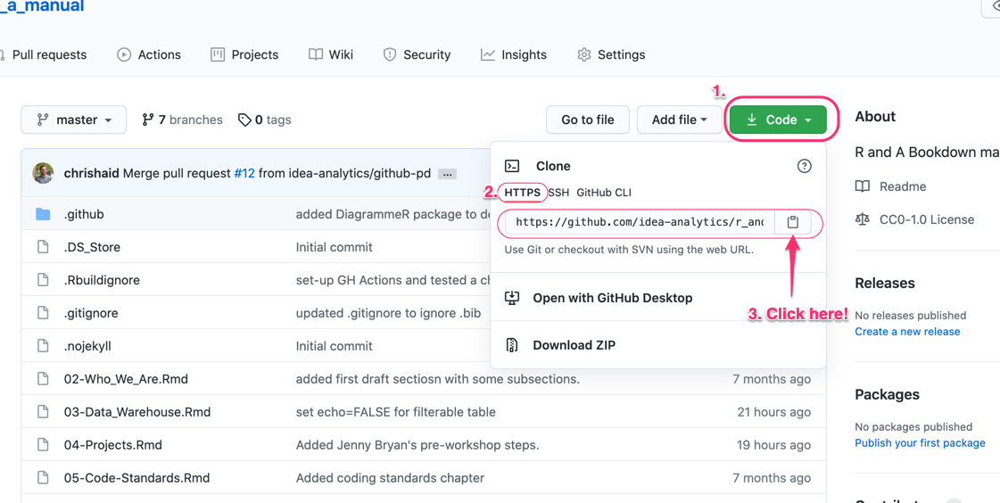
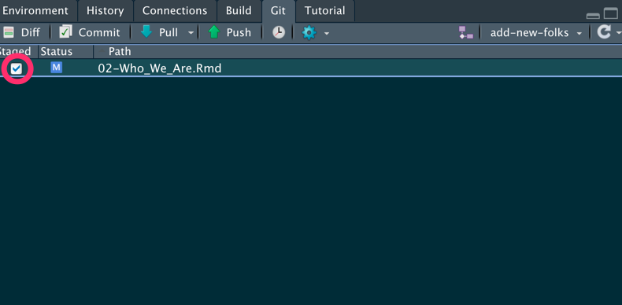

# Projects

Some *significant* applications are demonstrated in this chapter.

## Version control with Github

All analysis projects need to be saved via Git (on your local computer) and pushed to Github. Doing so has several benefits to both you, to your future self, and to your teammates:

-   Since Git is a version control system, you get to save and track changes in your work (data, source code, reports, PowerPoint decks, Shiny dashboards) incrementally.
-   Incremental saving means you can recover from any accidental plunders. It's like Track Changes in Word, but for multiple files and folders. Spill a Diet Coke on your laptop in the middle of a big analysis? No big deal (if you've been pushing commits to Github, it'll all be there!)
-   Collaboration is much more structured, with powerful tools for asynchronous work and managing versions.
-   Referencing and reviewing code, tracking issues, and sharing what you've done is seamless, which means ...
-   Your work will be reproducible: anyone from R&A can pull your repo from Github, run your analyses, add to or edit what you've done, and share those changes back in a way that is communicative and documented.
-   setting up web documentation for any R packages you build become seamless.

But enough on the **why** let's get to **how** (if you do want to know more on the why, [check out this excellent article by Jenny Bryan](https://doi.org/10.7287/peerj.preprints.3159v2))

### Getting Started with Git, Github, and RStudio

Here's a quick overview of what you'll need to do, with details to follow:

-   Dedicate a directory (a.k.a "folder") to it.

-   Make it an RStudio Project.

-   Make it a Git repository.

-   Go about your usual business. But instead of only saving individual files, periodically you make a commit, which takes a multi-file snapshot of the entire project.

-   Push commits to GitHub periodically.

    -   This is like sharing a document with colleagues on OneDrive or DropBox or sending it out as an email attachment.

#### First steps {#first-steps}

**These steps are borrowed with some light editing from [Happy git with R](https://happygitwithr.com/) by Jenny Bryan.**

1.  [Register for GitHub account.](https://happygitwithr.com/github-acct.html#github-acct)
2.  [Install or update R and RStudio](https://happygitwithr.com/install-r-rstudio.html#install-r-rstudio)
3.  [Install Git](https://happygitwithr.com/install-git.html#install-git)
4.  Those on Windows will want [to do these steps as well](https://happygitwithr.com/shell.html#windows-shell-hell)
5.  [Introduce yourself to Git.](https://happygitwithr.com/hello-git.html#hello-git)
6.  [Prove local Git can talk to GitHub.](https://happygitwithr.com/push-pull-github.html#push-pull-github)
7.  [Cache your username and password](https://happygitwithr.com/credential-caching.html#credential-caching) so you don't need to authenticate yourself to GitHub interactively *ad nauseum*.
8.  Create and save a [GitHub Personal Access Token (PAT)](https://happygitwithr.com/credential-caching.html#credential-caching).
9.  [Prove RStudio can find local Git and, therefore, can talk to GitHub](https://happygitwithr.com/rstudio-git-github.html#rstudio-git-github).

### Feature Branch Worklow

There are [many workflows using Git and remote repositories like Github](https://www.atlassian.com/git/tutorials/comparing-workflows). All of thenm boil down to the following steps:

1.  Pull or fetch or clone a repo on Github to your local machine. If you are starting a new project, then you'll need to create a new repo on Github (but you can also start one on your machine). **This is usually called the main (formerly master) branch.**
2.  Create a new branch that you will work on.\
3.  Do some analysis, coding, writing.
4.  Periodically save a snapshot of your entire project (all the files and folders, except those that you explicitly ignore). This is called \*committing changes\*\*.
5.  Every once ins while **push your commits** to the remote repo. Congrats! You've just backed up your remotely and made it easy to share.
6.  **Merge** your new analysis and code back into the main branch. This is usually initiated by something called a *pull request* (which is admittedly a little confusing).

The specific workflow we use on IDEA's R&A team is the [Feature Branch workflow](https://www.atlassian.com/git/tutorials/comparing-workflows/feature-branch-workflow), which has the benefit of being both simple, while minimizing merge conflicts. The core idea behind the Feature Branch Workflow is that all feature development should take place in a dedicated branch instead of the main branch. This encapsulation makes it easy for multiple analysts to work on a particular analysis without disturbing the main codebase. It also means the main branch will never contain broken code. Moreover, it means you'll be more likely to get a second or third set of eyes on our analysis. This makes your work more transparent, helps enforce coding standards, and helps spread all the cool new techniques you've implemented in your analysis.

So what does this look like? Well, here's a picture of the feature branch workflow in use for this manual:

[](https://github.com/idea-analytics/r_and_a_manual/network)

This picture shows the development of this manual over time (from left to right) [as rendered by Github's network diagram](https://github.com/idea-analytics/r_and_a_manual/network): it includes new branches being created, commits being made and merges back into the main branch. The black line is the main branch and includes the most up-to-date, "official" version of this book. The green and blue lines are feature branches, which diverge from the main when you checkout a new branch. The dots represent commits. Colored lines returning to the main branch indicate a merge: the new code is now part of of the main branch. You might be wondering what the unmerged yellow line labeld `gh-page` represents. That is a special branch that is used by [Githbub Actions](https://github.blog/2019-08-08-github-actions-now-supports-ci-cd/) that uses the concept of continuous integration/continuous to build the website that hosts this manual. You don't need to worry about that one; it's simply used to build out the site magically.

### Example worflow with this manual, or getting your feet wet

This section is going to walk you through how to use git/github by updating this manual. You'll (i) clone the Github repo locally on your laptop, (ii) create a feature branch, (iii) make some changes to this documentation, save those changes, and then commit those changes git (i.e., locally take a snapshot), (iv) push those changes (including all of your commits) up to the Github repo, (v) initiate a pull request (i.e., ask to merge your branch into the main branch), and finally (vi) merge your changes into the master branch.

But first things first:

1.  Verify you did [the initial set-up steps above](#first-steps)
2.  Get your bio ready

\*\*Note that throughout the steps below I'll show you how to each step Ok. Your ready? Great! Here we go.

#### Get the  [R_and_A\_Manual](https://github.com/idea-analytics/r_and_a_manual/) repository URL

1.  Go to [R_and_A\_Manual](https://github.com/idea-analytics/r_and_a_manual/) repo in your browser.

2.  On the main page for the repo click the green *Code* button, Click on HTTPS (the default), and click the clipboard to copy the repo's URL:

    

#### Clone the repo {.tabset}

Now you'll pull the remote repo from Github onto you computer.  You'll want to think about where you want to save this.  For example I save data analysis projects in seperate folders under a `Data_Analysis/` folder.  I save the manual just on my one drive.  

##### Comand line

Here I'm saving this to temporary space,  by navigating to `~/tmp/~` and then cloning the data:
```{bash cloning, eval=FALSE}
cd ~/tmp/
git clone https://github.com/idea-analytics/r_and_a_manual.git
```
This will pull down all the content of the repo: files, folders, all commits, all branches. Really the whole kit and kaboodle.

##### RStudio

Here's how you do it from RStudio:

1. In RStudio, start a new Project: **File > New Project > Version Control > Git**, or click on project icon in the upper right-hand corner of the IDE and select **New Project...**.

1. In the “repository URL” paste the URL of your new GitHub repository. That is: https://github.com/idea-analytics/r_and_a_manual.git
1. Be intentional about where you create this project.
1. You should click “Open in new session”.

1. Click **Create Project** to create a new directory, which will be all of these things:

  * a directory or “folder” on your computer
  * a Git repository, linked to the remote GitHub repository
  * an RStudio Project

Cool.  You should now have the R&A Manual files on repo history on your computer!


#### Checkout a branch

*Before you start doing anything* you should check out a branch.  A branch is like your own, tempory, disposable workspace.  When you checkout a branch you create a new copy of the the repo and changes you make only happen on the branch.  When your happy with the changes and are ready to share them you'll to a pull request. But we'll get to that below. 

##### Command line

It's pretty straightforward. You create the branch, by giving a short but meaningful name, and then check it out.

```{bash branch, eval=FALSE}
git branch update-bio-cjh
git checkout update-bio-cjh
```

Or you can do both of those moves in one line by using `git checkout` with the `-b` flag:

```{bash branch_one_line, eval=FALSE}
git checkout -b update-bio-cjh
```


##### RStudio

1. Click on the *Git* panel (usually in the upper right on that standard RStudio layout, but YMMV if you've customized your layouts).
2. Click on the purple "branch" icon (it kinda looks like a piece of a flowchart).

3. Giving a short but meaningful name (something like, `update-bio-cjh`).  Make sure the **Sync branch with remote** checkbox is selected; this will save you a step later when you push you changes up to the repo.  


#### Making changes and saving them

You now on a new branch and go go makes some changes.  Go ahead and open `02-Who_We_Are.Rmd` file and add your name as a section, update your bio and save it, as you usually would 

Now you'll want to commit those changes, which takes a snapshot of the current state on the branch you are working on.  

#### Command line

after saving you'll run the `git commit` command with the `-a` (adds all changes) and `-m` (add commit message) flag with a short description of what you did. 

```{bash commit, eval=FALSE}
git commit -a -m "Updated Chris's bio"
```

You should do this often.  After a while you'll want to push your changes up to Github (frequently, but not as often as commits):


```{bash push, eval = FALSE}
git push
```

You've likely not yet defined where this remote branch should go, but git will give you a helpful error which gives you the command for syncing your local branch with a new remote branch.:

```{bash, eval=FALSE}
fatal: The current branch update-bio-cjh has no upstream branch.
To push the current branch and set the remote as upstream, use

    git push --set-upstream origin update-bio-cjh
```

Go ahead and copy and run that command.  

```{bash, eval=FALSE}
git push --set-upstream origin update-bio-cjh
```


After that you can just use `git push` and you'll branch changes will be saved remotely. 

#### RStudio

1. In your git panel you see changed (or new) files show up.  You'll want to select the checkbox for any file that's been modifed (inicated by an M) or that needs to be added (indicated by an A). Doing so readies the file to be updated in the commit:

1. Click the commit button and new diaglogeu box will open, which will show any changes you've made in an y file.  Select the checkbos for staged, if isn't already selected, add a commit message and click **Commit**

1. When your ready to save those to the repo, simply press the *Push* button.


#### Merging changes. 

Merging changes in your feature branch with the main branch requires you go to Github and to a 
*pull request*.  A pull request is essential asking the main branch to "pull" in your changes and is technically known as a merge..  So here are the steps.

1. Go to the repo (https://github.com/idea-analytics/r_and_a_manual).  
1. You may see an info box suggesting you can merge your branch.  If so, click on the link.  Otherwise the **Pull Requests** tab at the top of the page and then click the green **New Pull Request** button.
1. In the gray bar at the top select the **second** drop down labelled `compare: main` and select your branch name. 
1. ...

:::gotcha
You'll want to be careful here if you are working with others. If you pulled your main branch donw a while ago there is a risk that the main branch on your laptop is not up-to-date with the main branch on Github (because others have merged changes there).

The best remedy is to checkout and pull main---which gets up to date---and then checkout your branch and run `git merge main`. You may have to resolve conflicts.
:::

## Project Process

Lorem ipsum dolor sit amet, in, et sed facilisi maximus suspendisse, facilisi in. Finibus in posuere risus, luctus, elit lacus in, rhoncus, ante mollis. In, eu in est curabitur. Sit ante lectus ante curabitur. Ac quis neque amet vel. Sed libero ut sed nisl non donec augue in molestie ut id sed aptent primis. Ligula dui tortor hac tempus cubilia, sapien morbi duis sed. Molestie ac faucibus ultrices. Scelerisque non ut sapien, proin sit odio duis ut aliquam suscipit in duis platea. Phasellus tellus volutpat sed vitae augue a. Ac sit, sociis eget vel sociis. Mus sit in sit erat, turpis, consequat. Mauris, ligula lobortis ac arcu, in magna, nibh pharetra phasellus nascetur. Ligula odio sapien ac eu laoreet rhoncus non netus. Tellus, sagittis dictum lacus vitae tristique.

### Onboarding via Wrike

Lorem ipsum dolor sit amet, in, et sed facilisi maximus suspendisse, facilisi in. Finibus in posuere risus, luctus, elit lacus in, rhoncus, ante mollis. In, eu in est curabitur. Sit ante lectus ante curabitur. Ac quis neque amet vel. Sed libero ut sed nisl non donec augue in molestie ut id sed aptent primis. Ligula dui tortor hac tempus cubilia, sapien morbi duis sed. Molestie ac faucibus ultrices. Scelerisque non ut sapien, proin sit odio duis ut aliquam suscipit in duis platea. Phasellus tellus volutpat sed vitae augue a. Ac sit, sociis eget vel sociis. Mus sit in sit erat, turpis, consequat. Mauris, ligula lobortis ac arcu, in magna, nibh pharetra phasellus nascetur. Ligula odio sapien ac eu laoreet rhoncus non netus. Tellus, sagittis dictum lacus vitae tristique.

### Project Template (for analyses)

Lorem ipsum dolor sit amet, in, et sed facilisi maximus suspendisse, facilisi in. Finibus in posuere risus, luctus, elit lacus in, rhoncus, ante mollis. In, eu in est curabitur. Sit ante lectus ante curabitur. Ac quis neque amet vel. Sed libero ut sed nisl non donec augue in molestie ut id sed aptent primis. Ligula dui tortor hac tempus cubilia, sapien morbi duis sed. Molestie ac faucibus ultrices. Scelerisque non ut sapien, proin sit odio duis ut aliquam suscipit in duis platea. Phasellus tellus volutpat sed vitae augue a. Ac sit, sociis eget vel sociis. Mus sit in sit erat, turpis, consequat. Mauris, ligula lobortis ac arcu, in magna, nibh pharetra phasellus nascetur. Ligula odio sapien ac eu laoreet rhoncus non netus. Tellus, sagittis dictum lacus vitae tristique.

### Project publication

Lorem ipsum dolor sit amet, in, et sed facilisi maximus suspendisse, facilisi in. Finibus in posuere risus, luctus, elit lacus in, rhoncus, ante mollis. In, eu in est curabitur. Sit ante lectus ante curabitur. Ac quis neque amet vel. Sed libero ut sed nisl non donec augue in molestie ut id sed aptent primis. Ligula dui tortor hac tempus cubilia, sapien morbi duis sed. Molestie ac faucibus ultrices. Scelerisque non ut sapien, proin sit odio duis ut aliquam suscipit in duis platea. Phasellus tellus volutpat sed vitae augue a. Ac sit, sociis eget vel sociis. Mus sit in sit erat, turpis, consequat. Mauris, ligula lobortis ac arcu, in magna, nibh pharetra phasellus nascetur. Ligula odio sapien ac eu laoreet rhoncus non netus. Tellus, sagittis dictum lacus vitae tristique.

## Project lists

Lorem ipsum dolor sit amet, in, et sed facilisi maximus suspendisse, facilisi in. Finibus in posuere risus, luctus, elit lacus in, rhoncus, ante mollis. In, eu in est curabitur. Sit ante lectus ante curabitur. Ac quis neque amet vel. Sed libero ut sed nisl non donec augue in molestie ut id sed aptent primis. Ligula dui tortor hac tempus cubilia, sapien morbi duis sed. Molestie ac faucibus ultrices. Scelerisque non ut sapien, proin sit odio duis ut aliquam suscipit in duis platea. Phasellus tellus volutpat sed vitae augue a. Ac sit, sociis eget vel sociis. Mus sit in sit erat, turpis, consequat. Mauris, ligula lobortis ac arcu, in magna, nibh pharetra phasellus nascetur. Ligula odio sapien ac eu laoreet rhoncus non netus. Tellus, sagittis dictum lacus vitae tristique.

### Recurring Projects

Lorem ipsum dolor sit amet, in, et sed facilisi maximus suspendisse, facilisi in. Finibus in posuere risus, luctus, elit lacus in, rhoncus, ante mollis. In, eu in est curabitur. Sit ante lectus ante curabitur. Ac quis neque amet vel. Sed libero ut sed nisl non donec augue in molestie ut id sed aptent primis. Ligula dui tortor hac tempus cubilia, sapien morbi duis sed. Molestie ac faucibus ultrices. Scelerisque non ut sapien, proin sit odio duis ut aliquam suscipit in duis platea. Phasellus tellus volutpat sed vitae augue a. Ac sit, sociis eget vel sociis. Mus sit in sit erat, turpis, consequat. Mauris, ligula lobortis ac arcu, in magna, nibh pharetra phasellus nascetur. Ligula odio sapien ac eu laoreet rhoncus non netus. Tellus, sagittis dictum lacus vitae tristique.

### Special (i.e., Ad-hoc) Projects

Lorem ipsum dolor sit amet, in, et sed facilisi maximus suspendisse, facilisi in. Finibus in posuere risus, luctus, elit lacus in, rhoncus, ante mollis. In, eu in est curabitur. Sit ante lectus ante curabitur. Ac quis neque amet vel. Sed libero ut sed nisl non donec augue in molestie ut id sed aptent primis. Ligula dui tortor hac tempus cubilia, sapien morbi duis sed. Molestie ac faucibus ultrices. Scelerisque non ut sapien, proin sit odio duis ut aliquam suscipit in duis platea. Phasellus tellus volutpat sed vitae augue a. Ac sit, sociis eget vel sociis. Mus sit in sit erat, turpis, consequat. Mauris, ligula lobortis ac arcu, in magna, nibh pharetra phasellus nascetur. Ligula odio sapien ac eu laoreet rhoncus non netus. Tellus, sagittis dictum lacus vitae tristique.
