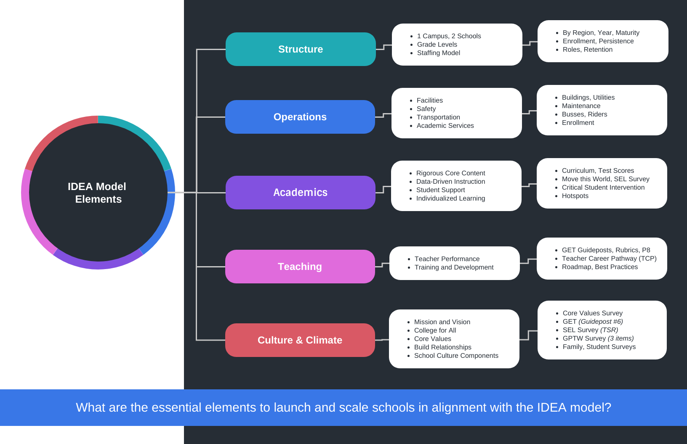
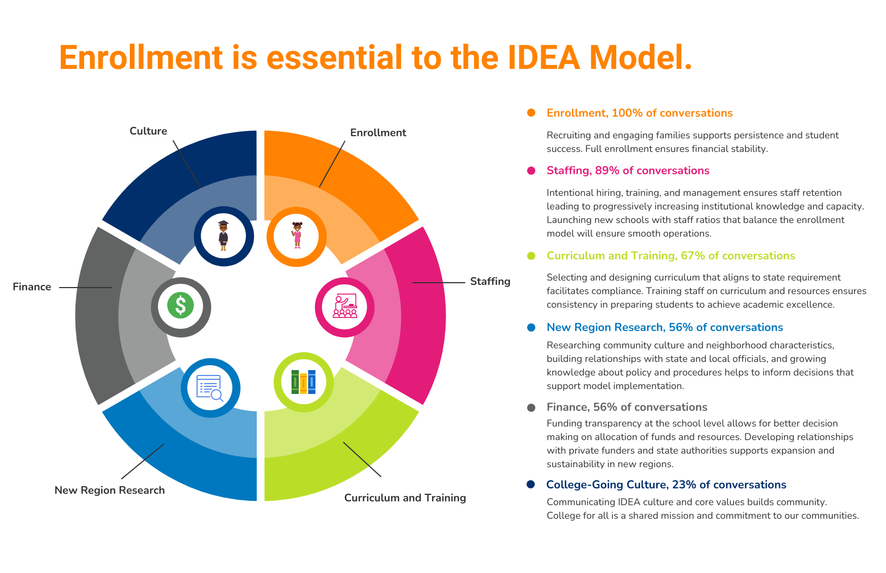

# Evaluation Projects

The R&A team conducts evaluations for annual grant-funded projects and specific or ad hoc projects as needed and by request. 

## Evaluation Plans 

How do we organize and guide our work on evaluation projects? Evaluation plans are prepared annually for each annually funded grant project and published to our Team Site. Annual evaluation projects may include several specific projects that directly inform the ongoing evaluation work. Evaluation plans are also developed for ad hoc and specific evaluation needs, topics, and projects.

### About Evaluation Plans

About Annual Evaluation Plans  

The annual evaluation plan provides a summary of the plan of work for a specific program, grant, or service during a fiscal year. Evaluation plans adhere to [American Evaluation Association (AEA) guidelines and standards](https://www.eval.org/About/Guiding-Principles#:~:text=The%20Guiding%20Principles%20reflect%20the,Principles%20are%20interdependent%20and%20interconnected.) for high quality evaluation. Individual plans may be customized to best reflect the work appropriate to the project. 

Evaluation plans serve to communicate the plan of work and guide expectations among stakeholders interested in the evaluation work. Evaluation plans may include the following components: a program description; evaluation purpose, objectives, and evaluation or research questions; methods and scope of the evaluation, data collection, and data analysis; timeline; required reporting and deliverables; and program support. Components are described in more detail in [Evaluation Plan Guidelines][Evaluation Plan Guidelines]. 

Evaluation plans are created with program and grant managers. Evaluation plans are drafted by evaluation staff and shared with program managers and partners for review, feedback, and approval. Annual evaluation plans must be finalized and approved by September 30. Although the annual evaluation plan is agreed upon at the beginning of the year, unexpected events, challenges, or circumstances may necessitate changes to the plan. The evaluation plan is subject to change through agreed upon decision making between the program manager and evaluation staff. Evaluators are held accountable to producing evaluation plans and meeting the milestone requirements included in the timeline and overall evaluation plan.

#### Evaluation Plan Guidelines

**Standard components found in*most*evaluation plans**

Because evaluation plans are customized to each project, not all components may be included in every evaluation plan. 

**Fiscal Year:**  2022-2023    
**Program/Grant Name:**    
**Program Manager/Partner:**    
**Grant/Fund Contact Person:**    
**Research and Analysis Team Staff:** (R&A team members who will be responsible for the work)

**Program Description**  
General information about the program. May include program goals, objectives, and other pertinent information to understanding its importance to IDEA Public Schools (e.g., organizational goals, strategic plan, key action steps supported by the program).

**Fiscal Considerations**  
Cost-Effectiveness or Cost-Benefit  Measures (to be included by the evaluation)

**Evaluation Purpose**  
May include a purpose statement, primary objectives, and evaluation or research questions to be addressed by the evaluation.  
*Evaluation Objectives*  
*Evaluation or Research Questions*

**Methods and Scope**  
Includes methods by which relevant data will be collected and analyzed.  
*Data Collection*  
*Data Analysis*  

**Required Reporting, Deliverables**  
Mandatory reporting requirements (for funding agency and other entities) and planned deliverables.  

**Program/Project Support**  
Types of ongoing support that will be provided to the program staff over the course of the year. Ex: recurring meetings, data requests, etc.  
*Sample language:* Evaluation staff will participate in ongoing, regularly scheduled meetings with the program staff for evaluation collaboration and provision of continuous feedback).

**Timeline**  
Lists and organizes tasks, activities, and focus areas as planned for the year. The timeline may combine months or list month-by-month as appropriate to the project. The timeline serves to communicate plans throughout the year and guide expectations among stakeholders interested in the evaluation work. Evaluators are held accountable to milestones highlighted in the timeline and overall evaluation plan.

**Special Projects**   
This may include ad hoc requests. If applicable.

**Notes**  
Readers of this document are encouraged to direct their comments and questions about the evaluations and services to Christopher Haid, VP Data Analytics, or to the contact person(s) named in the plan.

Although planned activities agreed upon at the beginning of the year may necessitate changes to the timeline due to unforeseen challenges or circumstances, the timeline is subject to change through agreed upon decision making between the program manager and evaluation staff.

### Published Evaluation Plans

Evaluation Plans for the current fiscal year are published to the [Team Site (TheHub)][Team Site (TheHub)]. 

Evaluation planning resources and files are stored in the [R&A Private Group][R&A Private Group] Evaluation folder.

## Annual Evaluation Projects

The R&A team evaluates four (4) annually funded grants including: 1) 21st Century Afterschool Program, 2) Camp Rio, 3) Charter School Program (CSP), and Teacher and School Leader Incentive Program (TSLIP).

### 21st Century Afterschool Program

IDEA Public Schools’ 21st Century Afterschool program provides high quality programming for students in the hours before and after the traditional school day has ended. The afterschool program allows IDEA schools to make a positive difference in the lives of students with greatest needs, as the program aims to provide additional support and ensure that all students are receiving the guidance and assistance they need to successfully progress towards college completion. The 21st Century program is centered around four main goals for students: increasing achievement scores, improving student behavior and attendance, and increasing rates of graduation or grade promotion towards timely graduation. 

During the 2021-2022 school year, the majority of IDEA schools implementing the Afterschool Program were funded by the 10th cycle of the 21st Century grant or by the Elementary and Secondary School Emergency Relief Fund (ESSER). These schools were located in the South Texas and Rio Grande Valley and served students from pre-K through 12th grade. The following campuses were funded by the 21st Century grant: IDEA Alamo, IDEA Donna, IDEA Frontier, IDEA McAllen, IDEA Mission, IDEA Pharr, IDEA Quest, IDEA San Benito, IDEA San Juan, and IDEA Weslaco. The following campuses were covered by ESSER funds: IDEA Brownsville, IDEA Edinburg, IDEA Elsa, IDEA Harlingen, IDEA La Joya, IDEA Los Encinos, IDEA North Mission, IDEA Owassa, IDEA Palmview, IDEA Rio Grande City, IDEA Robindale, IDEA Riverview, IDEA Sports Park, IDEA Toros, IDEA Tres Lagos, IDEA Weslaco Pike. In addition, IDEA Health Professions was funded by the Department of Education and IDEA Innovation was funded by the Louisiana Department of Education.

The Afterschool Program evaluation plan for school year 2022-2023 can be found [here](https://ideapublicschoolsorg.sharepoint.com/:b:/s/ResearchandAnalysis/EezZf9Bi5y5MpSGLsz5mzGoBRKe6kiUfvGiHdBpGG7KQzg?e=xMZGZg). The 2021-2022 program evaluation annual report can be found [here](https://ideapublicschoolsorg.sharepoint.com/:b:/s/ResearchandAnalysis/EfjTPNC0hG5ChfbgFsVdILUBEIyWU2KQ252cdCSpb0qNIA?e=0QpEQO).

Student participation in the Afterschool program is tracked in PowerSchool and then pulled into the R&A data warehouse server. The program coordinators track the programs that the students participate in and if they have participated for more that 45 days. Students that participate 45 days or more are classified as "Regular Participants". Student that participate for fewer than 45 days are classified as "Non-Regular Participants".

**Database:** [RGVPDRA-DASQL].[Program21stCentury].[dbo].[Students]

* **_[dbo].[Students]_**  This table tracks student program and activity participation. 

**Important columns:**

* **[FIRST_NAME]:** Student First Name
* **[LAST_NAME]:** Student Last Name
* **[STUDENT_NUMBER]:** Student local ID number (108 number)
* **[ACADEMIC_SUPPORT]:** Participation in academic support programs (0/1 indicator)
* **[COLLEGE_CAREER_READINESS]:** Participation in College and Career Readiness programs (0/1 indicator)
* **[FAMILY_ENGAGEMENT]:** Participation in Family Engagement programs (0/1 indicator)
* **[ENRICHMENT]:** Participation in Enrichment programs (0/1 indicator)
* **[WHENCREATED]:** Date when the record was created
* **[WHENMODIFIED]:** Date when the record was modified

A flag was added at the beginning of the 2022-2023 school year to indicate if the student participated 45 days or more.

From Chapter 4 (Temporary Insert):

The 21st Century Afterschool Programs provide students with afterschool opportunities to get academic support, college and career guidance, as well as family engagement activities. These programs are funded through several avenues, such as a grant from the Texas Education Agency, federal ESSER funds, the Department of Education, and the Louisiana Department of Education. The programs are offered at 26 campuses in the RGV, Health Professions in Austin, and Innovation in Louisiana. 

  + **FIRST_NAME:** the student's first name;
  + **LAST_NAME:** the student's last name;
  + **STUDENT_NUMBER:** the student's 108 number;
  + **ACADEMIC_SUPPORT:** binary indicator for participation in academic support activities;
  + **COLLEGE_CAREER_READINESS:** binary indicator for participation in college and career readiness activities;
  + **FAMILY_ENGAGEMENT:** binary indicator for participation in family engagement activities;
  + **WHENCREAATED:** a date/time stamp indicating the date of participation;
  + **WHENMODIFIED:** a date/time stamp indicating the date when the record was modified. Most values are null.

### Camp Rio

Camp RIO has been in operation since 2015 as a year-round outdoor education and summer camp facility. It is located on 85-acres of predominantly untouched wildlife preserve in Brownsville, Texas and is accessible to all regardless of school district, ability, or age. Camp RIO is a facility designed for outdoor discovery and adventure with a mission of promoting healthy lifestyles by exposing children to the benefits of exploration, land stewardship, and staying active through various hands-on activities. 

The program provides guided outdoor activities such as fishing, canoeing, building campfires, geocaching, hiking, and archery which help connect participants to their community and nature. From its inception in 2015, the number of students attending Camp Rio per year has increased from a few hundred to over 28,000 students in the 2021-2022 school year.

The program evaluation for Camp Rio focuses on 3 main goals:
  1) To understand the short- and long-term association between students’ participation in Camp RIO and students’ interests in natural resources and land stewardship 
  2) To evaluate the short- and long-term association between participation in Camp RIO and student academic achievement and well-being  
  3) To understand the long-term association between participation in Camp RIO and student college and career choices in the natural sciences  
 The evaluation plan for school year 2022-2023 can be found [here]( FINAL_FY 22-23_CampRio_Plan.pdf). The 2021-2022 annual report can be found [here]( CR_Annual_Report_2021-2022_DRAFT_8.09.22.pdf).

### Charter School Program (CSP) Grants

Charter School Program (CSP) grant awards to IDEA Public Schools funds to support the successful launch and expansion of new IDEA schools for five years. **Replication** refers to launching new schools. **Expansion** refers to scaling existing schools.

**CSP grant applications** are submitted and approved for funding by the Department of Education (DOE). The grant application provides general guidance for evaluation. CSP evaluation work is informed by evaluation questions and aims to address the following areas: implementation of the IDEA model, needs and challenges, supports, and sustainability strategies. Primary measures and metrics for reporting outcomes include student enrollment, student persistence, student average daily attendance, student academic performance, and employee retention.

#### CSP 2017 

Evaluation work for CSP Grants 2016 and 2017 was conducted by a contracted agency, Copia Consulting, who provided reports during 2020 and 2021. In 2021, the contract with Copia was discontinued. In fall 2022, R&A staff conducted analyses and prepared the final evaluation report.

* **CSP 2017 Final Evaluation Report Overview**

The 2017 CSP grant was dedicated to expanding IDEA schools in Austin, San Antonio, and Rio Grande Valley, and launching new schools in Tarrant County/Fort Worth. IDEA was awarded CSP 2017 funds with specific focus on Department of Education priorities to serve a low-income demographic and promote diversity. As stated in the approved grant application, aims of this five-year study were two-fold: 1) to understand whether the support in place for new schools was effective, and 2) to evaluate whether school model adaptations were done with fidelity. A firm, Copia Consulting, was hired to conduct the evaluation of the CSP 2017 grant during the grant cycle in partnership with IDEA Public Schools. Consistent with objectives outlined in the grant for evaluation, an internal evaluation team within the IDEA Division of Research and Analysis was established by the end of the grant.

The report described the performance of IDEA schools receiving funds from the CSP 2017 grant in terms of school characteristics, student demographics, and key outcomes associated with organizational goals and priorities. Key outcomes reported include student persistence, student average daily attendance (ADA), academic performance on state assessments, and staff retention.

* **CSP 2017 Data Collection and Analysis** 

Data collected was analyzed using R and Excel.  

Data sources included: 

Documentation was stored in the R&A Private Group folder for CSP Grants, CSP_2017 R Project, and Idea Analytics Team Github repository for CSP 2017. 

#### CSP 2019 and 2020

R&A conducts internal evaluation work for two CSP grants:
1) CSP Grant 2019-2024 and 2) CSP Grant 2020-2025. 

The evaluation work for each CSP Grant is guided by annual CSP Grant Evaluation Plan. 
For more details, see [Evaluation Plans][Evaluation Plans].

##### CSP Schools

* **CSP Schools and Regions**
CSP evaluation focuses on schools launching or scaling during SY 2018-2019, 2019-2020, 2020-2021, 2021-2022, 2022-2023, 2023-2024, and 2024-2025 in 12 regions. 

* **Regions:** Rio Grande Valley, San Antonio, Austin, El Paso, Baton Rouge, Tarrant County, Permian Basin, Houston, Tampa, Jacksonville, Cincinnati, and Headquarters.

* **Schools:** List schools. 

* **Changes to School Numbers & Names** 

Table below documents the changes to **School Numbers**

| School Name | School Short Name | School Number | Academic Year |
| :------- | :------- | -------: | :-------: |
| IDEA Hope Academy | Hope | 12001 | 2021-2022 |
| IDEA Hope Middle School | Hope | 12002 | 2021-2022 |
| IDEA Hope College Prep | Hope | 12003 | 2021-2022 |
| IDEA Victory Academy | Victory | 12004 | 2021-2022 |
| IDEA Victory Middle School | Victory | 12005 | 2021-2022 |
| IDEA Victory College Prep | Victory | 12006 | 2021-2022 |
| IDEA Hope Academy | Hope | 78400 | 2022-2023 |
| IDEA Hope Middle School | Hope | 78401 | 2022-2023 |
| IDEA Hope College Prep | Hope | 78402 | 2022-2023 |
| IDEA Victory Academy | Victory | 78350 | 2022-2023 |
| IDEA Victory Middle School | Victory | 78351 | 2022-2023 |
| IDEA Victory College Prep | Victory | 78352 | 2022-2023 |

Table below documents the changes to **School Names** (specifically, Amber Creek to Robinson)

| School Name | School Number | State School Number | Academic Year |
| :------- | -------: | -------: | :-------: |
| IDEA Amber Creek Academy | 108807304 | 108807304 | 2021-2022 |
| IDEA Amber Creek Middle School | 109907026 | 108807204 | 2021-2022 |
| IDEA Amber Creek College Prep | 108807204 | 108807204 | 2021-2022 |
| IDEA Robinson Academy | 108807304 | 108807304 | 2022-2023 |
| IDEA Robinson Middle School | 109907026 | 108807204 | 2022-2023 |
| IDEA Robinson College Prep | 108807204 | 108807204 | 2022-2023 |

* **Grade Levels:** Most schools open or launch with Kindergarten, 1st, and 2nd grades at the Academy level and 6th grade at the College Prep level. However there are exceptions to this model. 

* **School Opening Grade Exceptions:** 
  * Price Hill opened with 6th and 7th at the CP level.
  * Converse opened with PK, K, and 1st at the Academy level.
  * Hidden Meadow opened with PK, K, and 1st at the Academy level. 

##### Evaluation Questions

* **CSP Evaluation Question 1:** To what extent do replication and expansion schools consistently implement key model elements as defined by IDEA leadership? How, if at all, does implementation of noted elements differ between Academy and College Prep campuses, by school maturity (years in operation) and region? 

##### CSP IDEA Model

Research and evaluation work aimed to answer the following question, "What is the IDEA model for launching and scaling new schools?"

**CSP IDEA Model Development**

  * **Why did we develop a model?** After preliminary research and discussion, an existing, comprehensive model for launching and/or scaling new IDEA schools was not found.

  * **How did we develop the initial model?** We reviewed accessible content online and held a series of weekly discussions focused on CSP.

    + **Research** was conducted to locate and review the IDEA model for launching and scaling new schools. Contents available online via the Hub and web were reviewed and analyzed. Specific examples included Academic Books, APO Playbooks, GET Rubrics, TCP Handbooks, Onboarding Guides, School Culture Components, Team Sites, IDEA Schools, and Year 0.

    + **Discussions** focused on CSP. R&A Team Members have various professional experiences as administrators, evaluators, researchers, statisticians, students, teachers, and volunteers. Each weekly discussion focused on a unique aspect of CSP: 1) key components of the IDEA model; 2) processes involved in launching and scaling schools; 3) challenges and needs for launching and scaling schools; 3) sustaining new schools; 4) roles of leaders and teams; 5) regions, new regions, and new states; and 6) viable metrics and measures. 

    + **As part of the evaluation process,** evaluators collected information, recorded notes, and synthesized the content into three areas for investigation: 1) What is the IDEA model for launching and scaling new schools?; 2) What are the challenges, needs, and supports provided to launching and scaling schools?; and 3) What sustainability strategies have been implemented to support the launch and expansion of new schools?

To move forward with the evaluation, a draft model needed to be created and developed to showcase the main elements of the IDEA Model for opening new schools based on the review of information and discussions. As notes were reviewed, discussed, and documented, content informing the IDEA Model was organized into 5 key components. 

###### CSP IDEA Model Components (v.1)

What are the essential components to launch and scale schools in alignment with the IDEA model?

There were 5 key components in our first version of the CSP IDEA Model. Components may look different by region and school maturity, but essential components may be consistent across new schools at IDEA. We believe that each of these components must be in place for new IDEA schools to open successfully.

{width="500"}
  
  * **The visual representation was organized into 3 columns:** 1) key component; 2) specific examples or areas within the component; and 3) potential data, measures, or metrics for the component. 
  
  * **5 key components included:** 1) structure, 2) operations, 3) academics, 4) teaching, and 5) climate and culture. Each key component was further defined with a few specific areas and potential measures or metrics.

    + **Structure** included 1 campus and 2 schools, grade levels, and staffing. By region, year, and maturity; enrollment and persistence, and roles and retention (Onboarding Handbook; SY 21-22).

    + **Operations** included facilities, safety, transportation, and academic services. Buildings and utilities, maintenance, buses and riders, and enrollment (Operations Playbook SY 21-22).

    + **Academics** included rigorous core content, data-driven instruction, student support, and individualized learning (4-component academic model). Curriculum and test scores, move this world and SEL survey, critical student intervention, and hotspots (Academic Book SY 21-22).

    + **Teaching** included teacher performance and training and development. Guide to excellent teaching (GET) guideposts, rubrics, and power 8 rows, teacher career pathway, and roadmap and best practices (TCP Handbook SY 21-22, GET Guidebook and Rubrics SY 21-22).

    + **Climate and Culture** included mission and vision, core values, build relationships, and school culture components. Core values survey, GET guidepost #6, SEL survey TSR (teacher-student relationships), GPTW survey (3 items), and family and student surveys (IDEA website, School Culture Components Document and Rubrics, GPTW instrument, SEL instrument, GET Rubrics).

###### CSP Model v.1 Methods (Model Feedback and Validation)

* **Qualitative approach with narrative study design:** Because we aimed to gain insight on the perspectives of leaders based on their knowledge and experience, we conducted semi-structured interviews with leaders who were willing to participate. 
 
 * **Pilot Data Collection:** To seek feedback, verify, and improve on the draft model, organizational leaders who represented different areas of the model were identified and invited to provide their perspectives. Interviews, aka model conversation meetings, were held with each leader individually and lasted 30-60 minutes. A total of 10 meetings were conducted. Evaluators recorded notes from meeting discussions and met to debrief to discuss observations and notes. 
 
 * **Pilot Data Analysis:** We adapted narrative and phenomenological data analytic techniques. We identified main points each leader shared, looked for alignment and contradiction, compared model conversation notes and themes with the draft model drawing (CSP Model v.1). Findings were summarized in tables and figures. 
 
 * **Pilot Findings:** After 10 interviews were conducted, themes emerging included enrollment, staffing, curriculum and training, new region research, finance, and college-going culture.
 
The most important factors for implementing the IDEA model successfully (as would be indicated by opening new schools that are successful within the first 4 years) seemed to include: full enrollment, teacher and staff training, establishing a relationship with families, and knowing the new region where the new school is being opened. 

{width="500"}
 
 * **Implications:** Knowing what factors help new schools be successful will help us open and support new schools.

### Teacher and School Leader Incentive Program (TSLIP)

Grant that contains 4 key components/areas for research questions. Main points of analysis: Level 5 Pilot Program and "Best Practices" library; TCP Level percentages by District/Region/Campus/School and look at percentage and distribution of TCP Level 5 teachers across schools and possibly down to grade level.

More information to come soon.

## Ad Hoc Evaluation Projects
