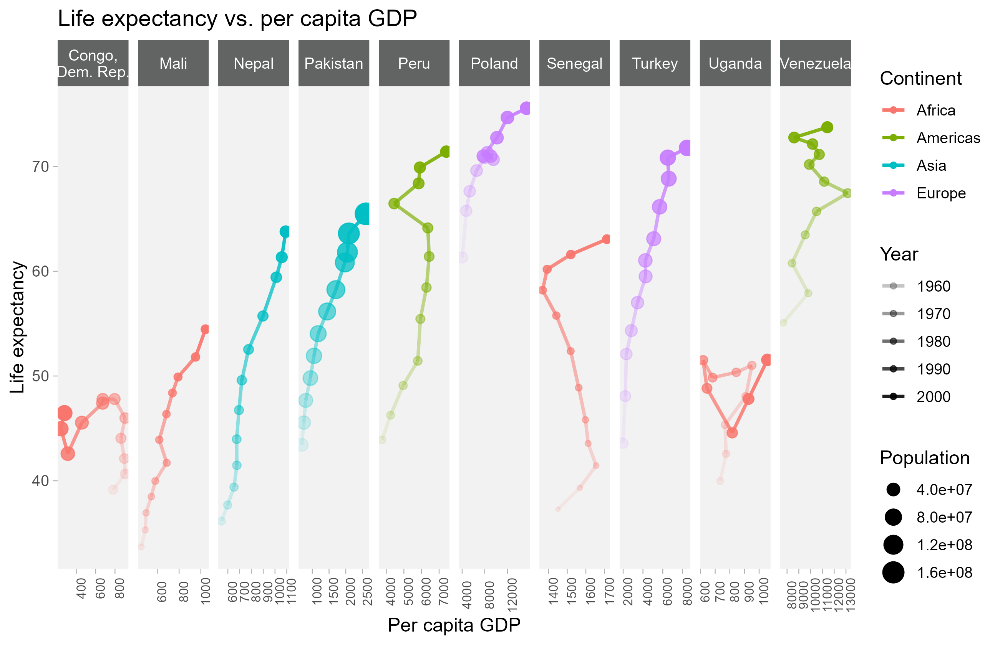
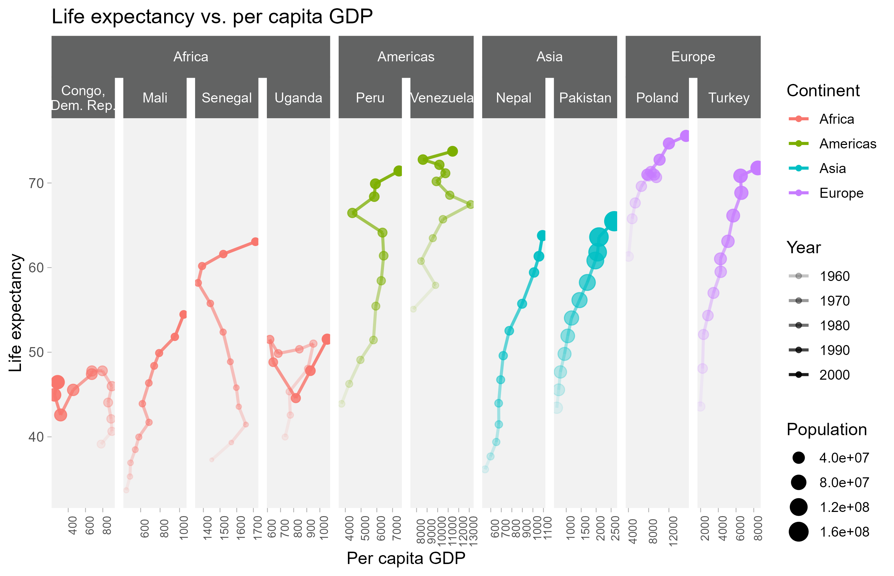

# Visualization Standards

## IDEA branding

When producing a visualization for presentation or publication, use the [Brand Guideline](https://ideapublicschoolsorg.sharepoint.com/sites/MCE/SitePages/Marketing-Team.aspx) standards established by the [Marketing team](https://ideapublicschoolsorg.sharepoint.com/sites/MCE/SitePages/Marketing-Team.aspx). Many of these guidelines, particularly colors, have already been incorporated into an R package, `ideacolors`.


### The `ideacolors` package

The `ideacolors` package is used in conjunction with `ggplot2` to produce graphs and visualizations consistent with the primary and secondary brand color schemes. For more information, consult the `ideacolors` [documentation](https://idea-analytics.github.io/ideacolors/).

To install the package, use the following code:

```{r ideacolors, echo=TRUE, eval=FALSE}
# install.packages("devtools")
devtools::install_github("idea-analytics/ideacolors")
```

#### `ideacolors` themes and scales

Consider the following chart using the `mtcars` data set, where we create a scatter plot of engine displacement by fuel efficiency measured in miles per gallon where we've set the color aesthetic (or channel) to the number of cylinders a car's engine has: 
```{r}
p <- ggplot(mtcars, aes(x=disp, y=mpg)) +
  geom_point(aes(color=as_factor(cyl)))

p
```

You can quickly apply IDEA brand compliant colors by using for the `scale_color_idea()` function:

```{r}
library(ideacolors)
p +
  scale_color_idea()
```
**Super easy!**.  We can also easily change the the palette and even reverse it:
```{r}
p +
  scale_color_idea(palette = "blueorange", reverse = TRUE)
```
Available palette's are given in the `idea_palettes` variable and can be seen here

```{r}
colorspace::swatchplot(idea_palettes)
```

### Color Blindness

Note that IDEA's brand colors are not completely safe for color blindness.  Here's each palette with adjustments to check for the predominant types of color blindness in the population:

```{r}
colorspace::swatchplot(idea_palettes, cvd = c("desaturate", 'deutan', "protan", "tritan"))
```
::: {.tip}

The chart above includes the following types of colorblindness:

* Deuteranopia: Deuteranopia is a type of color blindness that primarily affects the perception of the green color spectrum. People with deuteranopia have a deficiency or absence of the green cone cells in their eyes, which are responsible for perceiving green light. As a result, they have **difficulty distinguishing between green and red hues**. The red and green colors may appear more similar or indistinguishable to individuals with deuteranopia.

* Protanopia: Protanopia is a type of color blindness that primarily affects the perception of the red color spectrum. Individuals with protanopia lack or have a reduced number of functional red cone cells in their eyes. Consequently, they **struggle to differentiate between red and green colors**. They may perceive these colors as muted or similar in appearance.

* Tritanopia: Tritanopia, also known as blue-yellow color blindness, is a rarer form of color blindness that affects the perception of the blue and yellow color spectrum. People with tritanopia have a deficiency or absence of the blue cone cells in their eyes, leading to **difficulty in distinguishing between blue and yellow colors**. 
:::


### Race/Ethnicity Colors

When creating visuals of Race/Ethnicity we want to be consistent with the colors chosen for each race/ethnicity. Additionally, we want to ensure that the colors are not offensive to any group. Below are the colors that were used for all of the Diversity, Equity, and Inclusion (DEI) work that has been completed in the last couple of months of 2022.

  + **American Indian/Alaskan Native:** idea_colors$melon (#F9A054)
  + **Asian:** idea_colors$cyan (#53B4CC)
  + **Black:** idea_colors$magenta (#EE3A80)
  + **Hispanic:** idea_colors$blue (#0079C1)
  + **Multi-racial:** idea_colors$lime (#A4C364)
  + **Other:** idea_colors$yellow (#FFDE75)
  + **Pacific Islander:** idea_colors$darkblue (#1A4789)
  + **White:** idea_colors$coolgray (#626363)
  
Suppose your data frame, `df_reading_levels`, contains information about Academy students' grade-level reading equivalents `GradeLevelEquivalent` with race and ethnicity in the `RaceEthnicity` column. To create a visualization of reading levels using the custom palette, you'll need to code the palette in three places:

1. as a vector of colors, outside of the plotting function
2. as an aesthetic, inside the initial plotting call
3. as a value, inside a manual scale function

Let's define the palette as a vector. You may need to adjust the names of the race or ethnicity to match the factors in your data frame.

```{r vector_colors, eval=FALSE}
# step 1
race_ethnicity_legend <- c("American Indian" = idea_colors$melon,
                           "Asian" = idea_colors$cyan,
                           "Black" = idea_colors$magenta,
                           "Hispanic" = idea_colors$blue,
                           "Other" = idea_colors$yellow,
                           "Pacific Islander" = idea_colors$darkblue,
                           "Two or more races" = idea_colors$lime,
                           "White" = idea_colors$coolgray)
```

Then, inside a `geom_*()` layer, assign the appropriate column `RaceEthnicity` to the appropriate aesthetic `aes()`. (Depending on your visualization, the aesthetic might be `fill`, `shape`, etc.).

```{r geom_aes, eval=FALSE}
# step 2
ggplot(df_reading_levels) +
  geom_boxplot(aes(x = GradeLevelEquivalent,
                   color = RaceEthnicity))
```

One additional call is needed to force `ggplot()` to use the palette you specified earlier.

```{r scale_color_manual, eval=FALSE}
# step 2
ggplot(df_reading_levels) +
  geom_boxplot(aes(x = GradeLevelEquivalent,
                   color = RaceEthnicity)) +
  # other layers go here... +
  # step 3
  scale_color_manual(values = race_ethnicity_legend,
                     drop = FALSE) +
  labs(color = "Race / Ethnicity")
```

The `scale_color_manual()` call will accept the vector of colors specified earlier in `values`, and `drop = FALSE` forces the legend to show all possible values and colors of `race_ethnicity_legend`, regardless if they appear in the `RaceEthnicity` column. (If the aesthetic if `fill`, then use `scale_fill_manual(values = race_ethnicity_legend, drop = FALSE)`, and so on).

The default legend title is to use the column name. However, the `labs()` call *relabels* the legend title for the `color` aesthetic to "Race / Ethnicity". (If the aesthetic is `fill`, then use `labs(fill = "Race / Ethnicity")`, and so on).

### Grade Level colors

If your visualization or reporting requires grouping across grade levels, using the IDEA polo color for that grade level is a familiar palette for IDEA schools. For more information about uniforms, refer to the [parent guide](https://ideapublicschools.org/parents/uniform-guides/).

The following are the current polo colors for each grade level:

  Grade Level | Color 
  ------------|-------
 PK-5th, 8th | Blue
 6th, 10th | Red
 7th, 11th | Orange
 9th | Green
 12th | Black
 
Clearly, if all grade levels are present on one plot and cannot be individually labeled (say, a scatterplot), then using one color for multiple grade levels is not advised. However, if color coding a document or table where colors can be repeated, then this palette can provide visual cues to contextualize the report.


### Typography

The primary brand font is Proxima Nova; the secondary fonts are Arial or Helvetica. Before using the code, ensure that these fonts have already been installed. Then, to add these fonts to a visualization, use the following code:

```{r fonts, echo=TRUE, eval=FALSE}
# install.packages("showtext")
library(showtext)

showtext_auto()
font_add("proxima",
         regular = "proximanova-regular.ttf",
         bold = "proximanova-extrabold.ttf",
         italic = "proximanova-regularit.ttf",
         bolditalic = "proximanova-extraboldit.ttf")
```

This code will apply the font consistently to all text in any visualization created for that R session. To stop using the custom fonts in a session, use `showtext_auto(FALSE)` to revert to the default fonts.


## Visualizing hierarchical data

Our data is often presented and displayed hierarchically (e.g. state, then region, then school, etc.). Therefore, it may be useful to group visualizations in a hierarchy, rather than arranging them alphabetically or in another manner.

Let's use the [`gapminder`](https://jennybc.github.io/gapminder/) data in R, where each row is a life expectancy, population, and GDP per capita corresponding with a specific country in a specific year.

```{r gapminder_data, echo=TRUE, eval=TRUE}
library(gapminder)

set.seed(1234)
sample <- gapminder::gapminder %>%
  distinct(country) %>%
  slice_sample(n = 10) %>%
  pull()

df_gapminder_sample <- gapminder::gapminder %>%
  group_by(country) %>%
  filter(country %in% sample)

df_gapminder_sample %>%
  slice_head(n = 5) %>%
  knitr::kable()
```

We could visualize the changes in life expectancy vs. GDP per capita over time like this:

```{r gapminder_unnested, echo=TRUE, eval=FALSE}
df_gapminder_sample %>%
  ggplot(aes(x = gdpPercap, y = lifeExp,
             color = continent,
             alpha = year)) +
  geom_point(aes(size = pop)) +
  geom_path(size = 1) +
  
  # each country has a separate panel, arranged alphabetically by country
  facet_grid( ~ country,
                labeller = labeller(country = label_wrap_gen(width = 10)),
                scale = "free_x") +
  theme_idea_min() +
  theme(axis.text.x = element_text(size = 8,
                                   angle = 90)) +
  labs(size = "Population",
       alpha = "Year",
       color = "Continent",
       x = "Per capita GDP",
       y = "Life expectancy",
       title = "Life expectancy vs. per capita GDP")

```



where the line graphs are arranged alphabetically by country. However, it might be more visually appealing and intuitive to a reader if the graphs were arranged by continent, and *then* country. To do this, we can use the `{ggh4x}` package [(documentation here)](https://teunbrand.github.io/ggh4x/articles/ggh4x.html), and switch from `facet_grid()` or `facet_wrap()` in `ggplot2` to `facet_nested()` or `facet_nested_wrap()` in `ggh4x`.

```{r gapminder_nested, echo=TRUE, eval=FALSE}
library(ggh4x)

df_gapminder_sample %>%
  ggplot(aes(x = gdpPercap, y = lifeExp,
           color = continent,
           alpha = year)) +
  geom_point(aes(size = pop)) +
  geom_path(size = 1) +
  
  # each country has a separate panel,
  # but arranged alphabetically by continent, then by country
  facet_nested( ~ continent + country,
                labeller = labeller(country = label_wrap_gen(width = 10)),
                scale = "free_x") +
  theme_idea_min() +
  theme(axis.text.x = element_text(size = 8,
                                   angle = 90)) +
  labs(size = "Population",
       alpha = "Year",
       color = "Continent",
       x = "Per capita GDP",
       y = "Life expectancy",
       title = "Life expectancy vs. per capita GDP")
```


