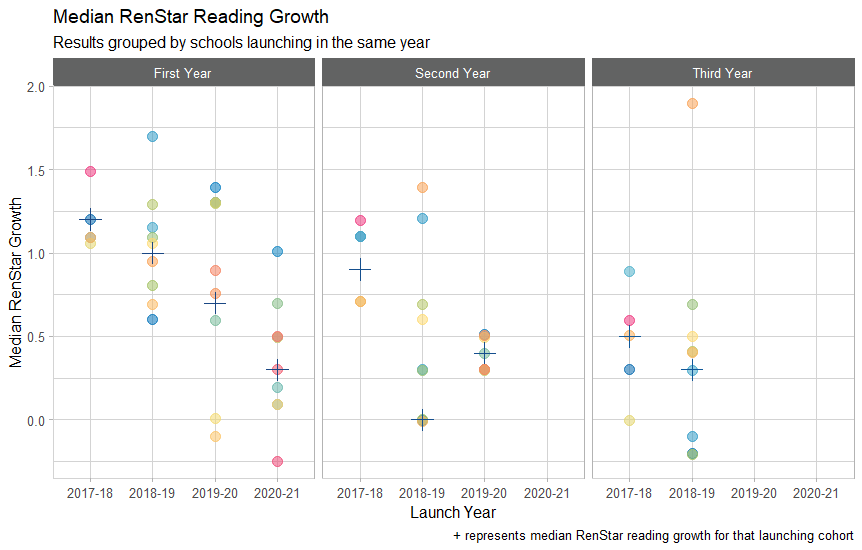

# Models and Methods 

Our research involves a wide variety of methods in statistics and data science to analyze problems and answer questions in educational data. In consultation with our stakeholders, we carefully select the most relevant approach(es) to provide an appropriate and accurate product.

We use methods in descriptive, inferential, and predictive statistics to understand information about our organization. However, the design of the program influences how we establish our methods of research.

## Research design

When our works requires us to assign causation, we must consider how the data were collected before deciding on an appropriate model.

### Causal inference

Most of our data is observational, so if we want to describe causal relationships in our data, we must appeal to potential outcomes. Thus, we will briefly cover some of relevant causal inference concepts and techniques.

When a student is marked for inclusion in, say, a tutorial group, we would like to see how much the tutorial increased their score on a test, compared to a scenario where the student did not attend the tutorial. If the student attends the tutorial, we can measure the outcome of the treatment (the tutorial) by seeing what grade they earned after a test; we cannot observe, however, the outcome of the control (no tutorial). Potential outcomes aims to remedy this.

#### Potential outcomes

Suppose we have both the treatment and control outcomes for each student. Then, our main estimators for the tutorial effect are $ATE, ATT, ATU$, which are defined below:
- $ATE = \delta_i$ represents the **A**verage **T**reatment **E**ffect $\delta_i = E[Y^1_i - Y^0_i]$, where $Y^1_i$ is the potential outcome from the treatment for individual $i$ and $Y^0_i$ is the potential outcome from the control for individual $i$.
  - $ATT = \frac{1}{n}\sum\delta^+_i$ represents the **A**verage **T**reatment effect of the **T**reatment group, where $\delta^+_i$ are the $ATE$ where $ATE > 0$.
  - $ATU = \frac{1}{n}\sum\delta^-_i$ represents the **A**verage **T**reatment effect of the **U**ntreated (control) group, where the $\delta^-_i$ are the $ATE$ where $ATE < 0$.
- $ATE$ can be decomposed into a weighted average of $ATT, ATU$, such that $ATE = p\times ATT + (1-p)\times ATU$, where $p$ is the weight of the treatment group.

In our scenario,
- $ATE$ represents the expected marginal effect of the tutorial group on test scores,
- $ATT$ represents the expected marginal effect of the tutorial group for students who participate in tutorials, and
- $ATU$ represents the expected marginal effect of the tutorial group for students who do not participate in tutorials.

#### Matching models 

#### Regression discontinuity

#### Instrumental variables

#### Difference-in-differences


### Experimental design

suggested topics - ANOVA, ANCOVA, MANOVA, nested, mixed effects, crossover design, etc.

## Descriptive statistics

When summarizing a distribution of data, we are usually tasked with describing (1) measures of center, such as counts and proportions for categorical data, or means and medians for quantitative data and then displaying those values for our stakeholders. To provide context and increase the statistical literacy of our team and family, we also describe the (2) spread, (3) shape, and (4) unusual features of the distribution.

### Numerical summaries - broad principles

For **categorical data**, consider the distribution of proportions and counts (the sample size) across the various categories. One-way and two-way frequency tables, with marginal and total proportions and counts, are useful for displaying the data.

For **univariate, quantitative data**, use the shape of the distribution to determine appropriate numerical measures. For symmetric data, the mean $\bar{x}$ `mean(x)` and standard deviation $s$ `sd(x)` can be appropriate for reporting and is accessible by a broad audience. For skewed data, consider the median $\tilde{x}$ `median(x)` (and possibly the MAD - median absolute deviation `mad(x)`), and provide context for choosing these measures. Note: The median is also a widely accessible statistic to most people, since it describes the midpoint of your distribution. Consider using it alongside the mean.

For **bivariate data**, use a scatterplot to determine if linear measures can be used appropriately. The Pearson correlation $r$ `cor(x, y)` can be easily understood by a wide audience to describe the linear strength of a bivariate association. However, the Spearman rank correlation `cor(x, y, method = "spearman")` can provide an associative measure for monotonic nonlinear associations, and Kendall's $\tau$ `cor(x, y, method = "kendall")` can describe concordance for ordinal data.

When describing **outliers** in a report, care should be taken when describing how we identify and use (or remove) the outliers from the data set. 

::: {.tip}
One heuristic for deciding what to do with an outlier is to ask yourself, "Does this observation *belong* in the sample?"

If you decide that the observation is fundamentally different than the others (e.g. a school is off-model and does not implement the Imagine Learning the same way that other schools do), then you might consider removing that observation. If the observation represents some exceptional case of the proposed model, then you might consider keeping that observation.
:::

In general, we should be modeling a measure of center and its spread as a function of covariates (see Modeling and predictive statistics).

### Graphical summaries - broad principles

While there are plenty of ways to display data, all graphs should be accompanied by an explanation of key features. Our aim is to help educators interpret the data in memorable, meaningful ways, and graphs without context can convey the wrong information or may obscure what the researcher attempted to communicate. Each graph should include a descriptive title, axes, and appropriate labels; consider using the [ideacolors](https://idea-analytics.github.io/ideacolors/) package for aesthetics.

Selecting an appropriate graphical display depends on the purpose of the analysis and the communication of results. Bar graphs, line graphs, histograms, and scatterplots each have their place in displaying central tendency; however, emphasis should be placed on displaying variation within the data.

#### Displaying variation

Variation can be addressed by the following (non-exhaustive) list:

1. Comparing sample sizes, both for the entire distribution and within each group

2. Comparing variation within and between groups

3. Displaying variation across time

4. Clustering of values in a region (and conversely, gaps in data)

Different approaches to this could be altering alpha values, jittering, color scales, size, and the shape of the marker. Some sample code for doing is found below:

```{r variation_example, echo=TRUE, eval=FALSE}

make_Data_By_Launch_Cohort() %>%
  ggplot(aes(x = LaunchSchoolYear,
             y = jitter(MedianGrowth), #jittering of clustered points
             group = School)) +
  geom_point(aes(color = School, #change color by school
                 alpha = 0.2), #set transparency level to 0.2
             size = 3.5) + #increases size of point
  geom_point(aes(y = MedianGrowthLaunch,
                 color = LaunchOrder),
             shape = 3, #changes shape to plus sign +
             size = 5) +
  scale_color_idea() + 
  theme_idea_light() +
  facet_wrap(~LaunchOrder,
             labeller = labeller(LaunchOrder = c("1" = "First Year",
                                                 "2" = "Second Year",
                                                 "3" = "Third Year"))) +
  labs(title = "Median RenStar Reading Growth",
       subtitle = "Results grouped by schools launching in the same year",
       caption = "+ represents median RenStar reading growth for that launching cohort",
       x = "Launch Year",
       y = "Median RenStar Growth") +
  scale_x_discrete(labels = c("2017-2018" = "2017-18",
                              "2018-2019" = "2018-19",
                              "2019-2020" = "2019-20",
                              "2020-2021" = "2020-21")) + 
  theme(legend.position = "none")

```

This code spaces out MedianGrowth if there are multiple schools with the same median growth, changes the transparency level to 0.2, and changes color wtih each school. The value of MedianGrowthLaunch is plotted with a "plus" shape at a larger size to emphasize the median growth for each school year.



## Inferential statistics

suggested topics - confidence intervals vs. p-values and communication

## Modeling and predictive statistics

### Linear modeling

suggested topics - uses, diagnostics, commands, interpreting, limitations, conclusions, communication

### Generalized linear modeling

suggested topics - uses, diagnostics, commands, interpreting, limitations, conclusions, communication

multinomial logit, log models, zero-inflated models

### Machine learning
