# Geospatial Methods and GIS

This chapter provides a gentle introduction to Geographic Information Systems (GIS) in R with simple features. 

## What is a simple feature?

**Simple Features** is a set of ISO and Open Geospatial Consortium (OGC) standards that specify a common storage and access model of geographic feature made of mostly two-dimensional geometries (point, line, polygon, multi-point, multi-line, etc.) used by geographic information systems. Simple features underlie the most common commercial and open-source GIS platforms (e.g., ESRI ArcGIS, PostGIS, the GeoJSON standard).

A **feature** is essentially a thing in the world. In the simple feature specification a feature has *a geometry* describing where on Earth the feature is located, **and they have attributes**, which describe other properties, like names or metrics such as population.

### How are simple features implemented in R

In a word, simply. A special feature in R is essentially a row in `data.frame` with class **sf**. This `data.frame` will have the normal suspects---names of things, metrics you care about---in columns and then a special column named **geometry** or **geom**. This will typically be a list-column, meaning that instead of holding characters or numbers, the contents are a list and each list is collection of 2-d coordinates that describe how to plot or draw the geometry. The image below illustrates the structure of an `sf` `data.frame`

{width="500"}

## Workflows using `sf` objects {#sf-workflow}

Importing and transforming data in a `sf` data frame is somewhat different than using data frames because extra metadata is encoded into an `sf` object. R&A uses the following skills (as of October 2023) ...

... for basic `sf` handling:

* Distinguishing ordinary data frames and `sf` data frames
* Geocoding using an address
* Establishing a coordinate reference system (CRS)
* Identifying and using a geometry column
* Using and modifying a bounding box (bbox)
* Using spatial joins

... for mapping data:

* Using mapping packages
* Common types of map visualizations, including chloropleths and dot densities
* Accessing and transforming shapefiles
* Computing and mapping isochrones
* Computing commute times
* Layers vs. facets
* Static vs. interactive maps

... and for working with Census data:

* Census surveys
* Census geographies
* Using the Census API

### Guided example using TACO schools {#taco-gis}

Let's start by getting schools in Tarrant County (TACO). We can get these schools and their addresses from the data warehouse:

```{r get_schools_for_gis}
# library(tidyverse)
# library(ideadata)

# schools_conn <- get_schools()

# regions_conn <- get_regions() %>% 
#   filter(RegionDescription == "Tarrant County") %>%
#   select(RegionID)

# get the addresses of schools for geocoding 

# taco_schools <- schools_conn %>% 
#   inner_join(regions_conn, by = "RegionID") %>% 
#   select(SchoolShortName, SchoolStreet, SchoolCity, SchoolState, SchoolZipCode) %>% 
#   distinct() %>% 
#   collect() %>% 
#   janitor::clean_names()  

# taco_schools

# save(taco_schools, file = "./taco_schools.Rda")

load("./taco_schools.Rda")

knitr::kable(taco_schools)
```

### Geocoding

We've got schools and addresses! But that isn't sufficient to plot these schools on a map, and we certainly don't have a simple features data.frame.

The first stop is **geocoding** these addresses, which is simply getting their latitude and longitude. Doing so is very straightforward for with the `[tidygeocoder](https://jessecambon.github.io/tidygeocoder/)` package which provides a great interface to a number of different geocoders (e.g., US Census, OpenStreetMaps, geocod.io). 

```{r geocode_schools}
library(tidygeocoder)

# note that different geocoders may require a full address OR
# an address split into components
taco_schools_geocoded <- taco_schools %>% 
    tidygeocoder::geocode(
      street = school_street,
      city = school_city,
      state = school_state,
      postalcode = school_zip_code, 
      method = "osm" # we also use method = "geocodio"
    )

knitr::kable(taco_schools_geocoded)
```

Brilliant! We've got `lat` and `long` variables for those addresses. Super Cool!

Let's transform these now to a `sf` object:

```{r as_sf}
library(sf)

# st_as_sf() requires a user to specify what column(s) to use for geometry
taco_schools_sf <- taco_schools_geocoded %>%  
  st_as_sf(coords = c("long", "lat")) # use coords to specify a POINT geometry

knitr::kable(taco_schools_sf)
```

Notice that the `lat` and `long` variables are replaced by the `geometry` column.

### Coordinate Reference System

Notice in the meta-data above that CRS is `NA`. CRS refers to the Coordinate Reference System, which is a framework for measuring locations precisely as coordinates. A CRS includes a coordinate system, a horizontal datum that binds the coordinates to a real space on the spheroid Earth with an estimate of the Earth's curvature and a set of control points, and finally a projection that converts spherical coordinates to Cartesian coordinates.

You should always set this and the most common CRS in latitude and longitude as `WGS84` (used by the GPS satellite navigation system) with the following CRS string `"+init=epsg:4326"` as a formal identifier, but also more simply by its name:

```{r set_crs_for_map, eval=FALSE}
st_crs(taco_schools_sf) <- "WGS84"

# alternate ways of establishing a CRS in the same pipe

# option 1: use if no CRS has been established
# taco_schools_sf <- taco_schools_geocoded %>%  
#   st_as_sf(coords = c("long", "lat")) %>%
#   st_set_crs("WGS84")

# option 2: use if no CRS has been established
# taco_schools_sf <- taco_schools_geocoded %>%
#   st_as_sf(coords = c("long", "lat"),
#            crs = "WGS84")

# option 3: use if CRS has already been established
# taco_schools_sf <- taco_schools_geocoded %>%
#   st_as_sf(coords = c("long", "lat")) %>%
#   st_transform("WGS84")

```

### Basic mapping

We now have enough information to draw a map! To create a map, you need a ggmap object, a base layer map, and additional `sf` layers you want to display. All `sf` objects can be plotted if the `geometry` column is specified. The function `geom_sf()` reads the geometry column and automatically plots the data using the specified metadata.

```{r ggmap, eval=FALSE}
# {ggsflabel} is not available on CRAN, {ggmap} requires get_stadiamap()
# that is not yet on CRAN
# renv::install("yutannihilation/ggsflabel")
# renv::install("dkahle/ggmap")

library(ggmap)

# starting with a Google map can give us a quick bounding box
# this pulls appropriate Google map tiles around zip code 76117 at zoom level 11
# and becomes our base layer map
base_google_map <- get_googlemap("76117", zoom = 11)

# before creating other layers/features, create a quick map with labels
# to verify the correct bounding box and zoom level
base_google_map %>% # baselayer map
  ggmap() + # create the ggmap object
  
  # additional layers
  # plots school locations with a hotpink dot
  geom_sf(
    data = taco_schools_sf, 
    color = "hotpink",
    inherit.aes = FALSE
  ) +
  
  # adds hotpink labels of school names
  ggsflabel::geom_sf_label_repel(
    data = taco_schools_sf,
    aes(label = school_short_name), 
    color = "hotpink",
    inherit.aes = FALSE
  ) 

```

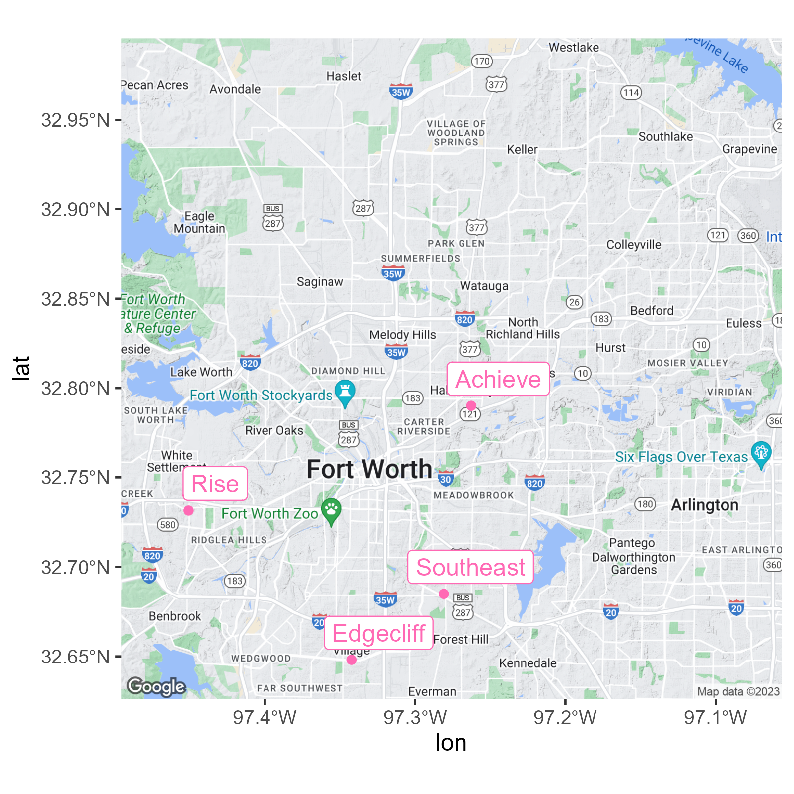{width="600"}

There are many types of **map tiles** that can be used to display geographic data. I don't always love Google Maps' look for display purposes on slides, so let's change that up with Stamen, which give us different styles of map tiles. In particular, we will use `toner-lite`, which provides a neutral, grey-white background. Stamen tiles, now provided by [Stadia Maps](https://stadiamaps.com/stamen/), requires an API key.

To get any baselayer map, you must specify the **bounding box**, or a set of longitudes and latitudes that respectively establish the left/right and top/bottom edges of the map. You can either get the bounding box attributes from the Google Map baselayer, or you can create your own.

```{r adjust_bounding_box, eval=FALSE}
# gets bounding box from Google Map base layer attributes
bbox <- bb2bbox(attr(base_google_map, "bb"))

# if you need a different bounding box, adjust the individual parameters
# using your preferred coordinates

# bbox <- c(left = -97.5, right = -97.1, top = 32.8, bottom = 32.5)

# get a new base layer map using the specified bounding box
base_stamen_map <- get_stadiamap(bbox, 
                                 zoom = 11, 
                                 maptype = "stamen_toner_lite")

base_stamen_map %>% 
  ggmap() +
  geom_sf(
    data = taco_schools_sf, 
    color = "hotpink",
    inherit.aes = FALSE
  ) +
  ggsflabel::geom_sf_label_repel(
    data = taco_schools_sf,
    aes(label = school_short_name), 
    color = "hotpink",
    inherit.aes = FALSE
  ) 
```

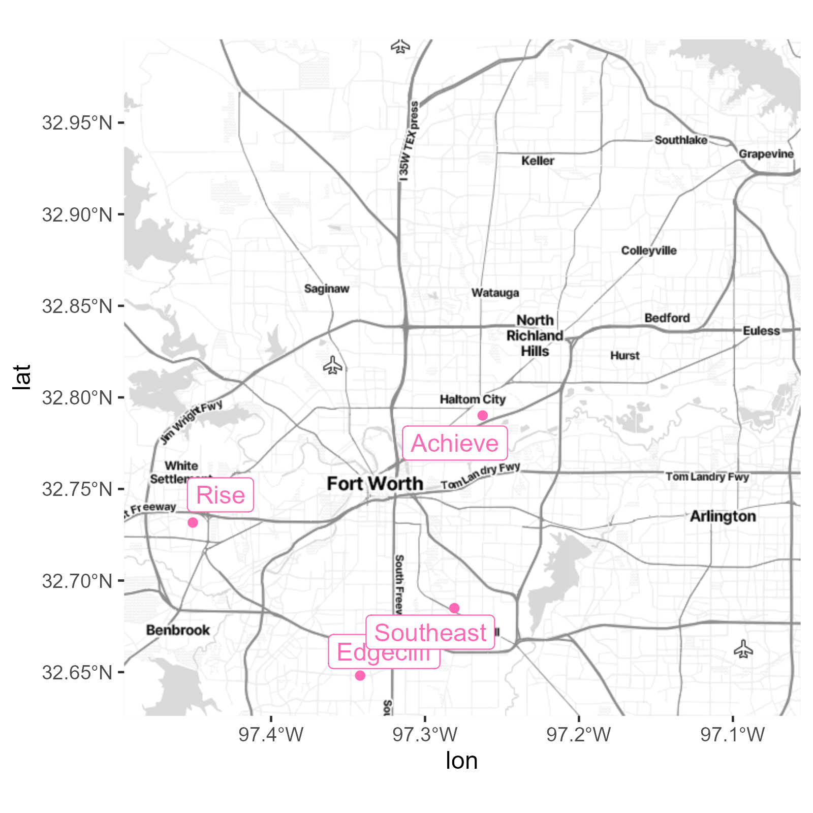{width="600"}

### Getting drive times

We are often interested in getting an **isochrone**, or a radius around a geographic feature with respect to time. Isochrones can be useful for identifying what communities are within a 10- or 15-minute drive-time of a school. This calculation requires the MapBox API, which requires an API key.

```{r get_isochrone, eval=FALSE}
# install.packages("mapboxapi")
library(mapboxapi)

drive_10min <- mb_isochrone(
    taco_schools_sf,
    profile = "driving", # can also get walking distances
    time = 10
  )


# this step removes the simple features metadata from a data frame
schools_drive_10min_sf <- drive_10min %>%
  bind_cols(as_tibble(taco_schools_sf) %>%
              select(-geometry))


base_stamen_map %>% 
  ggmap() +
  
  geom_sf(
    data = schools_drive_10min_sf,
    aes(
      color = school_short_name,
      fill = school_short_name
    ),
    alpha = .2,
    inherit.aes = FALSE
  ) +
  
  geom_sf(
    data = taco_schools_sf,
    aes(color = school_short_name),
    inherit.aes = FALSE
  ) +
  
  ggsflabel::geom_sf_label_repel(
    data = taco_schools_sf,
    aes(
      label = school_short_name, 
      color = school_short_name
    ),
    inherit.aes = FALSE
  ) +
  guides(fill = "none", color = "none")

```

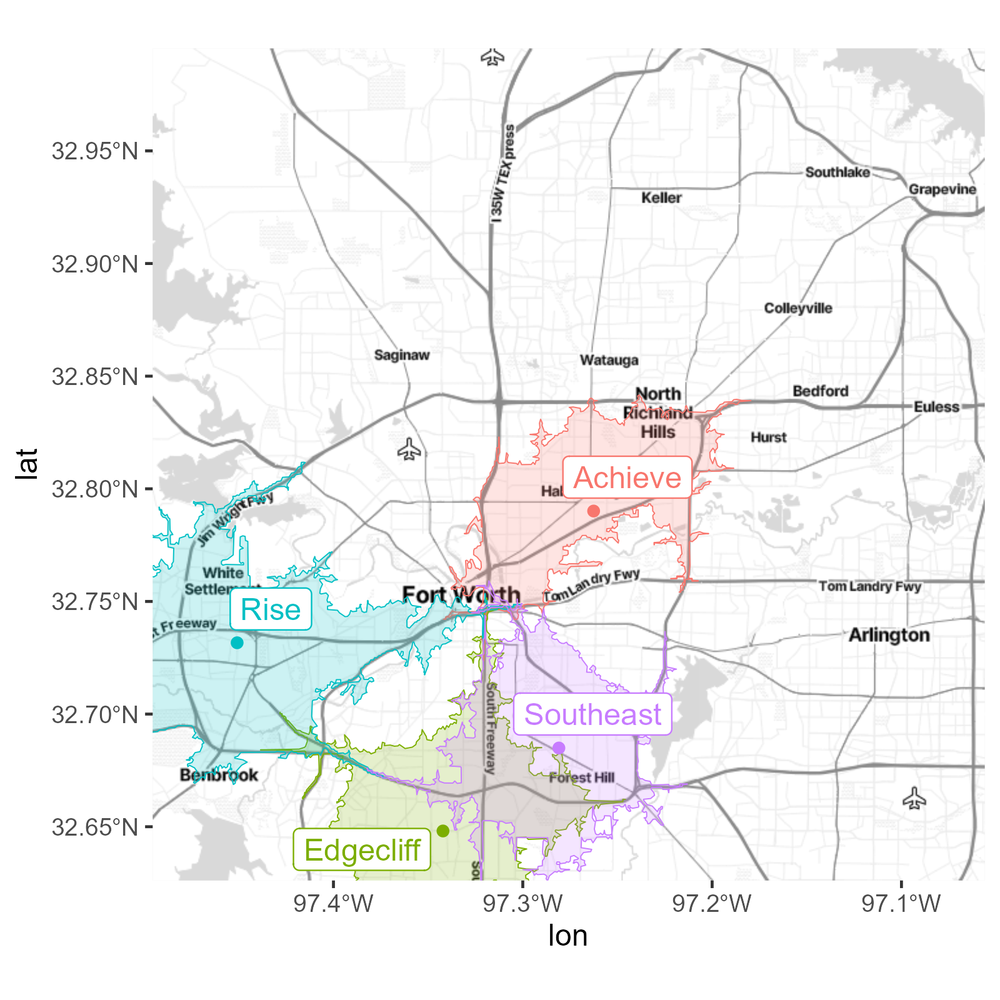{width="600"}

### Spatial joins

Using a **spatial join** is somewhat different than joining data frames. There are many types of *spatial predicates*, or join type, for spatial data, including:

- equals
- disjoint
- contains
- intersects
- within
- and more, which can be found in the [sf documentation for predicates](https://r-spatial.github.io/sf/reference/geos_binary_pred.html).

Spatial joins operate on the `geometry` column and check the relationship of the shapes (`POINT`, `POLYGON`, `LINE`, etc.) in the data frames with the spatial predicate.

Suppose we have a data frame describing the locations of each school as a `POINT`, and a second data frame describing the drive time radius around each school as a `POLYGON`. We might want to check if there are other schools located in a certain school's drive time radius. Spatially, we are using an intersecting join to check if certain points fall inside a polygon.

```{r geofiltering, eval=FALSE}
sf_use_s2(FALSE)

# use spatial joins with two sf objects
taco_area_of_max_intersection <- schools_drive_10min_sf %>% # contains POLYGON geometry
  filter(school_short_name == "Edgecliff") %>% 
  
  # we can use st_intersection to check if the school locations are inside the drive time
  st_intersection(schools_drive_10min_sf %>% 
                    filter(school_short_name == "Southeast")) # contains POINT geometry


base_stamen_map %>% 
  ggmap() +
  geom_sf(
    data = taco_area_of_max_intersection, 
    color = "goldenrod",
    fill = "goldenrod",
    alpha = .2,
    inherit.aes = FALSE
  ) +
  
  geom_sf(
    data = taco_schools_sf, 
    aes(color = school_short_name), 
    inherit.aes = FALSE
  ) +
  
  ggsflabel::geom_sf_label_repel(
    data = taco_schools_sf,
    aes(
      label = school_short_name, 
      color = school_short_name
    ),
    inherit.aes = FALSE
  ) +
  guides(fill = "none", color = "none")

```

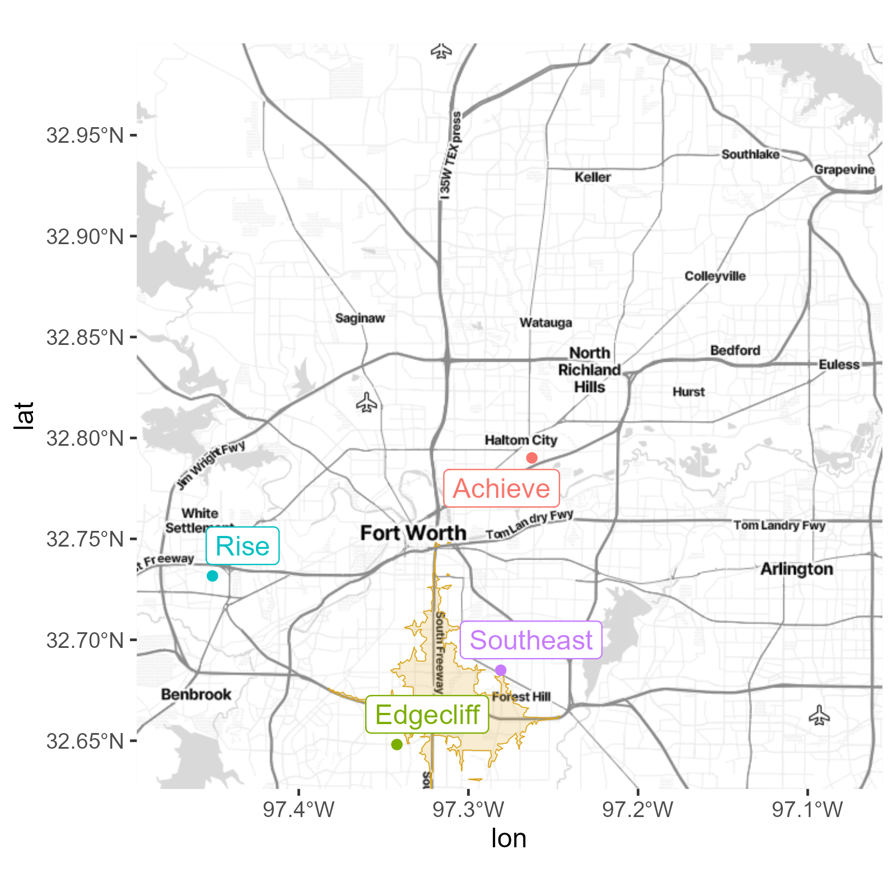{width="600"}

And what schools are found in this area of overlapping isochrones? We can use `st_filter()` with an `st_within` join to help us identify points inside of a polygon.

```{r schools_in_overlap, eval=FALSE}
schools_in_overlap <- taco_schools_sf %>%
  st_filter(
    taco_area_of_max_intersection, 
    join = st_within
  )

schools_in_overlap
```

It may look like Edgecliff is within the 10-minute drive time overlap area, but in truth it is just outside of the boundary.

## Census Data

Kyle Walker has written the exceptional `[tidycensus](https://walker-data.com/tidycensus/)`package, with fantastic documentation, which allows you to pull US Census data sources (including the Decennial Census and the yearly American Community Survey).

Let's load some Census data. We'll need a Census API key first to gain access.

```{r setup_tidycensus}
# install.packages('tidycensus')
library(tidycensus)

# NEt command saves Census API key to your .Renviron file
# census_api_key("YOUR API KEY GOES HERE")
# census_api_key(Sys.getenv("CENSUS_API_KEY"))
```

##### Getting Basic Data

There are two major functions implemented in tidycensus:

-   `get_decennial()`, which grants access to the 2000, 2010, and 2020 decennial US Census APIs, and
-   `get_acs()`, which grants access to the 1-year and 5-year American Community Survey APIs.

Let's get *median age by state* in 2010:

```{r get_decennial}
age10 <- get_decennial(geography = "state", 
                       variables = "P013001", 
                       year = 2010)

age10 %>%
  slice_head(n = 5) %>%
  knitr::kable()
```

Census data is structured to make usual tasks, like cleaning and plotting, work in the ways you expect using the tidyverse. For example, we can plot the median age by state using ggplot:

```{r plot_decennial_data, eval=FALSE}
age10 %>%
  ggplot(
    aes(
      x = value, 
      y = reorder(NAME, value)
    )
  ) + 
  geom_point() +
  labs(
    x = "Median Age",
    y = "State",
    title = "Median Age by State"
  )
```

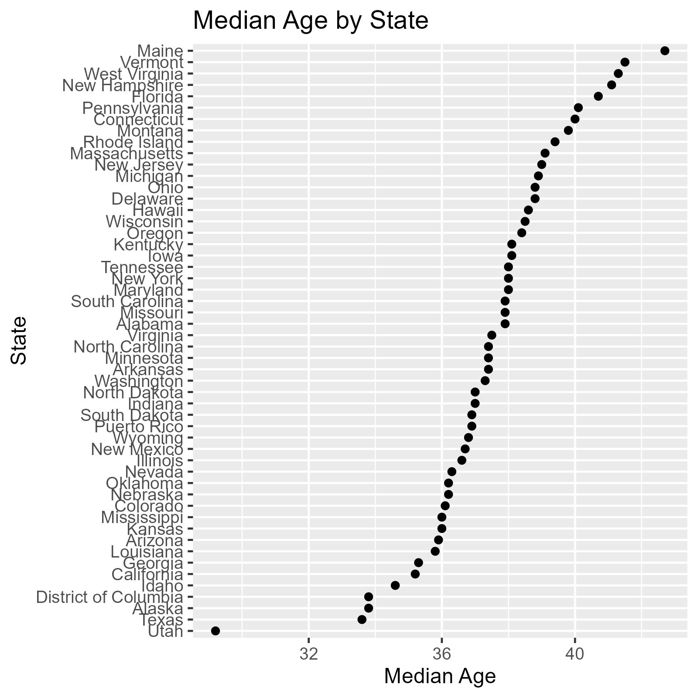{width="600"}

##### Searching for variables

How, pray tell, does one know that `P013001` is the variable for median age? Getting variables from the Census or ACS requires knowing the variable ID - and there are thousands of these IDs across the different Census files. To rapidly search for variables, use the `load_variables()` function. There are [more details on in the package's documentation page](https://walker-data.com/tidycensus/articles/basic-usage.html#searching-for-variables).

To browse these variables, assign the result of `load_variables()` to a variable and use the `View()` function in RStudio. An optional argument `cache = TRUE` will cache the dataset on your computer for future use.

```{r view_vars, eval=FALSE}
v_2020 <- load_variables(2020, "acs5", cache = TRUE)

# View(v_2020)
```

Let's get estimates for how many school-aged children live in Tarrant County, TX. To do this, we will use the `get_acs()` function, which requires:

- `geography`: the statistical geographic unit used by the Census [(a brief overview is provided by ESRI)](https://learn.arcgis.com/en/related-concepts/united-states-census-geography.htm)
- `variables`: the variable code/ID, which can be optionally renamed
- `state`: two-letter postal codes are accepted
- `county`: to avoid ambiguity in the API, type out the full county or parish name (e.g. "Tarrant County", not "Tarrant")
- `year`: the ACS survey-year requested
- `geometry`: TRUE will pull the appropriate geometry from the `tigris` package and return an sf object

Because I looked up the appropriate variable names in the `load_variables()` function, I know that the appropriate table is `B01001`, and I will choose the correct variables. I want this data at the smallest geographic unit, so I will choose "block group" for the geography, and I need data as of 2020. Because I eventually would like to map this data, I will choose to include the `geometry` column to have an sf data frame.

```{r get_acs, eval=FALSE}
tarr <- get_acs(
    geography = "block group", 
    variables = c(
      # variable codes (e.g. "B01001_001") are mandatory
      # renaming is optional
      # ex. "B01001_001", "B01001_004" are acceptable arguments
      
      "Total" = "B01001_001",
      "Male, 5 to 9 years" = "B01001_004",
      "Male, 10 to 14 years" = "B01001_005",
      "Male, 15 to 17 years" = "B01001_006", 
      "Female, 5 to 9 years" = "B01001_028",
      "Female, 10 to 14 years" = "B01001_029",
      "Female, 15 to 17 years" = "B01001_030"
    ),
    state = "TX", 
    county = "Tarrant County",
    year = 2020,
    geometry = TRUE, 
  )
```

## Plotting geographic data

Spatial data can broadly be represented as discrete processes, aggregations, or continuous processes.

You can use point pattern analysis when data merely locate the longitude and latitude of a variable. For example, we could plot where every school-aged child lives in Tarrant County. Areal data are aggregate data that describe a geographic *area* or *region*. The *total* number of school-aged children living in Tarrant County, Dallas County, or other surrounding counties is an example of areal data. Continuous processes map a point to a *value* - in this case, it could be the age of a single child at a given point. We could also add time as a variable and make the data spatiotemporal.

Specific resources on **modeling** these types of data can be found in [An Introduction to Spatial Data Analysis and Statistics](https://paezha.github.io/spatial-analysis-r/).

For **mapping** geographic data, we also have different methods depending on the type of spatial data used.

### Chloropleth

A **chloropleth** is a type of plot used for areal data that takes on different colors, depending on the data. Let's sum up all school aged children (5-17 year old boy and girls) by block group:

```{r chloropleth, warning=FALSE, message=FALSE, echo=TRUE, eval=FALSE}
library(viridis)

# aggregate school-aged children by block group
# remove "Total" category
tarr_school_aged <- tarr %>% 
  filter(variable != "Total") %>%
  
  # when summarizing multiple Census variables in a single Census location,
  # group by the GEOID, which is a unique identifier for a Census geography
  group_by(GEOID, NAME) %>% 
  
  # best practice - keep the estimate AND margin of error columns
  summarise(
    estimate = sum(estimate),
    moe = moe_sum(moe, estimate = .9) # recomputes the grouped margin of error at 90%
  )


base_stamen_map %>% 
  ggmap() +
  
  geom_sf(
    data = tarr_school_aged, 
    aes(fill = estimate), 
    inherit.aes = FALSE, 
    alpha = .82, 
    color = NA
  ) +
  
  # shades the isochrone intersection
  geom_sf(
    data = taco_area_of_max_intersection, 
    color = "goldenrod",
    fill = NA,
    alpha = .2,
    inherit.aes = FALSE
  ) +
  geom_sf(
    data = taco_schools_sf, 
    inherit.aes = FALSE, 
    color = "green"
  ) +
  theme_void() +
  
  scale_fill_viridis(option = "magma")
```

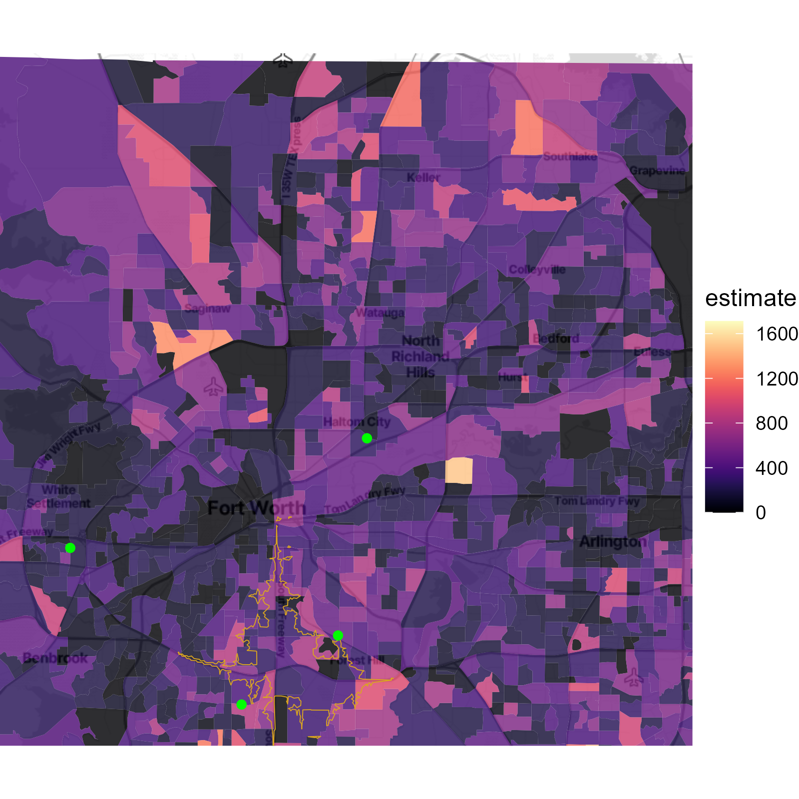{width="600"}

From this map, we can use color to identify which block groups have high densities of school-aged children and which do not.

### Dot-density

Areal representation of data suffer from a few problems. One problem is that geographically large areas draw the eye and can often over-emphasize those areas versus smaller geographies. This distortion is familiar to those who follow elections, where geographically large states with small populations, like Wyoming, loom larger than geographically small, but densely populated states, like Delaware (Wyoming has 1/2 the population of Delaware, but 42x the land mass). This distortion occurs with Census geographies because blocks, block groups, and tracts are created to have roughly equal populations (e.g., Census tracts generally have a population size between 1,200 and 8,000 people, with an optimum size of 4,000 people); these geographies are consequently larger in rural places than in urban centers.

A second issue is that it's very hard to show heterogeneity in spatial distributions. The plot above shows estimates of the count of all children aged 5-17 years in each tract. But, we may be interested in how differently distributed those students are.

A method to remedy both issues is to use **dot-density** plots which simply plot a sample of points within each geography for each group (often down sampled where each dot represents some number of people (e.g., 20 or 100 persons per dot). It's pretty straightforward to get what you need by using [`tidycensus::as_dot_density()`](https://walker-data.com/tidycensus/reference/as_dot_density.html)

```{r dot_density_df, warning=FALSE, eval=FALSE}
# library(terra) # as_dot_density() requires the {terra} package

# this table will be used to combine the male and female groups for estimating
acs_ages <- dplyr::tribble(
  ~ acs_var,     ~ variable,                ~ age_range,   ~ gender,
  "B01001_001",  "Total",                   "All",         "All",
  
  # male
  "B01001_004",  "Male, 5 to 9 years",      "5-9",         "Male",
  "B01001_005",  "Male, 10 to 14 years",    "10-14",       "Male",
  "B01001_006",  "Male, 15 to 17 years",    "15-17",       "Male",
  
  # female
  "B01001_028",  "Female, 5 to 9 years",    "5-9",         "Female",
  "B01001_029",  "Female, 10 to 14 years",  "10-14",       "Female",
  "B01001_030",  "Female, 15 to 17 years",  "15-17",       "Female"
)

# gets the estimated number of children per age group per block group
sf_tarrant_children <- tarr %>% 
  inner_join(acs_ages, by = "variable") %>% 
  filter(gender != "All") %>% 
  select(-acs_var, -gender) %>% 
  
  # this will count the number of boys and girls into one group
  group_by(GEOID, NAME, age_range) %>% 
  summarize(estimate = sum(estimate),
            moe = moe_sum(moe, estimate = 0.9))


# converts to a dot density
sf_tarrant_children_dots <- sf_tarrant_children %>% 
  as_dot_density(
    value = "estimate", # use the summary column to determine number of dots
    values_per_dot = 20,  # specify the dot-to-value ratio
    group = "age_range"   # specify how dots should be categorized (if needed)
  ) 
```

Note that `as_dot_density()` will convert an areal value (the count of children), represented in a `POLYGON`, into a value represented by a `POINT`. Once we have our data prepped as a dot density, then we are ready to plot the data.

```{r dot_density_map, eval=FALSE}
base_stamen_map %>% 
  ggmap() +
  
  # plot dot density
  geom_sf(
    data = sf_tarrant_children_dots %>%
      mutate(age_range = fct_relevel(age_range, 
                                     "5-9", "10-14", "15-17")),
    aes(color = age_range),
    inherit.aes = FALSE,
    alpha  = .25,
    size = .25
  ) +
  
  # plot spatial intersection of drive times
  geom_sf(
    data = taco_area_of_max_intersection, 
    color = "goldenrod",
    fill = "goldenrod",
    alpha = .2,
    inherit.aes = FALSE
  ) +
  
  # plot school locations
  geom_sf(
    data = taco_schools_sf,
    inherit.aes = FALSE,
    color = "hotpink",
    size = 2
  ) +
  
  # use more options to move labels out of the way
  ggsflabel::geom_sf_label_repel(
    data = taco_schools_sf,
    aes(label = school_short_name),
    color = idea_colors$coolgray,
    
    # use nudge values to align all labels to one side of the map
    direction = "y",
    nudge_x = -97.1 - st_coordinates(taco_schools_sf)[,"X"], # uses right edge of bbox
    nudge_y = 0.02,
    size = 3,
    inherit.aes = FALSE
  ) +
  
  facet_wrap(~ age_range) +
  theme_void() +
  
  scale_color_viridis(option = "viridis", discrete = TRUE) +
  guides(color = "none")
```

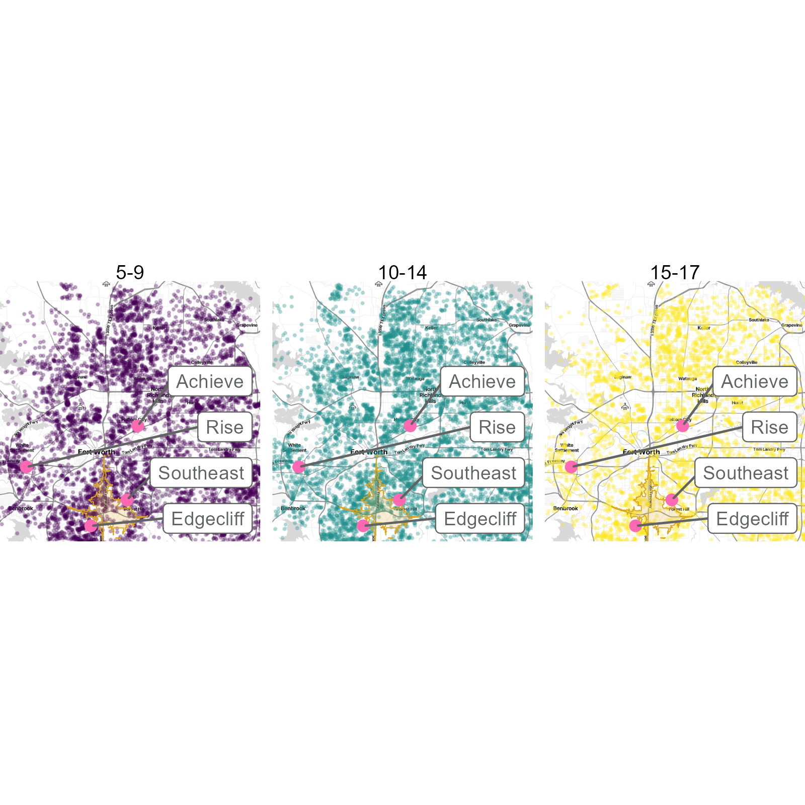{width="600"}

Dot densities can be particularly useful when the variables are faceted, so differences in distributions can be seen.

## GIS-Based MCDA

Suitability analyses can be used in a variety of contexts such as choosing the best candidate, car, or phone. Additionally, it can be used with a Geographic Information System (GIS) where land suitability is assessed. This land suitability analysis could be conducted for a variety of reasons such as identifying good locations for a park, landfill, or school.

When making decisions regarding the suitability of a piece of land for a particular purpose, multiple criteria are considered thus a multi-criteria decision analysis (MCDA) is conducted. This is the focus of this section, GIS-based MCDA. Three different methods will be covered, the simple and weighted linear combination and the analytical hierarchy process. 

### Simple and Weighted Linear Combination

The simple and weighted linear combination methods are two MCDAs. In the simple linear combination method, all criteria are equally weighted while the weighted linear combination method allows for criteria to be weighted according to importance.

If one were interested in locating suitable sites for a landfill (as an example), criteria would be identified and then rasters created. Each cell of those rasters is considered a potential alternative site for the landfill and a score is assigned to it. Raster algebra is used to compute the combination scores and then a threshold is set to distinguish between cells that are and are not suitable for a landfill site.

Assume that three criteria are being used for a landfill land suitability analysis: *Distance to Schools* (farther is better), *Slope* (flatter is better), and *Distance to Population Centers* (decently far away, but not too far). The first step for these linear combination methods is to create a raster for each of the criteria (school_raster, slope_raster, and pop_center_raster) where each cell is assessed with respect to that raster’s criteria. Once that is complete, combine linearly with either equal (simple linear combination method) or unequal (weighted linear combination method) weights and compare to a threshold value. Below is sample R code to accomplish this.

```{r linear_combos, eval = FALSE}
layer_stack <- c(school_raster, 
                 slope_raster,
                 pop_center_raster)

# linear combo, equal weights ----

equal_combo_raster <- layer_stack[[1]] + 
  layer_stack[[2]] + 
  layer_stack[[3]]

(equal_combo_raster > your_threshold) %>% 
  plot(type = "classes", 
       axes = F, 
       main = "Simple Linear Combination")

# linear combo, weighted ----

# note that weights have been arbitrarily assigned here
weighted_combo_raster <-  layer_stack[[1]]* 0.40 + 
  layer_stack[[2]]* 0.35 + 
  layer_stack[[3]] * 0.25

(weighted_combo_raster > your_threshold) %>% 
  plot(type = "classes", 
       axes = F, 
       main = "Weighted Linear Combination")
```

### Analytical Hierarchy Process

The analytical hierarchy process (AHP) was developed by Thomas Saaty in the 1970s and can be used as a Geographic Information System (GIS) multi-criteria decision analysis (MCDA) method. The AHP creates a set of weights that can then be used in the weighted linear combination (WLC) method or, as an example, in conjunction with Ordered Weighted Averaging (OWA). Here, the step-by-step process of the AHP method will be presented, both by hand and in R. 

#### Context
The number of uses for suitability analyses is vast. Some examples are identifying locations for new restaurants, parks, and retail sites; identifying the best candidate for a job; and choosing the best car for an individual. In this example, the goal is to identify the best location for a new landfill.

#### AHP Steps
The general steps to perform the AHP are:\
•	Identify the criteria\
•	Create the hierarchical structure\
•	Make pairwise comparisons and create matrix\
•	Check the consistency of the matrix\
•	Compute the criteria weights\

#### Identify the Criteria
Three arbitrary+ criteria will be used:\
•	Distance to schools\
•	Slope\
•	Distance to population centers\
+Please note that this is an *example* based on [this sample land suitability analysis](https://nkaza.github.io/post/land-suitabilty-with-ahp-wlc). Other criteria could be utilized to identify appropriate locations for a landfill.

#### Create the Hierarchical Structure
The AHP hierarchy includes, at a minimum, three levels: the goal, criteria, and alternatives. The alternatives could be the candidates or cars of interest (see examples in the Context section above). In the case where raster data is being used, the alternatives are every cell in the raster data.

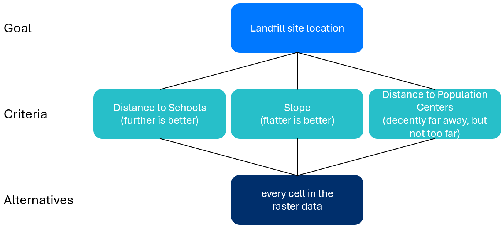{width="500"}

#### Make Pairwise Comparisons and Create Matrix
The nodes at each level must be compared two-by-two in relation to their contribution to the node above. These values will then be entered into a matrix which will be used to compute the criteria weights.

The AHP fundamental scale (see below) is used when making these pairwise comparisons.

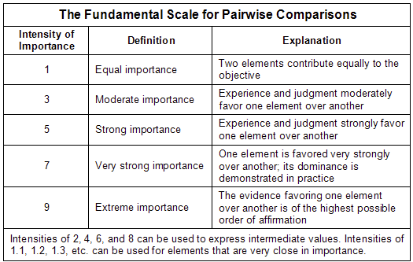{width="400"}\

For each pairwise comparison, a 1 is assigned to the weaker criteria (with respect to the node above). Then, the other criteria is assigned a value based on the AHP fundamental scale.

To begin, *Distance to Schools* and *Slope* were compared. The individual or group tasked with making these pairwise comparisons believes that the *Distance to Schools* is the stronger criteria with respect to the location of a landfill. As such, a 1 is assigned to *Slope* for that pairwise comparison. The individual or group believes that a landfill further away from a school site is strongly favored over the area being flatter. Thus, a value of 5 is assigned to *Distance to Schools* for this pairwise comparison.

This method continues through all pairwise comparisons and the results are as follows:

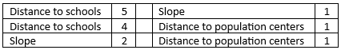{width="400"}\

The results can now be transferred to a matrix. 

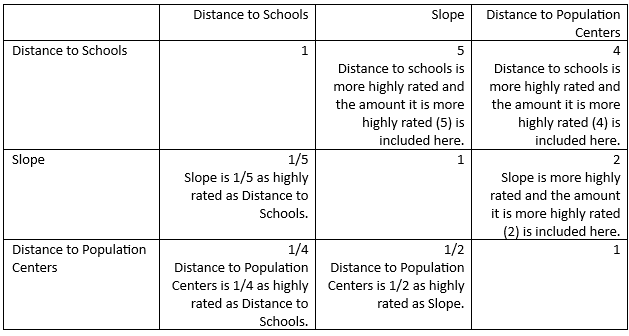{width="500"}\

To accomplish this in R, the following code can be used:
```{r AHP_matrix, eval = FALSE}
# create a 3x3 matrix with all 1s
AHP_matrix <- matrix(1,
                     nrow = 3, 
                     ncol = 3)
#       [,1] [,2] [,3]
# [1,]    1    1    1
# [2,]    1    1    1
# [3,]    1    1    1

# name the rows and columns
row.names(AHP_matrix) <- 
  colnames(AHP_matrix) <- 
  c('Distance to Schools', 
    'Slope', 
    'Distance to Population Centers')
#                                   Distance to Schools Slope Distance to Population Centers
# Distance to Schools                 1                   1       1
# Slope                               1                   1       1
# Distance to Population Centers      1                   1       1

# add the rankings to the upper triangle
AHP_matrix[upper.tri(AHP_matrix)] <- c(5,4,2)
#                                   Distance to Schools Slope Distance to Population Centers
# Distance to Schools                 1                   5       4
# Slope                               1                   1       2
# Distance to Population Centers      1                   1       1

# put the reciprocal in the lower triangle of the matrix
for(i in 1:dim(AHP_matrix)[1]){
  for(j in i:dim(AHP_matrix)[2])
    AHP_matrix[j,i] = 1/AHP_matrix[i,j]
}
#                                   Distance to Schools Slope Distance to Population Centers
# Distance to Schools                 1.00              5.0       4
# Slope                               0.20              1.0       2
# Distance to Population Centers      0.25              0.5       1
```

#### Check the Consistency of the Matrix
The AHP matrix must be consistent. To measure this, the Consistency Ratio (CR) is computed by dividing the Consistency Index (CI) by the Random Consistency Index (RCI) (Saaty, 1980). 

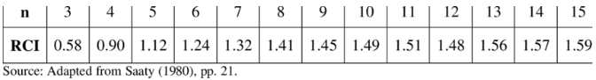{width="500"}\

If the CR < 0.10 then the AHP matrix is considered consistent. Once that consistency is confirmed, the criteria weights can be computed.

The CI is computed

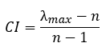{width="100"}\

where λmax = largest eigenvalue of the matrix and *n* = the number of criteria.

In R,
```{r CI, eval = FALSE}
CI <- (Mod(eigen(AHP_matrix)$values[1]) - 3)/ 2
# [1] 0.04700755

# RCI for n = 3 is 0.58
CR <- CI / 0.58 
# [1] 0.08104751
```

The value of the CR is less than 0.10 so the AHP matrix is considered consistent in this example.

#### Compute the Criteria Weights
The final step of the AHP is to compute the criteria weights. These weights are computed by normalizing the largest eigenvector of the matrix. To do this, each value in the largest eigenvector is divided by the sum of the values in that vector.

In R,
```{r criteria_weights, eval = FALSE}
# compute criteria weights by normalizing the largest eigenvector 
weights <- eigen(AHP_matrix, symmetric = F)$vectors[,1] / sum(eigen(AHP_matrix, symmetric = F)$vectors[,1])
# [1] 0.6869815+0i 0.1864755+0i 0.1265431+0i
```

The results show that the *Distance to Schools* is the highest weighted criteria followed by *Slope* and *Distance to Population Centers*. Now that the criteria weights are computed, they can be used in the WLC method or, as an example, in conjunction with OWA.

