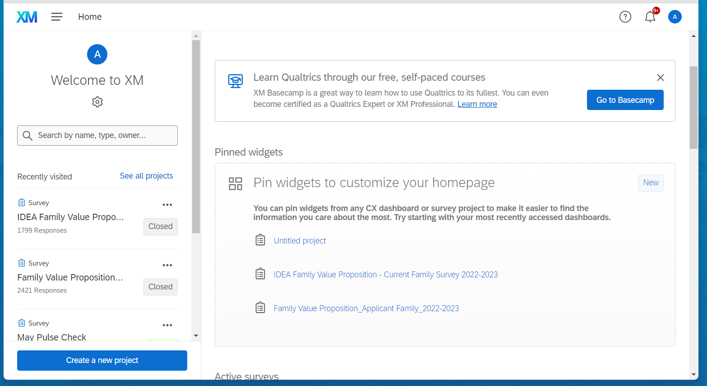

# Survey Platforms

This section of the R&A Manual concerns details on the various software platforms we use: general purpose of the software, some steps for using the software, and useful links for learning more about it.

## Qualtrics

Qualtrics is a survey and data collection platform. It allows for survey building, distribution of links via email or text, response analysis, and reporting. A particularly useful feature of Qualtrics is the ability to upload a list of email addresses with information associated with each email address and then send a personalized survey link to each email address selected from the list. For example, in surveying district teachers one may want their responses disaggregated by race/ethnicity, school of employment, and grade level. This information can be linked to each teacher’s email address and uploaded into Qualtrics prior to surveying the teachers. As data is collected, each response will have the uploaded pieces of information associated to it.

The following sessions outline how to create a survey, upload a list of email addresses to survey, and create a basic live report for your survey. 

### Creating a New Survey

You can start a new survey from a blank survey form or by copying and modifying an existing survey. Either way, when you log into Qualtrics, you will have an option for what you want to do next. Assuming you have a user license, to log into Qualtrics go to IDEAps.Qualtrics.com and select the single sign-on (SSO) option. Any projects that you have created or that have been shared with you will be listed on the left side of the window and right below this list you will find a button for creating a new survey.

{width="500"}
 
On the next page, you will have the option to create a project as a survey. Select that option and press get started.
On the next page, you will name your survey and will be allowed to start a survey from a blank project, copy a survey from an existing project, or use a survey previously stored in your library. If you are starting from a blank project, the next sections in this manual discuss types of items and next steps in building your survey.


### Item Types

More to come

### Survey Flow

More to come

#### Survey Logic

More to come

#### Survey Blocks

More to Come

### Survey Participant lists

More to come

#### Embeded Data

More to come

### Live Summary Reports

More to come

### Advanced Reports

In Qualtrics, you can create an advanced report found under the 'Reports' tab. The Reports tool allows you to create static or live reports from a blank form or by copying and modifying an existing report.  

You are able to customize reports based on your survey. Visualizations include charts (i.e.,  bar, line, pie, breakdown), tables (i.e., data, statistics, results), and heat maps. 

Using the breakdown visualization, you can breakdown items by certain demographics and apply a Display Logic (which displays the data presented in the visual if certain criteria are met). However, it is important to keep in mind that Display Logic applies to the total count (N) and is not specific to Breakout Groups count (n). 

### Exporting Survey Data

#### Export survey data to file

Survey data can be exported as various file types (.csv, .xlsx, among others). To do so, go to the **Data & Analysis** tab, and click on **Export & Import**. There, you can select a file type to download the data.

::: {.gotcha}
Note that there are 3 lines of header in the .csv export - a variable name, a title, and an ImportId (html tags). If you attempt to import this .csv export into R using readr::read_csv(), you will encounter errors. Instead, use the `qualtRics` package (next section).
:::

#### Read survey data into R

You can directly read survey data and metadata into R. To get your Qualtrics data, you need the `qualtRics` package (notice the capital R).

The following are one-time steps you'll need to establish a connection between R and the Qualtrics API:

1. **Obtain an API key from Qualtrics.** Click on your Account button (upper-right corner), and choose Account Settings. Then, if you are on the new version of Account Settings, click on Generate Token. Copy the token.
2. **Determine the base URL from Qualtrics.** In the same Account Settings page, a *Datacenter ID* should already be active. You will also use this unique ID when installing your credentials.
3. **Install your API credentials in your .Renviron file.** In your R session, use the following code to install your credentials.

```{r install_qualtrics_api_key, eval=FALSE}
# install.packages("qualtRics")
library(qualtRics)

qualtrics_api_credentials(api_key = "paste-your-api-key",
                          base_url = "base_url.qualtrics.com",
                          install = TRUE)
```

Once you have completed these steps, you can now simply load the `qualtRics` library and start importing your survey data.

```{r fetch_survey_qualtrics, eval=FALSE}
all_my_surveys <- all_surveys() # get survey IDs and names for surveys you can access

# copy the survey ID you need
my_specific_survey <- fetch_survey(surveyID = "paste-survey-id") # gets survey in tidy format
my_survey_questions <- survey_questions("paste-survey-id") # gets names of survey questions (but not each part)
my_metadata <- metadata("paste-survey-id") # gets list of metadata
```

However, if you need to import your survey directly from an exported .csv file from Qualtrics, then the `qualtRics` package provides a special function for that export. The `read_survey()` function will automatically handle the three lines of header by removing the html tags and using the title as a label for each variable.

```{r read_csv_survey, eval=FALSE}
csv_survey <- read_survey("file-path.csv") # only use to read a Qualtrics .csv export
```

### Where Can You Learn More?

Links to be added
