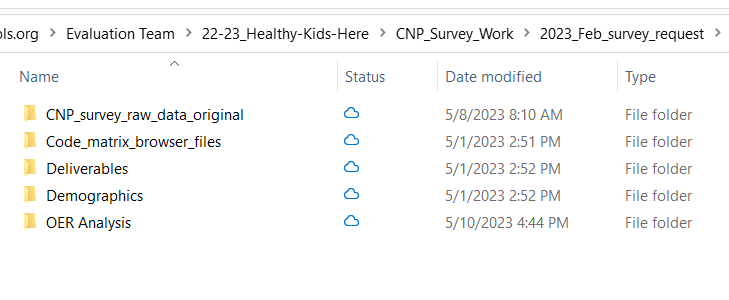

--- 
title: "IDEA R&A Manual"
author: "Chris Haid, Edison Coronado, Mishan Jensen, Maura Carter, Steven Macapagal, Aline Orr, Ilissa Madrigal, Marlena Coco"
date: "`r Sys.Date()`"
site: bookdown::bookdown_site
documentclass: book
bibliography: [book.bib, packages.bib]
url: https://idea-analytics.github.io/r_and_a_manual/
cover-image: 
description: |
  This is IDEA Public Schools' Research & Analysis Team's ever evolving encyclopedia of resources and best practices.
biblio-style: apalike
csl: chicago-fullnote-bibliography.csl
---

# A little about this manual {#about}

Placeholder


## What goes in this manual?
## How do you contribute to this book?
### Adding "Tips" and other callouts

<!--chapter:end:index.Rmd-->


# Contributors {#who}

Placeholder


## About Research and Analysis
## Who we are
### Edison Coronado
### Chris Haid 
### Mishan Jensen, PhD
### Steven Macapagal
### Maura Carter
### Aline Orr, PhD
### Ilissa Madrigal
### Marlena Coco, PhD
## What we've contributed

<!--chapter:end:02-Who_We_Are.Rmd-->


# The Data Warehouse and how to access it

Placeholder


## The Data Warehouse
### Core data warehouse server configuration
#### SRC Servers
#### PROD Servers
#### RS and Hisotrical data Servers
### Server, Table, and Field Lookup
## Accessing the data warehouse from R
### Installation
### Example
#### What if I am pulling down lots of data (say, millions of rows)?
### Finding things in the data warehouse
### Where to learn more

<!--chapter:end:03-Data_Warehouse.Rmd-->


# Key Tables, Measures, and Metrics

Placeholder


## The Students Table
### Common queries
## Schools and regions
### Schools table
### Regions table
## Student Attendance
### Common queries
### Other uses
## Student Persistence
### Student Persistence using Attendance Tables (A.K.A. Cohort Persistence)
## College Application & Matriculation Metrics
## Lottery Data
## Critical Student Intervention (CSI) Identification {#csi}
## Assessment Data
### State of Texas Assessments of Academic Readiness (STAAR)
### District assessments
#### Illuminate data
##### Naming conventions
##### IABWA
##### IABWAItems
#### Other sources
### DIBELS
### Renaissance STAR (also RenStar, Little Star)
#### Where to get RenStar data?
### AP
### IB
#### Coursework and scoring
#### Data
#### Useful queries
### ACT
### LEAP
#### Student level LEAP
## Student Course Grades
## Teacher, Staff, and Hiring Data
### Tyler Munis data
### Teach Boost Data
#### Forms
#### Users
#### Templates
### Compass data
#### Key Tables
### Jobvite Data
### TCP/Teacher Export Data
#### Data Matching
#### Join Tables
#### APR Report for June 2022 
##### Promotions
###### Teacher Promotions
###### Teacher-Leader Promotions
#### TCP Retention and TCP Levels
##### Missing TCP Placements
##### Leaver Rates
##### Exit Surveys for Teacher Leavers
#### TCP Levels and Composite Score Correlations

<!--chapter:end:04-Tables-Measures-and-Metrics.Rmd-->


# Projects

Placeholder


## Version control with Github {#section-github}
### Getting Started with Git, Github, and RStudio
#### First steps {#first-steps}
### Feature Branch Worklow
### Example worflow with this manual, or getting your feet wet
#### Get the [R_and_A\_Manual](https://github.com/idea-analytics/r_and_a_manual/) repository URL
#### Clone the repo {.tabset}
##### Comand line
##### RStudio
#### Checkout a branch
##### Command line
##### RStudio
#### Making changes and saving them
#### Command line
#### Maintaining large files
##### Large file storage (LFS)
##### Using `.gitignore`
#### RStudio
#### Merging changes.
## Project Process
### Wrike
#### Onboarding and setup
#### Goal setting and deadlines
#### Defining tasks and dependencies
#### Documenting and evaluating progress towards goal
### GRPI and RASI
### Project operating mechanisms
## ProjectTemplate (for analyses) {#section-ProjectTemplate}
### Installing ProjectTemplate
### Creating a project with ProjectTemplate
### What goes where
## The `renv` package: Ensuring reproducibility
### Setting up `renv` with a new project
### Setting up `renv` with an existing project
### Using `renv`
### Collaborating with `renv`
### `renv` and RStudio Connect
## Publishing Projects
### RStudio Connect
### Power BI
### Team Site (TheHub)
#### Published Evaluation Plans

<!--chapter:end:05a-Projects.Rmd-->


# Specific Projects

Placeholder


## Store and Share
### R&A Private Group
## Other Specific Projects
### Teacher Hiring and TCP Project
#### Jobvite Data
#### Teacher Export Data
#### TCP Handbook
#### Teacher Interviews/Teacher Manager Interviews
### First Year Teacher Project
#### 3 Years of Data Used in Analysis
#### Project Transfered to Ann Heller
### Math Curriculum Redesign Project
### Team Value Proposition Project

<!--chapter:end:05b-Specific-Projects.Rmd-->


# Evaluation Projects

Placeholder


## Evaluation Plans 
### About Evaluation Plans
#### Evaluation Plan Guidelines
### Published Evaluation Plans
## Annual Evaluation Projects
### 21st Century Afterschool Program
### Camp Rio
### Charter School Program (CSP) Grants
#### CSP 2017 
#### CSP 2019 and 2020
##### CSP Schools
##### Evaluation Questions
##### CSP IDEA Model
###### CSP IDEA Model Components (v.1)
###### CSP Model v.1 Methods (Model Feedback and Validation)
### Teacher and School Leader Incentive Program (TSLIP)
#### Focus Group Interviews, Sampling, and Models
#### TSLIP Continuance/ Year 4 of the Grant
## Ad Hoc Evaluation Projects

<!--chapter:end:05c-Evaluation-Projects.Rmd-->


# Coding Standards

Placeholder


## Language R
### Projects
### Variables 
### Functions
### dplyr
## Language SQL 
### Hard bracket encapsulation
### Variables
### Joins

<!--chapter:end:06-Code-Standards.Rmd-->


# Visualization Standards

Placeholder


## IDEA branding
### The `ideacolors` package
#### `ideacolors` themes and scales
### Color Blindness
### Race/Ethnicity Colors
### Grade Level colors
### Typography
## Visualizing hierarchical data

<!--chapter:end:07-Visual-Standards.Rmd-->

```{r include=FALSE, cache=FALSE}
# example R options set globally
options(width = 60)

# example chunk options set globally
knitr::opts_chunk$set(
  comment = "#>",
  collapse = TRUE
  )
```
# Models and Methods

Our research involves a wide variety of methods in statistics and data science to analyze problems and answer questions in educational data. In consultation with our stakeholders, we carefully select the most relevant approach(es) to provide an appropriate and accurate product.

We use methods in descriptive, inferential, and predictive statistics to understand information about our organization. The choice of frequentist vs. Bayesian methods is up to you and should always be justified, but choosing the simplest, appropriate tool should be the starting point for analysis But, before we start any analysis, the design of the program influences how we establish our methods of research.

## Research design

When our works requires us to assign causation, we must consider how the data were collected before deciding on an appropriate model.

### Causal inference

Most of our data is observational, so if we want to describe causal relationships in our data, we must appeal to potential outcomes. Thus, we will briefly cover some of relevant causal inference concepts and techniques.

When a student is marked for inclusion in, say, a tutorial group, we would like to see how much the tutorial increased their score on a test, compared to a scenario where the student did not attend the tutorial. If the student attends the tutorial, we can measure the outcome of the treatment (the tutorial) by seeing what grade they earned after a test; we cannot observe, however, the outcome of the control (no tutorial). Potential outcomes aims to remedy this.

#### Potential outcomes

Suppose we have both the treatment and control outcomes for each student. We would like to measure $\delta_i = Y^1_i - Y^0_i$, the difference in the treatment outcome $Y^1_i$ and control outcome $Y^0_i$ for student $i$. Then, our main estimators for the tutorial effect are $ATE, ATT$ and $ATU$, which are defined below:

-   $ATE = E[\delta_i]$ represents the **A**verage **T**reatment **E**ffect $E[\delta_i] = E[Y^1_i - Y^0_i]$. In other words, $ATE$ answers the question "What is the additional effect of the treatment?"

-   $ATT = E[\delta_i \mid \textrm{in treatment group}]$ represents the **A**verage **T**reatment effect of the **T**reatment group, $E[Y^1_i - Y^0_i \mid \textrm{in treatment group}]$. In other words, $ATT$ answers the question "What is the additional effect of the treatment for those in the treatment group?"

-   $ATU = E[\delta_i \mid \textrm{in control group}]$ represents the **A**verage **T**reatment effect of the **U**ntreated (control) group, $E[Y^1_i - Y^0_i \mid \textrm{in control group}]$. In other words, $ATU$ answers the question "What is the additional effect of the treatment for those in the control group?"

-   $ATE$ can be decomposed into a weighted average of $ATT, ATU$, such that $ATE = p\times ATT + (1-p)\times ATU$, where $p$ is the weight of the treatment group.

In our scenario,

-   $ATE$ represents the expected marginal effect of the tutorial group on test scores for all students,

-   $ATT$ represents the expected marginal effect of the tutorial group for students who participate in tutorials, and

-   $ATU$ represents the expected marginal effect of the tutorial group for students who do not participate in tutorials.

Estimates may be biased because we do not randomly assign students to tutorials - we select them for each group based on some criteria. Using randomization inference, we can separate assignment bias from the estimates of $ATT, ATU$ to find appropriate estimates and p-values on $ATE$.

#### Matching models

We can leverage large samples to find a potential outcome for a student by matching other students who are reasonably similar, using a specified distance measure. Thus, we can reasonably estimate $ATE$ since we have both the treatment and control outcomes.

By using the `matchit` package in R, we can specify covariates we would like to match in our data between the treatment and control groups.

```{r matchit_example, echo=TRUE, eval=FALSE}
#use matchit like a glm
m_out <- matchit(ActiveIL ~ Race + Gender + Grade +
                   SPED + LEP + EcoDis + GradeEquivalentBOY, #response specifies control/treatment, covariates specify what to match
                 data = rs_il_mod,
                 method = "cem", #specify matching method
                 link = "logit",
                 estimand = "ATT")

#produces data frame with needed weights
m_data <- match.data(m_out)

#model uses weighted linear model to estimate causal effect of using Imagine Learning
m_att <- lm_robust(GradeEquivalentGrowth ~ ActiveIL,
                   data = m_data,
                   weights = m_data$weights)

summary(m_att)

```

#### Regression discontinuity

#### Instrumental variables

#### Difference-in-differences

### Experimental design

Under ideal conditions, we would test the effect of a program by randomized controlled trials -- this usually does not happen. However, we can still use the tools of design to *structure* our data and variance appropriately.

#### Differences among distributions of groups

If we are comparing means from multiple groups, then we first need a procedure to compare all means together. Afterward, we might choose a post-hoc procedure to see which pairs of means are different.

The most common way of comparing multiple means is an ANOVA (analysis of variance). To perform an ANOVA:

1.  construct a linear model and save the object `lm_my_model <- lm()` (see linear modeling below)
2.  compare the variance among the groups using `aov(lm_my_model)`

Suppose we want to use SEL survey results to measure life satisfaction across multiple grade levels. To see if the average `LifeSatisfactionScore` differs at all between grade levels, then we can use the following code:

```{r anova_example, eval=FALSE}
# linear model, where grade level is treated as a factor, not numeric
lm_survey_results <- lm(LifeSatisfactionScore ~ as.factor(GradeLevelID))

# perform ANOVA
aov(lm_survey_results)
```

Then, if the ANOVA suggests the means are not all the same, then a post-hoc analysis can reveal *which* groups are different.

1.  Determine how many tests are being conducted.
2.  Use a Bonferonni correction (or other appropriate correction) to adjust p-values or $\alpha$-level.
3.  Choose an appropriate post-hoc test:

<!-- -->

a.  Tukey HSD - check all pairs of means to see which pairs are significantly different
b.  Dunnett - compare all means to a control
c.  Hsu - check which means are the "best", either the lowest or highest of the group

#### Differences among levels of variables

Educational data can often be described in a hierarchy:

-   Level 1: student
-   Level 2: student within a school
-   Level 3: student within a school within a region

A **mixed model** (also, **hierarchical** or **multilevel**) allows for both fixed and random effects, so this nesting will give us different variances at each level. This is ideal for modeling an outcome that can vary by school and regional differences - in other words, we can vary the slope and intercept by each school and region.

Code, diagnostics, communication and limitations coming soon...

## Descriptive statistics

When summarizing a distribution of data, we are usually tasked with describing (1) measures of center, such as counts and proportions for categorical data, or means and medians for quantitative data and then displaying those values for our stakeholders. To provide context and increase the statistical literacy of our team and family, we also describe the (2) spread, (3) shape, and (4) unusual features of the distribution.

### Numerical summaries - broad principles

For **categorical data**, consider the distribution of proportions and counts (the sample size) across the various categories. One-way and two-way frequency tables, with marginal and total proportions and counts, are useful for displaying the data.

For **univariate, quantitative data**, use the shape of the distribution to determine appropriate numerical measures. For symmetric data, the mean $\bar{x}$ `mean(x)` and standard deviation $s$ `sd(x)` can be appropriate for reporting and is accessible by a broad audience. For skewed data, consider the median $\tilde{x}$ `median(x)` (and possibly the MAD - median absolute deviation `mad(x)`), and provide context for choosing these measures. Note: The median is also a widely accessible statistic to most people, since it describes the midpoint of your distribution. Consider using it alongside the mean.

For **bivariate data**, use a scatterplot to determine if linear measures can be used appropriately. The Pearson correlation $r$ `cor(x, y)` can be easily understood by a wide audience to describe the linear strength of a bivariate association. However, the Spearman rank correlation `cor(x, y, method = "spearman")` can provide an associative measure for monotonic nonlinear associations, and Kendall's $\tau$ `cor(x, y, method = "kendall")` can describe concordance for ordinal data.

When describing **outliers** in a report, care should be taken when describing how we identify and use (or remove) the outliers from the data set.

::: tip
One heuristic for deciding what to do with an outlier is to ask yourself, "Does this observation *belong* in the sample?"

If you decide that the observation is fundamentally different than the others (e.g. a school is off-model and does not implement the Imagine Learning the same way that other schools do), then you might consider removing that observation. If the observation represents some exceptional case of the proposed model, then you might consider keeping that observation.
:::

In general, we should be modeling a measure of center and its spread as a function of covariates (see Modeling and predictive statistics).

### Graphical summaries - broad principles

While there are plenty of ways to display data, all graphs should be accompanied by an explanation of key features. Our aim is to help educators interpret the data in memorable, meaningful ways, and graphs without context can convey the wrong information or may obscure what the researcher attempted to communicate. Each graph should include a descriptive title, axes, and appropriate labels; consider using the [ideacolors](https://idea-analytics.github.io/ideacolors/) package for aesthetics.

Selecting an appropriate graphical display depends on the purpose of the analysis and the communication of results. Bar graphs, line graphs, histograms, and scatterplots each have their place in displaying central tendency; however, emphasis should be placed on displaying variation within the data.

#### Displaying variation

Variation can be addressed by the following (non-exhaustive) list:

1.  Comparing sample sizes, both for the entire distribution and within each group

2.  Comparing variation within and between groups

3.  Displaying variation across time

4.  Clustering of values in a region (and conversely, gaps in data)

Different approaches to this could be altering alpha values, jittering, color scales, size, and the shape of the marker. Some sample code for doing is found below:

```{r variation_example, echo=TRUE, eval=FALSE}

make_Data_By_Launch_Cohort() %>%
  ggplot(aes(x = LaunchSchoolYear,
             y = jitter(MedianGrowth), #jittering of clustered points
             group = School)) +
  geom_point(aes(color = School, #change color by school
                 alpha = 0.2), #set transparency level to 0.2
             size = 3.5) + #increases size of point
  geom_point(aes(y = MedianGrowthLaunch,
                 color = LaunchOrder),
             shape = 3, #changes shape to plus sign +
             size = 5) +
  scale_color_idea() + 
  theme_idea_light() +
  facet_wrap(~LaunchOrder,
             labeller = labeller(LaunchOrder = c("1" = "First Year",
                                                 "2" = "Second Year",
                                                 "3" = "Third Year"))) +
  labs(title = "Median RenStar Reading Growth",
       subtitle = "Results grouped by schools launching in the same year",
       caption = "+ represents median RenStar reading growth for that launching cohort",
       x = "Launch Year",
       y = "Median RenStar Growth") +
  scale_x_discrete(labels = c("2017-2018" = "2017-18",
                              "2018-2019" = "2018-19",
                              "2019-2020" = "2019-20",
                              "2020-2021" = "2020-21")) + 
  theme(legend.position = "none")

```

This code spaces out MedianGrowth if there are multiple schools with the same median growth, changes the transparency level to 0.2, and changes color wtih each school. The value of MedianGrowthLaunch is plotted with a "plus" shape at a larger size to emphasize the median growth for each school year.


## Inferential statistics

If the goal of the project is to do *inference*, or drawing conclusions about the population from the data, then we should provide context about these conclusions, particularly around variability and likelihood.

### Interval estimates

Suppose we are providing an estimate, like forecasted student persistence rates. A single *point estimate* may give us our best target, but due to variability, we surely will not reach that exact forecast. Thus, we also provide a *confidence interval* (or a *Bayesian credible interval*) to give a lower and upper bound around our estimate. These bounds could be found by computing a margin of error around the point estimate, or could be determined by the bootstrapped quantiles.

It may be instructive for a general audience to interpret these bounds as a

-   "worst case scenario" and
-   "best case scenario"

and give a visual around these estimates. For reference, see the [Persistence Dashboard](https://app.powerbi.com/links/OsCFNR7-a2?ctid=02f61eb0-8f78-48cf-beec-40296abdf806&pbi_source=linkShare) (no longer actively updated).

### p-values and hypothesis testing

When deciding if a pattern or relationship even exists, we can choose a model and set of hypotheses to test. Given the type of explanatory and response variables in your model, you should choose an appropriately designed test [(reference for common tests)](https://guides.nyu.edu/quant/choose_test_1DV). Often, the test statistics and p-values are already given when using a package. Note the term "statistical significance" may carry a lot of weight with an audience, but it should be use with great caution. When using or explaining a p-value, first recall that

*a p-value is the probability of obtaining a result as extreme or greater from repeated sampling under the proposed distribution of the null hypothesis*

meaning that our probability operates under the assumption that *the proposed model (the null hypothesis) is correct*. (This means if we change the null hypothesis, then we could get an entirely different p-value with the same data). Thus, we should look carefully at how our choices in modeling and distribution affected the significance of the result. Furthermore, the choice of *level* (typically, $\alpha = 0.05$) is arbitrary, so we cannot make certain conclusions, such as:

-   If a result has a p-value of 0.06, and another has 0.04, then one result is not necessarily "more significant" than the other.
-   The p-value does not imply how large the effect size is.

> Statistical significance does not necessarily represent practical significance.

**When communicating your results, do not merely rely on a p-value.** Supplement a p-value with other explanations of the effect in context, like an interval estimate, graphs, a margin of error, or transformed values.

For reference, see the American Statistical Association's statement on p-values [(2016)](https://doi.org/10.1080/00031305.2016.1154108).

## Inferential methods with the `{infer}` package

The [`{infer}`](https://infer.tidymodels.org/) package provides `tidyverse` grammar for statistical inference. Like many packages referenced in this manual, you should read the doc, which are excellent. This section will simply provide some examples to get you started.

`{infer}` implements a straightforward inferential workflow, which is encapsulated by five verbs:

-   `specify()` a relationship between variables
-   `hytpothesize()` the null relationship (i.e., *declare* the null hypothesis)
-   `generate()` data that holds if the null hypothesis is true (i.e, draws form the null distribution)
-   `calculate()`the distribution of statistics from null distributions data

Additionally the package provides tools for visualizing the relationship between the null distributions and your observed data. The workflow is illustrated below:

{width="500"}

+---------------------------------------------------------+-----------------------------------------------------------------------------------------------------------------+------------------------------+-----------------------------------------------------------------------+
| Data                                                    | Null Hypothesis                                                                                                 | Test Type                    | `Code`                                                                |
+=========================================================+=================================================================================================================+==============================+=======================================================================+
| Sample mean                                             | hypothesized true mean                                                                                          | 1-sample *t*-test            | ``` R                                                                 |
|                                                         |                                                                                                                 |                              |  hypothesize(null = "point", mu = hypothesized_value)                 |
| 1 continuous variable                                   |                                                                                                                 |                              | ```                                                                   |
+---------------------------------------------------------+-----------------------------------------------------------------------------------------------------------------+------------------------------+-----------------------------------------------------------------------+
| means of paired values                                  | difference in pairs of 0                                                                                        | paired *t-*test              | ``` R                                                                 |
|                                                         |                                                                                                                 |                              |  hypothesize(null = "point", mu = 0)                                  |
| 1 continuous variable, measured twice                   |                                                                                                                 |                              | ```                                                                   |
+---------------------------------------------------------+-----------------------------------------------------------------------------------------------------------------+------------------------------+-----------------------------------------------------------------------+
| means of two populations                                | difference in means is 0                                                                                        | 2-sample *t*-test            | ``` R                                                                 |
|                                                         |                                                                                                                 |                              | gss %>%                                                               |
| 2 continuous variable                                   |                                                                                                                 |                              |   specify(hours ~ college) %>%                                        |
|                                                         |                                                                                                                 |                              |   hypothesize(null = "independence") %>%                              |
|                                                         |                                                                                                                 |                              |   generate(reps = 1000, type = "permute") %>%                         |
|                                                         |                                                                                                                 |                              |   calculate(stat = "diff in means", order = c("degree", "no degree")) |
|                                                         |                                                                                                                 |                              | ```                                                                   |
+---------------------------------------------------------+-----------------------------------------------------------------------------------------------------------------+------------------------------+-----------------------------------------------------------------------+
| Differences in means across groups                      | Means across populations are the same (i.e., categorical variable has no relationship with continuous variable) | Analysis of Variance (ANOVA) | ``` R                                                                 |
|                                                         |                                                                                                                 |                              | gss %>%                                                               |
| 1 continuous variable grouped by a categorical variable |                                                                                                                 | F-test                       |   specify(age ~ partyid) %>%                                          |
|                                                         |                                                                                                                 |                              |   hypothesize(null = "independence") %>%                              |
|                                                         |                                                                                                                 |                              |   generate(reps = 1000, type = "permute") %>%                         |
|                                                         |                                                                                                                 |                              |   calculate(stat = "F")                                               |
|                                                         |                                                                                                                 |                              | ```                                                                   |
+---------------------------------------------------------+-----------------------------------------------------------------------------------------------------------------+------------------------------+-----------------------------------------------------------------------+
| Association between two categorical variables           | No relationship between both categorical variables                                                              | $\chi^2$ test                | ``` R                                                                 |
|                                                         |                                                                                                                 |                              | null_dist_sim <- gss %>%                                              |
|                                                         |                                                                                                                 |                              |   specify(college ~ finrela) %>%                                      |
|                                                         |                                                                                                                 |                              |   hypothesize(null = "independence") %>%                              |
|                                                         |                                                                                                                 |                              |   generate(reps = 1000, type = "permute") %>%                         |
|                                                         |                                                                                                                 |                              |   calculate(stat = "Chisq")                                           |
|                                                         |                                                                                                                 |                              | ```                                                                   |
+---------------------------------------------------------+-----------------------------------------------------------------------------------------------------------------+------------------------------+-----------------------------------------------------------------------+

: Infernetial methods based on observed variable types and numbers

## Modeling and predictive statistics

A large chunk of our statistical work involves developing a model and making predictions about a new set of data. The methods we use range from the basic models, like a least-squares linear model, to non-parametric methods and machine learning, like random forests. The choice of model largely depends on the goal of the project.

### Linear modeling

To measure an association between two or more variables, we usually start with a simple linear regression, which essentially models a mean (quantitative) response value as a function of other explanatory variables. The mathematical model looks like this:

$\mu_i = \beta_0 + \beta_1 x_{1i} + \cdots \beta_n x_{ni} + \epsilon_i$

Suppose we want to model the number of questions a student gets correct on their STAAR exam as a function of their semester exam questions correct and their course grade.

$\textrm{STAARCorrect}_i = \beta_0 + \beta_1\times\textrm{SemesterExamCorrect}_i + \beta_2\times\textrm{CourseGrade}_i + \epsilon_i$

To estimate these coefficients and evaluate the fit, we can use the following workflow:

```{r lm_example, eval=FALSE}
# df_staar_scores has columns StudentNumber, STAARQuestionsCorrect, SemesterExamQuestionsCorrect, CourseGrade, SchoolName, Approaches, Meets, Masters
# all columns are numeric except SchoolName; StudentNumber, STAARQuestionsCorrect, SemesterExamQuestionsCorrect, CourseGrade are integers; Approaches, Meets, Masters are 0 or 1

# run the regression (a linear model)
# lm(formula = response ~ explanatory_1 + explanatory_2 + ..., 
#    data = data.frame)
lm_staar <- lm(STAARQuestionsCorrect ~ SemesterExamQuestionsCorrect + CourseGrade,
               data = df_staar_scores)

# view the coefficients, std errors, model error, t-statistics, p-values, R^2
summary(lm_staar)

# view residual plots, Q-Q plots, leverage plot (Cook's D)
# par(mfrow = c(2, 2)) # use this if you want to view all 4 plots at once
plot(lm_staar)
```

We can describe the coefficients as an *additional* unit effect on the number of STAAR questions correct. For example, if the coefficient on `SemesterExamQuestionsCorrect` is 1.34, then we would say that as a student gets an additional correct answer on the semester exam, then on average, the predicted increase in STAAR questions correct is about 1.34.

If the model has been identified using a DAG, then we can interpret the coefficient of a direct path as the causal effect.

### Generalized linear modeling

When a transformed response is linear in the betas, then we use a generalized linear model (GLM). A common example of GLM is a logistic regression, where the response is binary, so we effectively predict the odds of an event happening relative to another event. The mathematical model looks like this:

$g(\mu_i) = \beta_0 + \beta_1 x_{1i} + \cdots + \beta_n x_{ni} + \epsilon_i$

where

-   $g(\cdot)$ is a link function to the mean
-   $\mu$ is the mean response

Note that there are many [link functions](https://www.rdocumentation.org/packages/stats/versions/3.6.2/topics/family), so the choice of link and mean response will affect the interpretation of the model. Different implementations in R will provide differing pieces of information, so it is best to look up the [documentation.](https://www.rdocumentation.org/packages/stats/versions/3.6.2/topics/glm) However, base R provides the `glm()` function, which gives options to choose a link.

Now suppose we are modeling the probability of a student passing the STAAR (probability of approaches $P(\textrm{App}_i)$) as a function of their semester exam questions correct and course grade.

$\log{\frac{P(\textrm{App}_i)}{1 - P(\textrm{App}_i)}} = \beta_0 + \beta_1\times\textrm{SemesterExamCorrect}_i + \beta_2\times\textrm{CourseGrade}_i + \epsilon_i$

```{r glm_example, eval=FALSE}
# logistic regression to determine log odds of passing STAAR
glm_staar <- glm(Approaches ~ SemesterExamQuestions + CourseGrade,
                 family = binomial(link = "logit"),
                 data = df_staar_scores)

# view the coefficients, std errors, model error, z-scores, p-values, deviance
summary(glm_staar)
```

Here, we used a logistic regression, which models the *log odds* (which can be converted into a probability), by defining the `binomial` family with a `logit` link. If the coefficient on `SemesterExamQuestions` is 0.04, then as a student gets an additional question correct on the semester exam, then on average, the predicted odds of passing increases by about $e^{0.04}$, or a probability of $\frac{e^{0.04}}{1 + e^{0.04}}$. (Use the `exp()` function for Euler's constant, e.g. $e^{0.04} =$`exp(0.04)`).

If the response is multinomial (multiple categories), then it is suggested to use a **multinomial logistic regression**. If the categories are ordered, which are common in assessment data, TCP ratings, Likert scales, etc., the model may benefit from using ordered responses in an **ordinal logistic regression**, which improves the power.

For example, modeling an AP score (which only takes on ordered levels of 1 to 5) as a function of semester exam questions correct and the course grade could be:

$g(\textrm{APScore}_i) = \beta_0 + \beta_1\times\textrm{SemesterExamCorrect}_i + \beta_2\times\textrm{CourseGrade}_i + \epsilon_i$

See [this reference](https://cscu.cornell.edu/wp-content/uploads/91_ordlogistic.pdf) for implementations of ordinal logistic regression using various packages.

### Generalized additive modeling

If the relationship between the explanatory and response variables cannot be specified by simple functions (linear, log, etc.), then a generalized additive model (GAM) can be used to fit a nonlinear relationship. This model uses *splines*, which are more flexible and somewhat less restrictive than fitting polynomials.

Suppose you notice a sharp increase in enrollment at the beginning of the year, and then a gradual decrease over the remainder of the year. A parabola assumes the same rate of increase and decrease, so a polynomial would not fit the data well. However, a spline will locally fit the curvature of the data and better describe the shape.

```{r gams_example, eval=FALSE}
library(mgcv) # widely used for fitting different types of GAMs

# model enrolled students using a GAM
# fit a linear relationship with years_open
# fit a spline with date
gam_enrollment <- gam(enrolled ~ years_open + s(date),
                      data = df_enrollment) # use s() to enclose variables with a nonlinear relationship

# check fitted coefficient on years_open, degrees of freedom on s(date)
summary(gam_enrollment)

# plot fitted splines against response variable
plot(gam_enrollment)
```

Note that splines only fit relationships within the domain of the data. In other words, do not extrapolate 2021-22 enrollment splines to 2022-23, unless you believe the relationship will hold again. Splines also may overfit data if the relationship is unclear, so use caution before choosing to model nonlinear relationships with a spline.

More resources for learning about GAMs are listed below:

1. Wood, S. N. (2017). *Generalized Additive Models: An Introduction with R* (2nd ed.). Chapman and Hall/CRC. (Comprehensive introduction by author of `mgcv` package)
2. [GAMs in R](https://noamross.github.io/gams-in-r-course/) (Short course by Noam Ross)
3. [Generalized Additive Models](https://m-clark.github.io/generalized-additive-models/) (Short book by Michael Clark)

### Machine learning

If the goal moves beyond inference (describing and estimating relationships) towards prediction (getting as accurate of a response as possible), then we can use machine (statistical) learning methods to model the data. These tools are particularly useful when we are modeling nonlinear trends and cannot assume a functional form.

Note that communicating results from these models may be beyond a general audience's reach, so caution should be taken when describing a marginal effect of a variable.

The [ISLR website](https://www.statlearning.com/) and [tidymodels implementation](https://emilhvitfeldt.github.io/ISLR-tidymodels-labs/index.html) should be consulted for more details about these models.

## Geospatial Methods, or A Gentle Introduction to GIS in R with Simple Features

### What is a simple feature?

**Simple Features** is a set of ISO and Open Geospatial Consortium (OGC) standards that specify a common storage and access model of geographic feature made of mostly two-dimensional geometries (point, line, polygon, multi-point, multi-line, etc.) used by geographic information systems. Simple features underlie the most common commercial and open-source GIS platforms (e.g., ESRI ArcGIS, PostGIS, the GeoJSON standard).

A **feature** is a essentially a thing in the world. In the simple feature specification a feature ha *a geometry* describing where on Earth the feature is located, **and they have attributes**, which describe other properties, like names or metrics like population.

#### How are simple features implemented in R

In a word, simply. A special feature in R is essentially a a row in `data.frame` with class **sf**. This `data.frame` will have the normal suspects---names of things, metrics you care about---in columns and then a special column named **geometry** or **geom**. This will typically be a list-column, meaning that instead of holding characters or a numbers, the contents are list and each list is collection of 2-d coordinates that describe how to plot or draw the geometry. The image below illustrates the structure of an `sf` `data.frame`

{width="500"}

### Let's look at TACO schools

Let's start by getting schools in Tarrant County. We can get these schools and their address from the data warehouse:

```{r get-schools}


#library(tidyverse)
#library(ideadata)

# schools_conn <- get_schools()

# regions_conn <- get_regions() %>% 
#   filter(RegionDescription == "Tarrant County") %>% 
#   select(RegionID)

# taco_schools <- schools_conn %>% 
#   inner_join(regions_conn, by = "RegionID") %>% 
#   select(SchoolShortName, SchoolStreet, SchoolCity, SchoolState, SchoolZipCode) %>% 
#   distinct() %>% 
#   collect() %>% 
#   janitor::clean_names()  

#taco_schools

#save(taco_schools, file = "./taco_schools.Rda")

load("./taco_schools.Rda")

taco_schools
```

#### Geocoding

We've got schools and addresses! But that isn't sufficient to plot these schools on a map and we certainly don't have simple features data.frame.

The first stop is **geocoding** these addresses, which is simply getting their latitude and longitude. Doing so is very straightforward for with the `[tidygeocoder](https://jessecambon.github.io/tidygeocoder/)` which provides a great interface to a number of different geocoders (e.g. US Census, OpenStreetMaps, geocod.io, )

```{r geocode_schools}
library(tidygeocoder)

taco_schools_geocoded <- taco_schools %>% 
    tidygeocoder::geocode(street = school_street,
            city = school_city,
            state = school_state,
            postalcode = school_zip_code, 
            method = "osm")

taco_schools_geocoded
```

Brilliant! We've got `lat` and `long` variables for those addresses. Super Cool!

Let's transform these now to a `sf` object:

```{r as_sf}

library(sf)

taco_schools_sf <- taco_schools_geocoded %>%  
  st_as_sf(coords = c("long", "lat"))


taco_schools_sf
```

Notice that the `lat` and `long` variables are replaced by the `geometry` column.

##### Coordinate Reference System

Notice in the meta-data above that CRS is `NA`. CRS refers to the Coordinate Reference System, which is a framework for measuring locations precisely as coordinates. A CRS includes a coordinate system, a horizontal datum that binds the coordinates to a real space on the spheroid Earth with estimate of the Earth's curvature and a set of control points, and finally projection that converts spherical coordinates to Cartesian coordinates.

You should always set this and the most common CRS in latitude and longitude is WGS84 (used by the GPS satellite navigation system) with the following CRS string `"+init=epsg:4326"` as a formal identifier, but also more simply by its name:

```{r set-crs}
st_crs(taco_schools_sf) <- "WGS84"
```

#### Plotting

We now have enough information to draw a map!

```{r ggmap}

#renv::install("yutannihilation/ggsflabel")

library(ggmap)

base_google_map <- get_googlemap("76117", zoom = 11)


base_google_map %>% 
  ggmap() +
  geom_sf(data = taco_schools_sf, color = "hotpink", inherit.aes = FALSE) +
  ggsflabel::geom_sf_label_repel(data = taco_schools_sf,
               aes(label = school_short_name), color = "hotpink",
               inherit.aes = FALSE) 

```

I dont' always love Google Maps look for display purposes on slides, so let's change that up with Stamen Maps:

```{r}
# Need a bounding box for the get_stamenmap function
bbox <- bb2bbox(attr(base_google_map, "bb"))


base_stamen_map <- get_stamenmap(bbox, zoom=11, maptype = "toner-lite")

base_stamen_map %>% 
  ggmap() +
  geom_sf(data = taco_schools_sf, color = "hotpink", inherit.aes = FALSE) +
  ggsflabel::geom_sf_label_repel(data = taco_schools_sf,
               aes(label = school_short_name), color = "hotpink",
               inherit.aes = FALSE) 
```

#### Getting drive times

This requires the MapBox API, which requries an API key.

```{r}
#install.packages("mapboxapi")
library(mapboxapi)

drive_10min <- mb_isochrone(taco_schools_sf, 
                            profile = "driving", 
                            time = 10)


schools_drive_10min_sf <-drive_10min  %>%  bind_cols(as_tibble(taco_schools_sf) %>% select(-geometry))


base_stamen_map %>% 
  ggmap() +
  
  geom_sf(data = schools_drive_10min_sf, 
          aes(color = school_short_name,
              fill = school_short_name),
          alpha = .2,
              inherit.aes = FALSE) +
  
  geom_sf(data = taco_schools_sf, 
          aes(color = school_short_name), 
              inherit.aes = FALSE) +
  
  ggsflabel::geom_sf_label_repel(
        data = taco_schools_sf,
               aes(label = school_short_name, color = school_short_name),
               inherit.aes = FALSE) +
  guides(fill = "none", color = "none")

```

#### Some geographic filtering

```{r geo-filtering}

sf_use_s2(FALSE)
taco_area_of_max_intersection <- schools_drive_10min_sf %>% 
  filter(school_short_name == "Edgecliff") %>% 
  st_intersection(schools_drive_10min_sf %>% filter(school_short_name == "Southeast"))


base_stamen_map %>% 
  ggmap() +
  geom_sf(data = taco_area_of_max_intersection, 
          color = "goldenrod",
          fill = "goldenrod",
          alpha = .2,
              inherit.aes = FALSE) +
  
  geom_sf(data = taco_schools_sf, 
          aes(color = school_short_name), 
              inherit.aes = FALSE) +
  
  ggsflabel::geom_sf_label_repel(
        data = taco_schools_sf,
               aes(label = school_short_name, color = school_short_name),
               inherit.aes = FALSE) +
  guides(fill = "none", color = "none")

```

And what schools are found in this area?

```{r}
schools_in_overlap <- st_filter(taco_schools_sf,
                         taco_area_of_max_intersection, 
                         join = st_within)

schools_in_overlap
```

It may look like Edgecliff is within the 10-minute drive time overlap area, but in truth it is just outside of the boundary.

### Census Data

Kyle Walker has written the exceptional `[tidycensus](https://walker-data.com/tidycensus/)`package, which fantastic documentation, that allows you to pull US Census data sources (including the Decennial Census and the yearly American Community Survey).

Let's load it up:

```{r setup-tidycensus}
#install.packages('tidycensus')
library(tidycensus)

# NEt command saves Census API key to your .Renviron file
#census_api_key("YOUR API KEY GOES HERE")
#census_api_key(Sys.getenv("CENSUS_API_KEY"))
```

###### Getting Basic Data

There are two major functions implemented in tidycensus:

-   `get_decennial()`, which grants access to the 2000, 2010, and 2020 decennial US Census APIs, and
-   `get_acs()`, which grants access to the 1-year and 5-year American Community Survey APIs.

Let's get *median age by state* in 2010:

```{r}
age10 <- get_decennial(geography = "state", 
                       variables = "P013001", 
                       year = 2010)

age10
```

Plotting is super duper easy:

```{r}
age10 %>%
  ggplot(aes(x = value, y = reorder(NAME, value))) + 
  geom_point()
```

###### Searching for variables:

How, pray tell, does one know that `P013001` is the variable for median age? Getting variables from the Census or ACS requires knowing the variable ID - and there are thousands of these IDs across the different Census files. To rapidly search for variables, use the `load_variables()` function. There are [more details on in the package's documentation page](https://walker-data.com/tidycensus/articles/basic-usage.html#searching-for-variables).

To browse these variables, assign the result of `load_variables()` to a variable and use the `View()` function in RStudio. An optional argument `cache = TRUE` will cache the dataset on your computer for future use.

```{r view-vars}


v_2020 <- load_variables(2020, "acs5", cache = TRUE)

#View(v_2020)
```

Let's get Tarrant county:

```{r}
#| message: false
#| results: false


tarr <- get_acs(geography = "block group", variables = c( #tpotal pop
                                                    "B01001_001", 
                                                   
                                                    #male
                                                   "B01001_004", #5-9
                                                   "B01001_005", #10-14
                                                   "B01001_006", #15-17
                                                    
                                                   #Femaile
                                                   "B01001_028", #5-9
                                                   "B01001_029", #10-14
                                                   "B01001_030"),#15-17
                state = "TX", county = "Tarrant", geometry = TRUE, year = 2020)

tarr
```

### Chloropleth

Now we are summing up all school aged children (5-17 year old boy and girls):

```{r warning=FALSE, message=FALSE, echo=FALSE}

library(viridis)
tarr_school_aged<-tarr %>% 
  filter(variable %in% c("B01001_004", #5-9 Male
                         "B01001_005", #10-14
                         "B01001_006", #15-17
                         "B01001_028", #5-9 Female
                         "B01001_029", #10-14
                         "B01001_030") #15-17
         ) %>% 
  group_by(GEOID, NAME) %>% 
  summarise(tot_all_ages = sum(estimate))


base_stamen_map %>% 
  ggmap() +
  
  geom_sf(data = tarr_school_aged, 
         aes(fill = tot_all_ages), 
         inherit.aes = FALSE, 
         alpha  = .82, 
         color = NA) +
  geom_sf(data = taco_area_of_max_intersection, 
          color = "goldenrod",
          fill = NA,
          alpha = .2,
              inherit.aes = FALSE) +
  geom_sf(data = taco_schools_sf, 
              inherit.aes = FALSE, 
          color = "green") +
  theme_void() +
  
  scale_fill_viridis(option = "magma") 
  #scale_color_viridis(option = "magma")

```

### Dot-density

Areal representation of data suffer from a few problems. One problem is that geographically large areas draw the eye and can often over-emphasis those area versus smaller geographies. This distortion is familiar to those that follow elections, where geographically large states with small populations Wyoming loom larger then geographically small, but densely populated states like Delaware (Wyoming has 1/2 the population of Delaware, but 42x the land mass). This distortion occurs with Census geographies because blocks, block groups, and tracts are created to have roughly equal population (e.g., Census tracts generally have a population size between 1,200 and 8,000 people, with an optimum size of 4,000 people); these geographies are consequently larger in rural places than in urban centers.

A second issue is that it's very hard to show heterogeneity in spatial distributions. The plot above shows estimates of the count of all Children 5-17 years old in each tract. But we may be interested in how differently distributed those students are.

A method to remedy both issues is to use **dot-density** plots which simply plot a sample of points within each geography for each group (often down sampled where each dot represents some number of people (e.g., 20 or 100 persons per dot)). It's pretty straightforward to get what you need by using [`sf::as_dot_density()`](https://walker-data.com/tidycensus/reference/as_dot_density.html)

```{r dot_dentsity_df, warning=FALSE}
acs_ages <- dplyr::tribble(
  ~ variable,     ~age_range, ~gender,
  "B01001_001",    "All",      "All",  
                                                   
    #male
   "B01001_004", "5-9",   "Male",
   "B01001_005", "10-14", "Male",
   "B01001_006", "15-17", "Male",
    
   #Femaile
   "B01001_028", "5-9",    "female",
   "B01001_029", "10-14", "female",
   "B01001_030", "15-17", "female"
)

tarr_childs <- tarr %>% inner_join(acs_ages) %>% 
  filter(gender != "All") %>% 
  select(-variable, -moe, -gender) %>% 
  group_by(GEOID, NAME, age_range) %>% 
  mutate(n_children = sum(estimate))


tarr_dots <- tarr_childs %>% 
  as_dot_density(
    value = "n_children",
    values_per_dot = 20,
    group = "age_range"
  ) 


```

```{r dot_density_map}
base_stamen_map %>% 
  ggmap() +
  
  geom_sf(data = tarr_dots, 
         aes(color = age_range), 
         inherit.aes = FALSE, 
         alpha  = .25,
         size=.25) +
  geom_sf(data = taco_area_of_max_intersection, 
          color = "goldenrod",
          fill = "goldenrod",
          alpha = .2,
              inherit.aes = FALSE) +
  geom_sf(data = taco_schools_sf, 
              inherit.aes = FALSE, 
          color = "green", 
          size = 3) +
  theme_void() +
  
  scale_color_viridis(option = "viridis", discrete = TRUE)
```

## Qualitative Methods

### Qualitative Research

Qualitative Research provides IDEA Public Schools rich, contextual information through various data collection and analysis techniques that are aimed to understand the meaning of the information collected. While qualitative research can be used for both exploratory and confirmatory research, it is most useful when context is important, a rich description is needed, and when participant interpretation and meaning of experiences need to be considered.


The R&A team, specializes in the construction of qualitative methods and approaches, data collection, and data analysis of several qualitative methods.


Common methods used to collect data include: 
-   Individual Interviews 
-   Focus Groups 
-   Review of archival documents. 


Common methods used to analyze data include: 
-   Thematic analysis 
-   Triangulation 
-   Linguistic analysis emotions (including Natural Language Processing). 


### Qualitative Tools

#### MaxQDA

The R&A team engages in qualitative analyses using several approaches (i.e., Natural Language Processing, thematic analysis) and tools. Qualitative analysis provides rich contextual information to research projects at IDEA Public Schools.

One tool used for thematic analyses is [MaxQDA](www.maxqda.com), which is a software program that is used to assist in analysis of qualitative and mixed-methods data.

Data that can be imported are: 

- Survey data, 
- Interview and focus group data, and 
- Media (texts, images, audio, and video) files. 


MaxQDA is mainly used by the R&A Evaluation team. Qualitative analyses that have used MaxQDA include: 

- GPTW Annual OER Survey Analysis 
- CNP May Survey Analysis 
- EVP Analysis (Interviews, Focus Groups, Staff Survey) 
- GPTW Pulse Check OER Survey Analysis 
- Core Values 2x2 Analysis 

##### Importing Files

There are various types of text file formats that can be used in MaxQDA for analysis, such as Word, PDF, Excel documents. The following section provides a walk through for creating a new project and importing excel documents into MaxQDA.  

 1) Create folders to store original data, MaxQDA analysis, description visualizations, and project deliverables.  

    + **Tip: Be sure to prep and save your raw data in this folder prior to opening MaxQDA.** 
    
    + {width="500"}     

 2) Open MaxQDA software and select 'New' project. Create a file name for the project and save in the analysis folder created in step 1 (e.g., 'OER Analysis'). 

 3) Under the 'Import' tab, click on the 'Texts, PDFs, Tables' icon.  

 4) Select the data file that will be used for analysis.  

    + Identify columns for 'Document Group' and 'Document name.' Document group may describe certain characteristics of groups (i.e., students, regions). Document name refers to the individual documents (i.e., participant #). 

    + Select columns that you want to be imported as 'Code' and/or 'Variable'. Code reflects text data for OER analysis. Variable reflects data (i.e., Likert responses, demographics) that will not be coded for via OER analysis. 
    
    + {width="500"}     

    + Click 'Ok', review the data field, and then Click 'Import'. 

<!--chapter:end:08-Models-and-Methods.Rmd-->


# Surveys

Placeholder


## About Survey Research
## Surveys at IDEA
## Best Practices
### Survey Planning
### Survey Items

<!--chapter:end:08b-Surveys.Rmd-->


# Tips and Tricks

Placeholder


## Data processing 
### De-duplicating rows in a table. 
### Hierarchical aggregation, or the `list-group_by` trick
#### Saving grouping info
### Duplicating rows
### Creating "Scaffolds" when joining data.  
## Statistical pitfalls
### Simpson's Paradox
### Bias-variance tradeoff
## Troubleshooting messages and errors
### Connection to the dashboard

<!--chapter:end:09-Tips_and_Tricks.Rmd-->

```{r include=FALSE, cache=FALSE}
# example R options set globally
options(width = 60)

# example chunk options set globally
knitr::opts_chunk$set(
  comment = "#>",
  collapse = TRUE
  )
```
# Platforms

This section of the R&A Manual concerns details on the various software platforms we use: General purpose of the software, some details on how to use for your project, and useful links.

## Qualtrics

Qualtrics is a survey and data collection platform. It allows for survey building, distribution of links via email or text, response analysis and reporting. A particularly useful feature of Qualtrics is the ability to upload a list of emails address with information associated with each email address and then send a personalized survey link to each email address selected from the list. For example, in surveying district teachers one may want their responses disaggregated by race/ethnicity, school of employment, and grade level. This information can be linked to each teachers email address and uploaded into Qualtrics prior to surveying the teachers. As data is collected, each response will have the uploaded pieces of information associated to it.

The following sessions outline how to create a survey, upload and list of email addresses to surveyed, and create a basic live report for your survey. 

### Creating a Survey

More to come

### Creating and Uploading a Participant List

More to come

### Exporting Survey Response Data

More to come

<!--chapter:end:10-Platforms.rmd-->

```{r include=FALSE, cache=FALSE}
# example R options set globally
options(width = 60)

# example chunk options set globally
knitr::opts_chunk$set(
  comment = "#>",
  collapse = TRUE
  )
```
`r if (knitr:::is_html_output()) '
# References {-}
'`

<!--chapter:end:11-References.Rmd-->

