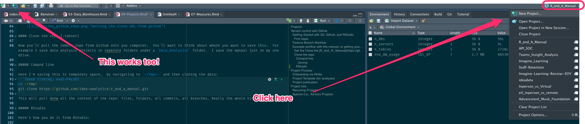
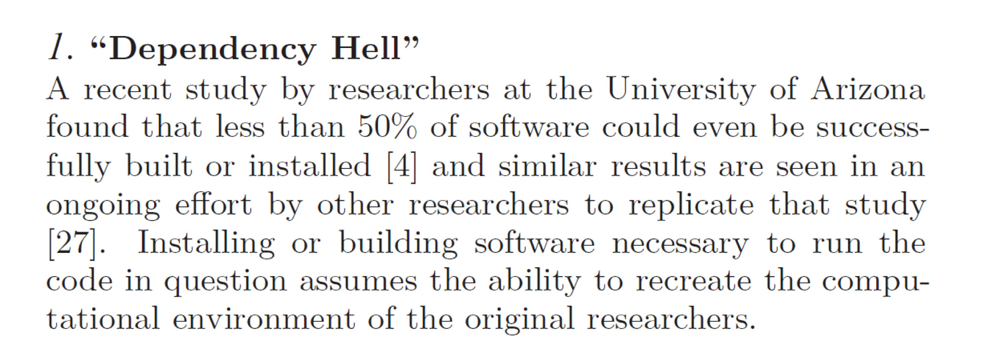

--- 
title: "IDEA R&A Manual"
author: "Chris Haid, Edison Coronado, Mishan Jensen, Maura Carter, Steven Macapagal, Aline Orr, Ilissa Madrigal, Marlena Coco"
date: "`r Sys.Date()`"
site: bookdown::bookdown_site
documentclass: book
bibliography: [book.bib, packages.bib]
url: https://idea-analytics.github.io/r_and_a_manual/
cover-image: 
description: |
  This is IDEA Public Schools' Research & Analysis Team's ever evolving encyclopedia of resources and best practices.
biblio-style: apalike
csl: chicago-fullnote-bibliography.csl
---
```{r include=FALSE, cache=FALSE}
# example R options set globally
options(width = 60)

# example chunk options set globally
knitr::opts_chunk$set(
  comment = "#>",
  collapse = TRUE
  )
```


# A little about this manual {#about}

 The *IDEA R&A Manual*  is [IDEA Public Schools'](www.ideapublicschools.org) Research & Analysis Team's ever evolving encyclopedia of resources and best practices.  It's purpose is to make any R&A team member's (or really any other interested reader's) job easier, by sharing how we do our jobs.   

The manual is particularly aimed at a technical audience (e.g. statisticians, data analysts, data engineers, data scientists) and most contributions are from technical authors. Indeed, the expectation is that technical members for the R&A team will contribute to this manual regularly (i.e., weekly or daily during the festive (information) harvesting celebration of Doctoberfest)


```{r init-setup, include=FALSE}
library(tidyverse)


# automatically create a bib database for R packages
knitr::write_bib(c(
  .packages(), 'bookdown', 'knitr', 'rmarkdown', 'tidyverse', 'janitor'
), 'packages.bib')
```


## What goes in this manual?

Anything and everything we learn during the course of our work at IDEA. Of particular help is any information, learning, or insights, but some topics that are especially useful to your colleagues (and our future self) include:

* Locations of important tables in [the data warehouse][The Data Warehouse]
* Information about how to use data in the warehouse (e.g. how do you [identify students in CSI](#csi)
* Links and examples to useful R packages
* [Tips and tricks] in R, SQL, or Python that you discover in the course of your work 
* Templates:  output templates, input templates, [ProjectTemplates](#section-ProjectTemplate), . . . all the templates. 

## How do you contribute to this book?

This manual is written in **Markdown** and managed with git/Github. 

::: {.tip}
If you are unfamiliar with git/Github you'll want to read through[ how we use git in the Projects chapter](#section-github)
:::

The general process is as follows:

1. Clone the repo:  If you haven't already, pull this book down [from it's Github repo](https://github.com/idea-analytics/r_and_a_manual).  From the command line run `git clone https://github.com/idea-analytics/r_and_a_manual.git`.
1.  Or, pull down the latest version of the master branch `git checkout master` and then `git pull`
1.  In File Explorer/Finder find the `r_and_a_manaul` folder and double click `r_and_a_manual.Rproj`, which will open the book's project in RStudio
1. Check out a branch `git checkout -b my-manual-update`.
1.  Make updates.  You can run in R `bookdown::serve_book` to have it recompile the book on save. 
1. Commit frequently.
1. Push your changes on yoru branch up to Github.
1.  Intitiate a pull request to merge your changes.  If they are minor you can do the whole process your self. IF they are major--especially changing the books structure--then have another team member review your pull request before merging. 
1. Complete the merge. 
1. Rinse and repeat!

::: {.tip}
Remember each Rmd file contains one and only one chapter, and a chapter is defined by the first-level heading `#`.  Use second (`##`) and third (`###`) level headings for sections in each chapter. 
:::

### Adding "Tips" and other callouts

Do you see the blue box just above this section?  That's a tips box, but we have a few others you can add.  

Doing so is super simple by using a special block tag (`:::`) in your RMarkdown that creates a CSS-styled `<div>` block in the resulting HTML when this manual's RMD files are rendered.

Here's an example.  Writing this in your RMD:

```{markdown}
::: {.tip}
This is s a tip box!
  
You should use this for quick callouts that are important pieces of hard-earned wisdom
:::
```
Results in this:

::: {.tip}
This is s a tip box!

You should use this for quick callouts that are important pieces of hard-earned wisdom
:::

There are *four* other callout boxes we can use, each with a different icon:


```{markdown}
::: {.rstudio-tip}
This is an **RSTudio** Tip box

This is s a different tip box to use for any sage advice regarding RStduio products like RStudio Connect, the RStudio  IDE, or even RStudio supported packages.
:::
```


```{markdown}
::: {.rstudio-tip}
This is a **RSTudio** Tip box

This is s a different tip box to use for any sage advice regarding RStduio products like RStudio Connect, the RStudio  IDE, or even RStudio supported packages.
:::
```

::: {.rstudio-tip}
This is a **RSTudio** Tip box

This is s a different tip box to use for any sage advice regarding RStudio products like RStudio Connect, the RStudio IDE, or even RStudio supported packages.
:::


```{markdown}
::: {.gotcha}
This is a **gotcha** call out

Warn your reader of things to look out for with this box.
:::
```


::: {.gotcha}
This is a **gotcha** call out

Warn your reader of things to look out for with this box.
:::


```{markdown}
::: {.design}
This is a **design** call out

This is great looking spot to provide extra advice on look-and-feel and design conventions.
:::
```


::: {.design}
This is a **design** call out

This is great looking spot to provide extra advice on look-and-feel and design conventions.
:::


```{markdown}
::: {hat}
This is a **hat** call out

You get a hat!  

You can use this extra special tips that seem like magic.  Or something like that.
:::
```


::: {.hat}
This is a **hat** call out

You get a hat!  

You can use this extra special tips that seem like magic.  Or something like that.
:::


<!--chapter:end:index.Rmd-->

```{r include=FALSE, cache=FALSE}
# example R options set globally
options(width = 60)

# example chunk options set globally
knitr::opts_chunk$set(
  comment = "#>",
  collapse = TRUE
  )
```
# Who we are {#who}

## About Research and Analysis

We are the research and analysis team at IDEA Public Schools.  We are evaluators, statisticians, data scientists, and engineers, seeking above all to generate insight.

### Edison Coronado

Edison supports IDEA by making sure our stakeholders have access to the highest quality information that is streamlined, efficient, and accurate.  He works with all teams across IDEA to increase the accuracy of our information used to help guide all stakeholders in making the best possible decisions.  Edison also works with different teams in identifying opportunities to improve the process we use to collect, share, and use information.


### Chris Haid 
Chris Haid is VP of Data Analytics at IDEA Public Schools, where leads research, evaluation, and data analysis across 160 schools in Texas and Louisiana.

Previously he was KIPP Chicago’s Chief of Staff, leading progress monitoring, strategic planning, data analysis, and technology planning. He also supported external affairs, growth strategy, communications, and development. Other roles he held at KIPP Chicago included Chief Information Officer and the Director of Research and Analysis.

Chris has held academic positions at Yale University, New York University, and the University of Chicago. He has taught graduate and undergraduate courses in social scientific theory, statistical analysis, game theory, international development, and globalization. Chris attended the College of William and Mary where he earned a BA in Economics and the University of Chicago earning both a MPP and a MA in Political Science.

### Mishan Jensen, PhD
Dr. Mishan Jensen is a Statistician on IDEA’s Research and Analysis Team with 4 years of experience in program evaluation in a large urban school district and 2 years of experience as a Statistician for the Texas Department of Public Safety. She holds a Master's and Doctoral degrees from the University of Texas at Austin in educational psychology, with a specialization in Quantitative Methods. Previous work included evaluating multilingual education, teacher appraisal programs, and integration of arts into the classroom. During her time at UT, Mishan assisted with the development of the College of Education’s first fully web-based Introduction to Statistics course, as well as provided assistant teaching support for most of the graduate level statistics courses offered. Recent work at IDEA has included Student Persistence, Enrollment, Teacher Career Pathways and Advanced Placement, focusing on impact analyses and predictive modeling.

### Steven Macapagal
Steven Macapagal (Mac) is a statistician with IDEA Public Schools on the Research and Analysis team and has taught 6th through 12th grade. Most recently, he was a middle school math teacher and grade team leader at IDEA Bluff Springs College Prep in Austin, TX and prior to that, started his career at IDEA Frontier College Prep in Brownsville, TX as a 2014 corps member with Teach For America. Throughout his time at IDEA Frontier, he taught AP and IB math and economics, served as 12th grade team leader, and witnessed IDEA fulfill its promise to his 5 senior classes, all of whom achieved 100 percent matriculation to college. He earned his BA in economics and mathematics at The University of Texas at Austin and is currently working on his MS in statistics at Texas A&M University. His recent projects have centered on instruction and curriculum, college success, DEI, and Camp Rio.


### Maura Carter
Maura Carter is a Statistician on the R&A Team at IDEA, and a former mathematics educator and university instructor in the Statistics department at University of California, Santa Cruz. She holds a master's degree from University of Notre Dame in nonprofit business management, and a master's degree from California State University in Statistics and Data Science. She enjoys volunteering, mentoring students in STEM topics, ocean science, and scuba diving. Maura supports IDEA by providing analytical and statistical support to a variety of teams and decision makers across the organization.

### Aline Orr, PhD
Dr. Aline Orr has over 20 years of combined experience in research and program evaluation. She holds a Master's degree in educational psychology and quantitative methods from the University of Texas at Austin and a PhD in Neuroscience from the University of Pittsburgh, where she focused on brain pathways underlying emotional responses. In the recent past, Aline has led the evaluation of educational programs serving elementary and secondary students in a large urban public school district. Before that she was conducting educational research for a large assessment and textbook publishing house. Aline joined IDEA's Research and Analysis team as an evaluator in 2021. In this position, she supports the evaluation of initiatives associated with the Charter School Program grants, the 21st Century Afterschool program, and the Camp Rio program.


### Ilissa Madrigal
Ilissa Madrigal is an Evaluator on the R&A team, often assisting with qualitative methods and frequently partnering with HA and AST teams. 

Recent work includes providing thematic analyses for GPTW open-ended questions, conducting focus groups on Core Values, designing training evaluation surveys, and providing evaluation support for the Teacher & School Leader Incentive Program grant.  

Before working at IDEA, Ilissa taught high school chemistry in the RGV before earning her master's in Industrial-Organizational Psychology from the University of Tulsa. She holds a BS in Psychology and a BA in Biology from The University of Texas at Austin.


### Marlena Coco, PhD
Dr. Marlena Coco is an Evaluator on the R&A Team with over 15 years of experience in education and higher education. She earned a PhD in Higher Education Leadership and Research Methodology at Florida Atlantic University, MA in College Student Development at St. Edward’s University, and BS in Psychology at UT-Austin. She teaches undergraduate and graduate courses, chairs doctoral students dissertation research, reviews articles for journal publication, provides education consulting services, and conducts strengths-based leadership development. In previous roles, she led research, evaluation, and data support for college and career readiness at a large, urban school district, implemented district wide surveys, and analyzed postsecondary retention and academic support data at multiple universities. She evaluates Charter School Program grants.

<!--chapter:end:02-Who_We_Are.Rmd-->

```{r include=FALSE, cache=FALSE}
# example R options set globally
options(width = 60)

# example chunk options set globally
knitr::opts_chunk$set(
  comment = "#>",
  collapse = TRUE
  )
```
# The Data Warehouse and how to access it

The [first section](#section-the-data-warehouse) that follows provides lots of context about IDEA's data warehouse.

If, however, you are in a rush and want to go about accessing the data warehouse, then skip to section \@ref(accessing-the-data-warehouse-from-r) on accessing from R below. 

```{r load_dw, include=FALSE}
rna_dw_usage <- readxl::read_excel("DataWarehouse Usage.xlsx") %>% 
  janitor::clean_names() %>% 
  select(r_and_a_uses = r_a_uses_x,
         server_name, 
         database_name, 
         table_name, 
         column_name, 
         data_type, 
         constraint) %>% 
  mutate(
         across(where(is.character), as_factor),
         r_and_a_uses = !is.na(r_and_a_uses)) %>% 
  distinct()

n_servers <- rna_dw_usage %>% distinct(server_name) %>% nrow()
n_dbs <- rna_dw_usage %>% distinct(database_name) %>% nrow()
n_tables <- rna_dw_usage %>% 
  select(server_name, database_name, table_name) %>% 
  distinct() %>% 
  nrow()
```

## The Data Warehouse
The 'data warehouse' is actually a collection of disparate databases hosted by IDEA Public Schools.  Some databases are used to host the original source data, some are used as the data model for production applications, while others site between those two points.

While the IDEA has ~28 servers hosting SQL Server databases, R&A typically only accesses `r n_servers` servers hosting `r n_dbs` databases and `r prettyNum(n_tables, big.mark = ",")` distinct tables. It's a lot, for sure. 

### Core data warehouse server configuration

::: {.gotcha}
These facts below are scheduled to change in May-June of 2022.  The IT team is moving all servers from Rackspace to on-prem and as a result the Data warehousing team is upgrading servers and doing some maintenance on on the warehouse. 

Check back here for updates!
:::

The servers are not islands unto themselves, but rather form a small economy of data flows, where data moves from source servers, to production servers (i.e., the sweetspot for us) to reporting servers that host transformed data for our Logi-powered Locus dashboards.  

```{r server-graphs, echo=FALSE, fig.cap="Data in the warehouse is initially stored in 'src_*` databases in 'DS*' servers and flows to the right towads Logi hosted Locus dashboards."}
DiagrammeR::grViz("
  digraph data_wh {
    label='Basic Data Flows in Core Data Warehouse';
    labelloc = 't';
    compound=true;
  #graph statement
  graph [overlap = true, layout = dot, rankdir = LR]
  
    #node statement
    node [shape = cylinder, 
          style = filled, 
          fontname = Helvetica, 
          fillcolor= '#f9a054', 
          color = '#626363',
          fontcolor = white,
          fontsize=10]
    SRC1 [label=<SRC1<br/><font point-size='6'>RGVPDSD-DWSRC1</font>>]; 
    SRC2  [label=<SRC2<br/><font point-size='6'>RGVPDSD-DWSRC2	</font>>]; 
    SRC3 [label=<SRC3<br/><font point-size='6'>RGVPDSD-DWSRC3</font>>];
    SRC4 [label=<SRC3<br/><font point-size='6'>RGVPDSD-DWSRC4</font>>];
    SRC5 [label=<SRC3<br/><font point-size='6'>RGVPDSD-DWSRC5</font>>];
  
    node [fillcolor= '#1a4784']
    PROD1 [label=<PROD1<br/><font point-size='6'>RGVPDSD-DWPRD1</font>>]; 
    PROD2 [label=<PROD2<br/><font point-size='6'>RGVPDSD-DWPRD2</font>>]
    
    node [fillcolor= '#a4c364']
    RS2 [label=<RS2<br/><font point-size='6'>RGVPDSD-DWRPT1</font>>];
    RS1 [label=<RS1<br/><font point-size='6'>RGVPDSD-DWRPT1</font>>]
  
  
  node [shape = box, fontname = Helvetica, fillcolor= '#ffde75', fontcolor = black]
  LOGI [label='LOGI/PowerBI']
  
  node [shape = box, fontname = Helvetica, fillcolor= '#ee3a80', fontcolor = white]
  Analysis [label = 'R&A']

  # subgraph statements
  subgraph cluster_ds {rank = same; style = dotted; SRC1; SRC2; SRC3; SRC4; SRC5; label='1. Source Data'}
  subgraph cluster_prod {rank = same; style = dashed; PROD1; PROD2; label = '2. Production'}
  subgraph cluster_rs {rank = same; style = dotted; RS2; RS1; label='4. Reporting'}

  
  #edges statement
  edge [color = '#626363', arrowhead=vee]
  {SRC1 SRC3 SRC4 SRC5} -> PROD1 
  {SRC2} -> PROD2
   PROD1 -> {SRC1 SRC3 SRC4 SRC5} [label='Look-ups', color = gray, style=dashed, fontcolor=gray, fontsize=7]
   PROD1 -> RS1
   PROD2 -> RS2
  {PROD1 PROD2} 
   
  {RS2} -> LOGI [ltail=cluster_rs]
  
  {PROD1} -> LOGI [ltail=cluster_prod]
  {PROD1} -> Analysis [ltail=cluster_prod]
  
  
  
  }
")


```

Figure \@ref(fig:server-graphs) shows the flows of data in the warehouse, which essentially move from left to right.  The` DS-*` servers host databases holding source data.  That data is processed and saved in databases in the two production servers (`PROD1` and `PROD2`).  **These two production servers host most the data that R&A uses in analysis**, but know where the source data comes from in is often helpful.  The reporting servers---`RS1` and `RS2` serve transformed flat files that serve as the data layer for [Logi](https://www.logianalytics.com/) and PowerBI, which serve up [Locus dashboards on the hub](https://ideapublicschoolsorg.sharepoint.com/sites/dashboards).  

The following sections provide some details on the what databases might be found on each server.

#### SRC Servers
These servers are were source data from various applications is landed. 

* **`SRC1`** is hosted on  `RGVPDSD-DWSRC1` and serves as a source for `PROD1`.  Most the data hosted on `RGVPDSD-DWSRC1` mirrors the various SISes (i.e. Schools data from PowerSchool, Focus, and Skyward) for TX, LA, FL, and OH.

  * **Databases**:

    * SRC_Texas_Schools
    * SRC_Texas_Travis_Schools
    * SRC_Louisiana_Schools
    * SRC_Florida_Schools
    * SRC_Ohio_Schools
    * SRC_AD
    * Master_Schools
    * TravisSnapshotData
    
  * **Sources**:
    
    * PowerSchool
    * Skyward
    * Focus

  * **Targets**:
    
    * `PROD1`
    

* **`SRC2`** is hosted on  `RGVPDSD-DWSRC2`  and serves as a source for `PROD2` and exclusively source data from assessment platforms like Edcite, Illuminate DnA, AP, IB, ACT, and SAT. 

  * **Databases**:
    * lk_Schools          
    * SRC_Accountability  
    * SRC_ACT             
    * SRC_AP              
    * SRC_Dibles          
    * SRC_EA              
    * SRC_IA              
    * SRC_IANew           
    * SRC_IB              
    * SRC_Ohio_Assessments
    * SRC_StateAssessments
    * SRC_EXPLORER        
    * SRC_NWEA            
    * SRC_SAT             
    * SRC_PLAN   

    
  * **Sources**:
    
    * See the database names just above
    * `PROD1` for lookup data about students and schools

  * **Targets**:
    
    * `PROD2`
    
* **SRC3** is hosted on `RGVPDSD-DWSRC3`  and serves as a source for `PROD1`.  Databases focus on source data from variance external systems, including Naviance, Tyler Munis, Teachboost, Schoolmint, and a slew if individualized learning/blended learing platforms. 

  * **Databases**:
    * lk_Schools
    * SRC_Alumni
    * SRC_AssetPanda
    * SRC_CollegeSuccess
    * SRC_CornerStoneEvaluations
    * SRC_DMac
    * SRC_GetRatings
    * SRC_HealthOfficeAnywhere
    * SRC_HR
    * SRC_Naviance
    * SRC_OpsCampusRanking
    * SRC_PanoramaSurveys
    * SRC_Recruitment
    * SRC_SchoolMint
    * SRC_StaffRetention
    * SRC_STMATH
    * SRC_Stream
    * SRC_Teachboost
    * SRC_TSI
    * SRC_TylerMunis
    * SRC_Wrike
    * SRC_Zendesk
    * SRC_ZendeskDev
    * TCPAppDev
    * SRC_JobVite
    * SRC_TTM
    * SRC_FitnessGram
    * SRC_NationalClearingHouse
    
      
      
  * **Sources**:
    
    * See the database names just above
    * `PROD1` for lookup data about students and schools

  * **Targets**:
    
    * `PROD1`
      
* **SRC4** is hosted on `RGVPDSD-DWSRC4`  and serves as a source for `PROD1`.  Databases focus on source data from various individualized learning/blended learnng platforms. 

  * **Databases**:
    * lk_Schools         
    * SRC_AR             
    * SRC_BlendedLearning
    * SRC_IHT    
    
      
  * **Sources**:
    
    * See the database names just above
    * `PROD1` for lookup data about students and schools

  * **Targets**:
    
    * `PROD1`    


* **SRC5** is hosted on `RGVPDSD-DWSRC5`  and serves as a source for `PROD1`.  Databases focus on source data Microsoft Teams

  * **Databases**:
    * TeamsAttendance   
    
      
  * **Sources**:
    
    * See the database names just above
    * `PROD1` for lookup data about students and schools

  * **Targets**:
    
    * `PROD1`    

#### PROD Servers

* **PROD1** is hosted on `RGVPDSD-DWPRD1` and contains a variety of data bases sourced from all `SRC` servers except for `SRC2`. The key students, schools, and regions data is found here and is 

  * **Databases**:
    * ADA               
    * BlendedLearning   
    * dwSnapshots       
    * Enrollment        
    * IT                
    * Persistence       
    * PROD1             
    * ProductDevelopment
    * CollegeSuccess    
    * Matriculation     
    * SSISTemp          
    * Staffing          
    * DashboardSettings 
    
  * **Sources**:
    
    * `SRC1`
    * `SRC3`
    * `SRC4`
    * `SRC5`
  
 * **Targets**:
 
  * `RS1`
  * `ST-HIS`

  
* **PROD2** hosts all assessement data for all state  This is the source server for `RS2` and includes assessments (e.g., IAs, bi-weekly and unit assessments, AP, IB) data and accountability tables. 

  * **Databases**:
    * Assessments  
    * lk_Schools   
    * PROD2        
    * SSISTemp  
    

    * Schools : this actually contains inventories at the school level, like lists of employees, equipment and asset inventories, students schedules, correspondences between teachers and students. 
    
#### RS and Hisotrical data Servers

R&A tends not to use these tables very often. `RS1`and  `RS2` git  have flat tables that utilized by by Logi for Locus Dashboards that are developed by Software Development. `ST-HIS` ostensibly has snapshots of data from the `PROD` servers, but that is just an unverified hunch 


* **RS1** 
  
  * **Databases**: unknown
  * **Sources**:
    
    * `PROD2`
    * something called `ST2`?
  
  * **Targets**
    * Logi
    
* **RS2**
  
  * **Databases**: unknown
  * **Sources**:
    
    * `PROD1`
    * something called `ST1`?
  
  * **Targets**
    * Logi
  


### Server, Table, and Field Lookup

The easiest way to explore databases and tables available in the data warehouse is to use the [`ideadata`](https://idea-analytics.github.io/ideadata/) packages's `view_warehouse_metadata()` function, which will launch a fiterable table in the RStudio IDEA.  

```{r display-dw-tables, eval=FALSE, echo=TRUE, warning=FALSE, fig.cap="Data warehouse details"}
library(ideadata)

view_warehouse_metadata()
```

")

More details on accessing the data warehouse from R are in the following section.

## Accessing the data warehouse from R

The most straightforward way to access the data warehouse is to use our own, bespoke r package: `ideadata`, which is [maintained on github](https://github.com/idea-analytics/ideadata) and has [its own documentation site](https://idea-analytics.github.io/ideadata/).
 
### Installation


Since `ideadata` is an internal IDEA package, there is only a development version, which is installed from [GitHub](https://github.com/) with:

``` {r install, eval=FALSE}
#install.packages("remotes")
remotes::install_github("idea-analytics/ideadata")

#renv::install("idea-analytics/ideadata@main") also works
```
### Example

Here's how you connect to the `Schools` table in the warehouse.

```{r example, eval=FALSE}
library(dplyr)
library(ideadata)

schools <- get_schools()

glimpse(schools)
```


The `schools` object above is `tbl` object.  That means it works with `dplyr` verbs and functions, but  what  happens in the background is that `dplyr` and `dbplyr` generate SQL that is sent to the database you are connected to and  all that computation (e.g., filtering, selecting, joining, calculations, aggregation) are completed on the remote SQL Server instance and **not** on your computer.  

Nevertheless, you will eventually want to pull that data down onto your machine when you want to use R or Python do what they can do (like modeling or graphics) that the database can't do. 

Pulling that data down is easy with [dplyr::collect()]

```{r collect, eval=FALSE}
library(dplyr)

schools_df <- schools %>% 
  collect() %>% 
  janitor::clean_names()
```

(Here `janitor::clean_names()` snake_cases all the column names). 

#### What if I am pulling down lots of data (say, millions of rows)?
In this instance the database connection may fail.  It's not ideal, but it happens.  One way to deal with this is to pull down the data piecemeal.  The `collector()` function in `ideadata` makes this task trivial. It takes column names as arguments (unquote) from the table you want to pull down and those columns are used to break up the data into smaller sets of data that are pulled down from the database onto your computer and then recombined into a single table. 

```{r collector, eval=FALSE}

schools_df <- schools %>% 
  collector(SchoolState, CountyName) %>% 
  janitor::clean_names()

```

::: {.gotcha}
The `ideadata` package is clever in that it updates its knowledge of the data warehouse every time you load the package with `library(ideadata)`.  However to do that you need to have access to the the warehouse, and that requires that you are on the VPN/behind the firewall. Do makes sure that is true before invoking the package!
:::


### Finding things in the data warehouse

The `ideadata` package has a function that will open up a sortable, filterable, and searchable table in the RStudio idea: [`view_warehouse_meta_data()`](https://idea-analytics.github.io/ideadata/reference/view_warehouse_metadata.html)


### Where to learn more

`ideadata` [has it's own documentation here](https://idea-analytics.github.io/ideadata/).  If you can't find an answer there, then reach out to Chris Haid (he's responsible for this craziness).  

::: {.tip}
[Go to this article](https://idea-analytics.github.io/ideadata/articles/setting-up-your-credentials.html) to set up your credentials in R so that the warehouse can authenticate and authorize you as verified user
:::


::: {.tip}
Another important aspect of the warehouse is that the sources system for most student data is our SIS: PowerSchool.  The [PowerSchool Tables Data Dictionary](http://www.albertapsug.ca/uploads/1/5/1/2/15120130/ps10x_data_dictionary_tbl.pdf) is a helpful resource in understanding fields and relationships between tables. 
:::


<!--chapter:end:03-Data_Warehouse.Rmd-->

```{r include=FALSE, cache=FALSE}
# example R options set globally
options(width = 60)

# example chunk options set globally
knitr::opts_chunk$set(
  comment = "#>",
  collapse = TRUE
  )
```
# Key Tables, Measures, and Metrics

Within this chapter we will find the tables and metrics IDEA Public Schools stakeholders are the most interested about.

## The Students Table

The Students table is probably the most important table of all. It contains historical student personal data since IDEA's inception. 

We use this table to know to what subpopulation a student belongs to. Also, we can link this table to other student data using the _[StudentNumber]_ field.

**Table:** [[REDACTED-HOST]].[PROD1].[Schools].[Students]

**Main fields:** [AcademicYear] [StudentNumber] | [SchoolNumber] | [GradeLevelID] | [EnrollmentStatus] | [Gender] | [SPED] | [ELLCode] | [PrimaryDisabilityCode ] | [SecondaryDisabilityCode ] | [TertiaryDisabilityCode ] | [EconomicDisadvantageCode] | [FederalHispanicFlag] | [FederaRaceI] | [FederaRaceA] | [FederaRaceB] | [FederaRaceP] |  [FederaRaceW] |[EntryDate] | [ExitDate] | [RowIsCurrent]

**Who is what?:** 

* **_[EnrollmentStatus]:_** 
  + If EnrollmentStatus = 0, it means that the student is/was an active student for the corresponding academic year,
  + If EnrollmentStatus = 2, it means the student left the district before completing the academic year,
  + If EnrollmentStatus = 3, it means the student graduated from IDEA's high school.

* **_[ELLCode]:_** English Learner (EL) A.K.A. Limited English Proficiency (LEP)
  + If ELLCode = 0, student **is not** identified as an EL student,
  + If ELLCode = 1, the student **is** identified as an EL student,
  + If ELLCode not in (0,1), it means the student is not currently identified as an EL but was identified before as one,
  + If ELLCode = "F", the student **is not** identified as an EL student but is in the First Year of Monitoring status,
  + IF ELLCode = "S", the student **is not** identified as an EL student but is in the Second Year of Monitoring status,
  + If ELLCode = 3, the student **is not** identified as an EL student but is in the Third Year of Monitoring status,
  + If ELLCode = 4, the student **is not** identified as an EL student but is in the Fourth Year of Monitoring status,
  + If ELLCode = 5, the student **is not** identified as an EL student but was at one point more than 4 years ago.
  
* **EL Reclassification** An EL who has passed the Texas English Language Proficiency Assessment System (TELPAS) will be reclassified as a Non-EL and monitored for 4 years. After reclassification the students ELLCode will not change to 0, it will move through the codes for the 4 years of monitoring status and then change to an ELLCode of 5  

* **_[SPED]:_** SPED students are composed of RISE and Life Skills students, not including Critical Student Intervention (CSI) students.
  + If SPED = 0, it means the student is not identified as a SPED student, otherwise then SPED = 1.
  
* **_[InstructionalSettingCode]:_** Students who are classified as SPED may receive additional services. Their services can be found in the **InstructionalSettingDescription** column, which is linked to a specific [PEIMS code](http://ritter.tea.state.tx.us/peims/standards/1314/c035.html):

  InstructionalSettingCode | Description
  -------------------------|-------------
 0 | No additional SPED services
 1 | Homebound
 40 | Mainstream
 41 | Resource Room/Services < 21%
 42 | Resource Room/Services 21- <50%
 43 | Resource Room/Services 50- 60%
 44 | Resource Room/Services > 60%
 
  + If InstructionalSettingCode = 43 or 44, the student is typically in RISE.

* **_[DisabilityCode]_**

  DisabilityCode | Description
  ---------------|-------------
 0 | No disability
 1 | Orthopedic impairment
 2 | Other health impairment
 3 | Auditory impairment
 4 | Visual impairment
 5 | Deaf-Blind
 6 | Intellectual Disability
 7 | Emotional disturbance
 8 | Learning disability
 9 | Speech impairment
 10 | Autism
 13 | Traumatic brain injury
 14 | Noncategorical early childhood

```{sql, eval=FALSE}
SELECT DISTINCT 
 [StudentNumber], 
 [PrimaryDisabilityCode] AS [DisabilityCode], 
 [PrimaryDisabilityDescription] AS [DisabilityDescription]

 FROM (

SELECT DISTINCT [StudentNumber],[PrimaryDisabilityCode], [PrimaryDisabilityDescription]

 FROM [PROD1].[Schools].[Students]
 WHERE AcademicYear='2018-2019'

 UNION ALL

SELECT DISTINCT  [StudentNumber], [SecondaryDisabilityCode], [SecondaryDisabilityDescription]

 FROM [PROD1].[Schools].[Students]
 WHERE AcademicYear='2018-2019'

 UNION ALL

SELECT DISTINCT  [StudentNumber], [TertiaryDisabilityCode], [TertiaryDisabilityDescription]

 FROM [PROD1].[Schools].[Students]
 WHERE AcademicYear='2018-2019') A WHERE [PrimaryDisabilityDescription] <> '' ORDER BY StudentNumber


```

* **_[EconomicDisadvantageCode]:_** A.K.A ECD 
  + If EconomicDisadvantageCode = 0, then the student is _not identified as economically disadvantaged_, otherwise the student is identified as **economically disadvantaged**,
  + If EconomicDisadvantageCode = 1, then the student is identified as an economically disadvantaged and eligible for free meals,
  + If EconomicDisadvantageCode = 2, the student is also identified as an economically disadvantaged but only eligible for reduced-price meals,
  + If EconomicDisadvantageCode = 99, it means the student is identified as an economically disadvantaged one but has another economic disadvantage.
  
* **ECDFlag** Consolidates the codes above to 0/1 indicator
  + If ECDFlag = TRUE (1), the student **is** identified as economically disadvantaged,
  + If ECDFlag = FALSE (0), the student **is not** identified as economically disadvantaged.


* **_Race / Ethnicity:_** Same like in TX
  + If the student identifies as Hispanic or Latino then the student is classified as Hispanic/Latino,
  + If the student **does not** identify as Hispanic or Latino and only selected one race the student is classified as that race,
  + If the student **does not** identify as Hispanic or Latino and selected more than one race, then the student is classified as Two or more races.

* **_[RowIsCurrent]:_** Indicates the most current row for a student, **Only to be used on the current school year**

### Common queries

We frequently need to disaggregate data by year, region, school, and so on, while retaining basic information about a student. The Students table does not directly contain the school or region names, so we need to join the Schools table and Regions table. 

Two common queries involving students are 

1. producing a *roster* of all students that fit certain characteristics and
2. *counting* the number of students that fit certain characteristics.

Suppose we are tracking the number of seniors on track to go to college. The following are two queries to pull a *roster* of currently enrolled seniors:

* SQL example:
```{sql, eval=FALSE}
SELECT [AcademicYear]
	  ,C.[RegionDescription]  
	  ,B.[SchoolName]
	  ,[GradeLevelID]
	  ,[StudentNumber]
    ,[StudentFullName]
    ,[FirstName]
    ,[MiddleInitial]
    ,[LastName]

--join Schools and Regions tables
  FROM [RGVPDSD-DWPRD1].[PROD1].[Schools].[Students] AS A
    LEFT JOIN [RGVPDSD-DWPRD1].[PROD1].[Schools].[Schools] AS B
      ON A.[SchoolNumber] = B.[SchoolNumber]
    INNER JOIN [RGVPDSD-DWPRD1].[PROD1].[Schools].[Regions] AS C
      ON B.[RegionID] = C.[RegionID]

--filter for currently enrolled seniors in 2021-2022
  WHERE [AcademicYear] = '2021-2022'
    AND [GradeLevelID] = '12'
    AND [ExitDate] > '2022-05-01'
    AND [RowIsCurrent] = '1'

--optional, filter RISE students
--  AND [InstructionalSettingCode] NOT IN ('43', '44')
    
```

* R example:
```{r r_current_seniors, echo=TRUE, eval=FALSE}
get_students() %>%

# filter for currently enrolled seniors in 2021-2022
  filter(AcademicYear == "2021-2022",
         GradeLevelID == "12",
         ExitDate > "2022-05-01",
         RowIsCurrent == 1) %>%
  
# optional, filter RISE students
# filter(!(InstructionalSettingCode %in% c("43", "44"))) %>%
  
# join Schools and Regions tables
  inner_join(get_schools(),
             by = c("SchoolNumber" = "SchoolNumber")) %>%
  inner_join(get_regions(),
             by = c("RegionID" = "RegionID")) %>%
  
  select(AcademicYear,
         RegionDescription,
         SchoolName,
         GradeLevelID,
         StudentNumber,
         StudentFullName,
         FirstName,
         MiddleInitial,
         LastName)
```

However, to *count* the number of seniors by school and region, group the students by those characteristics, and then use an aggregate function to count the number per group.

* SQL example:
```{sql, eval=FALSE}
SELECT [AcademicYear]
    ,CASE
	     WHEN C.[RegionDescription] IN ('Austin', 'San Antonio') THEN 'Central Texas'
		   WHEN C.[RegionDescription] IN ('Lower Valley', 'Mid Valley', 'Upper Valley') THEN 'Rio Grande Valley'
		   ELSE C.[RegionDescription]
	   END AS [Area]
	  ,C.[RegionDescription]
	  ,B.[SchoolName]
	  ,[GradeLevelID]
	  
--count number of student IDs to get total per group
	  ,COUNT([StudentNumber]) AS [EnrolledSeniors]
	  
  FROM [RGVPDSD-DWPRD1].[PROD1].[Schools].[Students] AS A
	LEFT JOIN [RGVPDSD-DWPRD1].[PROD1].[Schools].[Schools] AS B  
		ON A.[SchoolNumber] = B.[SchoolNumber]  
	INNER JOIN [RGVPDSD-DWPRD1].[PROD1].[Schools].[Regions] AS C 
		ON B.[RegionAltID] = C.[RegionID]  
		
  WHERE [AcademicYear] = '2022-2023' 
	  AND [ExitDate] > '2022-08-17'
	  AND [RowIsCurrent] = '1'
	  AND [GradeLevelID] = '12'
--  AND [InstructionalSettingCode] NOT IN ('43', '44')

--grouping variables to determine aggregates	
  GROUP BY [AcademicYear]
      ,[Area]
		  ,C.[RegionDescription]
		  ,B.[SchoolName]
		  ,[GradeLevelID]
  ORDER BY [Area]
		  ,[RegionDescription]
      ,[SchoolName]
```


* R example:
```{r count_seniors, eval=FALSE}
get_students() %>%
  
  filter(AcademicYear == "2022-2023",
         GradeLevelID == "12",
         ExitDate > lubridate::today(),
         RowIsCurrent == 1) %>%
  # filter(!(InstructionalSettingCode %in% c("43", "44"))) %>%
  
  inner_join(get_schools(),
             by = c("SchoolNumber" = "SchoolNumber")) %>%
  inner_join(get_regions(),
             by = c("RegionAltID" = "RegionID")) %>%

  # grouping variables to determine aggregates  
  group_by(RegionDescription,
           SchoolName,
           GradeLevelID) %>%
  
  # count number of students to get total per group
  summarize(EnrolledSeniors = n()) %>%
  
  mutate(Area = case_when(
    RegionDescription %in% c("Lower Valley", "Mid Valley", "Upper Valley") ~ "Rio Grande Valley",
    RegionDescription %in% c("Austin", "San Antonio") ~ "Central Texas",
    TRUE ~ RegionDescription
  )) %>%
  arrange(Area,
          RegionDescription,
          SchoolName)
```


::: {.gotcha}
As IDEA continues to expand, it is important to reexamine these tables to incorporate differences in demographics coding, nomenclature, etc., to account for states and regional authorizers using different conventions.
:::


## Schools and regions

### Schools table

The Schools table provides essential information about each school, including their contact information, full and short names, and regions, all of which can be connected to other tables via the SchoolNumber.

**Database:** [RGVPDSD-DWPRD1].[PROD1].[Schools].[Schools]

**Main metrics:** School names, PowerSchool numbers, state IDs, regions

**Important columns:**

* **[SchoolNumber]:** official PowerSchool school ID; most frequently used to link to other tables
* **[SchoolName]:** full name of the school, e.g. IDEA Frontier College Preparatory
* **[SchoolShortName]:** campus name, e.g. Frontier
* **[StateSchoolNumber]:** number used by the campus' respective state for reporting (note: this column may not have correct values for all schools)
* **[SchoolAbbreviation]:** abbreviation of school name (not commonly used)
* **[SchoolLowestGrade]:** lowest grade level, where PK = -1, K = 0
* **[SchoolHighestGrade]:** highest grade level
* **[SchoolStreet], [SchoolCity], [SchoolState], [SchoolZipCode], [SchoolPhone], [SchoolFax], [PrincipalName], [PrincipalPhone], [PrincipalEmail], [CountyNumber], [CountyName]**: contact information
* **[RegionID]:** official IDEA region when describing location of school; links to the Regions table
* **[VPofSchools]:** regional Vice President (VP) who oversees the school; links to Employees table using EmployeeKey
* **[ExecutiveDirector]:** Executive Director (ED) OR Regional Superintendent who oversees the region; links to Employees table using EmployeeKey
* **[RegionDirectorOfOperations]:** Regional Director of Operations (RDO) who oversees the region; links to Employees table using EmployeeKey
* **[CollegeSuccessDirector]:** Director of College Counseling (DCC) at the school; links to Employees table using EmployeeKey
* **[Area]:** describes if the school is under the division of RGV, Texas, or IPS & SA, i.e. which superintendent oversees the school
* **[RegionAltID]:** describes the Subregion, if applicable (default is Region); mostly used for RGV schools to divide into Lower, Mid and Upper Valley; links to the Regions table

**Context:**

* The [SchoolName] column is the PowerSchool name for the school, not necessarily its official name. Many high school names in PowerSchool are shortened to "College Prep" instead of "College Preparatory". Some schools may officially be named "IDEA Academy/College Preparatory [ShortName]". 
* Note that both Middle School and High School are administered under a single College Preparatory; however, they receive separate PowerSchool instances.
* For historical reasons, IDEA Academy Donna is labeled as "IDEA Academy Primary", IDEA Middle School Donna is labeled as "IDEA Academy", and IDEA College Preparatory Donna is labeled as "IDEA College Preparatory". (It is suggested you rename these to the modern names).
* IDEA San Juan Academy is [physically in a different location](https://ideapublicschools.org/our-schools/idea-san-juan/) than is IDEA San Juan College Prep, rather than being on the same campus. Systems and individuals that are traditionally shared between campuses, such as the APO, are distinct for each school. Their [SchoolShortName] is also different - "San Juan AC" and "San Juan CP", respectively. (It is suggested you rename these both to be "San Juan" when pulling in data.)
* IDEA Allan was renamed as IDEA Montopolis, so older records may still reflect this name.
* IDEA Travis Academy is an in-district partnership with Midland ISD. Records from this school may not necessarily be accurate or interpretable, since values may reflect coding choices at Midland ISD.


### Regions table

The Regions table provides keys for each RegionDescription, which can be connected to other tables via the RegionID.

**Database:** [RGVPDSD-DWPRD1].[PROD1].[Schools].[Regions]

**Main metrics:** region numbers, region names, state, parent region (if applicable)

**Important columns:**

* **[RegionID]:** region number, used to link back to the [Schools] table
* **[RegionDescription]:** full name of the region or subregion
* **[State]:** full name of the state
* **[ParentRegion]:** link to the region number that contains that subregion; 0 if not usually combined with other regions

**Context:**

* IDEA originally started as a single school in Donna, TX in 2000, and made its first expansions to Quest and Frontier in 2006. The notion of a regional structure outside of the Rio Grande Valley (RGV) did not start until IDEA expanded in 2012, when Allan (now Montopolis) opened in Austin, and Carver, in San Antonio.
* IDEA did not open outside of Texas until the Southern Louisiana (SOLA) region opened its first schools, Bridge and Innovation, in 2018.
* Informally, the RGV "super region" can be divided into Lower, Mid, and Upper Valley, and these subregions all have the same parent region (RGV). At some point, IDEA formally divided RGV schools into Lower and Upper Valley regions, each with a separate Executive Director, but the Lower/Upper distinction is no longer officially used. The RGV may also be considered an Area, governed by the Area Superintendent rather than an Executive Director. 
* Occasionally, the Central Texas "super region" is used to include the San Antonio and Austin regions, but this is not included in the Regions table.
* An Area is the portfolio of a superintendent, which includes multiple regions. The three Areas are "RGV", "Texas", and "IPS and SA", which are included in the [Schools] table (see above entry).


::: {.gotcha}
Different teams across IDEA may or may not split their portfolios using the Lower/Upper or the Lower/Mid/Upper subregions. Before assigning regions to RGV schools, check with the partnering team to see how they categorize RGV schools.

If the team does NOT use the subregions, then link the Regions and Schools table using [Regions].[RegionID] = [Schools].[RegionID]. If the team uses the Lower/Mid/Upper subregions, then link using [Regions].[RegionID] = [Schools].[RegionAltID]. If the team uses the Lower/Upper subregions, you will need to ask the team how they divide their portfolio of schools.
:::


## Student Attendance

Daily attendance is taken through PowerSchool to see which students are presently at school or not. By default, a student is assumed present until they are marked *absent (A)* by the teacher, or as *tardy present (TP)* at the school's front office. Schools will typically take a preliminary attendance snapshot within the first available period (i.e. either homeroom or 1st period) to determine which families need to be called. Then, each school designates an **Official Attendance-Taking Time or Period (OATT/OATP)**, a roughly 10-minute window for all teachers with a class at that time to submit the day's official attendance roster. The OATP snapshot is what is sent to the state for Average Daily Attendance (ADA) counts and is what is recorded in our warehouse.

**Database:** [RGVPDSD-DWPRD1].[PROD1].[Attendance].[Students]

**Main metrics:** Full-day vs. half-day attendance; number of absences; new to IDEA students

**Important columns:**

* **[AcademicYear]**: yyyy-yyyy
* **[SchoolName]**: IDEA [Campus] [SchoolType]
* **[schoolnumber]**: Note that the column name is stored in all lowercase.
* **[SchoolShortName]**: Campus name only
* **[SchoolType]**: Academy or College Prep
* **[RegionDescription]**
* **[GradeLevelID]**: Uses the values -1 and 0 for PK and K, respectively.
* **[GradeLevel]**: Uses the labels PK and K.
* **[AttStudentKey]**: Identifying key for each student for each day.
* **[WeekNumber]**: Gives the week of the school year.
* **[DateNumber]**: Gives the day number of the school year (1, 2, 3, ..., 180).
* **[AttDate]**: Gives the actual date of the record.
* **[Membership]**: Indicates 1.00 for a full-day student (nearly everyone) and 0.50 for a half-day student (Pre-K only).
* **[Absences]**: Indicates 1.00 for a full-day absence, or 0.50 for a half-day absence.
* **[VAbsences]**: Unsure if this is different from [Absences].
* **[SchoolYear]**: Indicates 1 for a new-to-IDEA student, or 2+ for a returning student.
* **[SchoolTypeOperation]:** DO NOT USE. This information has been found to be inaccurate. We will work on creating a table that has the corrected information by school and academic year, but for now, "Launching", "Scaling", and "Fully Scaled" operation data is stored in an Excel file in the Enrollment GitHub repo.


### Common queries

To pull student daily attendance for the current school year at a specific school on a certain date, you can use a few functions to pull the data:

```{r attendance_ex, echo=TRUE, eval=FALSE}
current_school_year <- "2021-2022"
our_school <- "IDEA Walzem Academy"
date <- "2022-04-01"

# gets individual attendance records by student

get_student_daily_attendance() %>%  # this is a built-in function for {ideadata}
  filter(AcademicYear == current_school_year,
         SchoolName == our_school,
         AttDate == date) 

```


Average daily attendance (ADA) is computed as the ratio of present students to enrolled students, which can be found using:

```{r ada_ex, echo=TRUE, eval=FALSE}
get_student_daily_attendance() %>%
  rename(SchoolNumber = schoolnumber,
         Region = RegionDescription) %>%
  
# pick a specific school and academic year 
  filter(AcademicYear == current_school_year,
         SchoolName == our_school) %>%

# groups by school for a particular day  
  group_by(AcademicYear,
           Region,
           SchoolNumber,
           SchoolName,
           SchoolShortName,
           SchoolType,
           AttDate,
           DateNumber) %>%
  distinct() %>%
  summarise(n_enrolled = sum(Membership),
            n_absent = sum(Absences)) %>%

# computes ADA as 1 - absence ratio
  mutate(ada_percent = 1 - (n_absent/n_enrolled)) %>% 
```


### Other uses

Attendance can also be used to obtain **daily total enrollment** at multiple levels, including by grade level at each school.

```{r enrollment_ex, echo=TRUE, eval=FALSE}
get_student_daily_attendance() %>%
  rename(SchoolNumber = schoolnumber,
         Region = RegionDescription) %>%
  
# pick a specific school and academic year 
  filter(AcademicYear == current_school_year,
         SchoolName == our_school) %>%
  
# groups by grade level at a school per day  
  group_by(SchoolNumber,
           SchoolName,
           SchoolShortName,
           SchoolType,
           GradeLevelID,
           AttDate,
           DateNumber) %>%                     
  distinct() %>%
  
# counts total number of students enrolled  
  summarise(n_enrolled = sum(Membership))

```


The other side of enrollment is **student persistence**. To see how enrollment is used with student persistence, jump to [the student persistence section](https://idea-analytics.github.io/r_and_a_manual/key-tables-measures-and-metrics.html#student-persistence-using-attendance-tables-a.k.a.-cohort-persistence).


## Student Persistence

Student Persistence is one of the most important measures that Chiefs, VPs, and School Leaders are always monitoring to understand our efforts in providing high quality services to our students and families. In order for a student to actualize the benefits of IDEA the student must persist through high school. We say a student persisted if the student was enrolled and attended school for the entire academic school year, returned the following school year, and was enrolled and attending on the Monday after the first week of school (the First Day of Persistence FDOP). In other words, the student was enrolled and attended school on the "First Day of Persistence (FDOP)" for two consecutive years. The only exception to this are New Students that enroll after the FDOP, attend the entire year, return the following year, and are enrolled and attending for FDOP. These new students were not enrolled and attending for 2 consecutive FDOPs because they enrolled after the first FDOP but would be considered as persisting.

Example: John enrolled in IDEA Public Schools on August 19, 2019, and attended school on FDOP, which is the Monday after the first week of school. John attended the entire 2019-2020 academic year and was enrolled and attending on the FDOP of the following academic year (FDOP for 2020-2021 school year). If John was enrolled but did not attend on FDOP because he didn't return until September, John would not count as a student who persisted.

**Database:** [[REDACTED-HOST]].[Persistence]

**Main metrics:** District, Regional, School, Sub-population, Grade Level

**General Formula:** 1 – (Leavers/All Students)

**Tables:**

* **_[dbo].[PersistenceCode]:_** This table is used to calculate the persistence rate for the current academic year. The data is updated every three hours, weekdays. LeaverWeek column shows the week the student left the district (beginning the week containing the FDOP, which is the second week of the academic year)? After the end of the current school year but before the persistence year has ended (the summer months), the week the student leaves the district is captured in the ULeaverWeek column. The PersistenceWeek column shows the current week of persistence for the school and region that the student attends (this week will be different across schoools and regions due to differing start dates and FDOPs).

* **_[dbo].[PersistenceHistorical]:_** This table contains the final persistence data for previous persistence years starting with 2018-2019 and up through 2020-2021. This table is updated with the previous years' data after that year is closed out and the next persistence year has started.

**Context:**

* **Who Counts?** 

To calculate persistence, we need to filter out all students who should be excluded from the denominator, filter(EXCLUDE == 0, FDOPCOUNTP == 1). This limits the denominator to only those students that should be counted. These two filters should be used when looking at current **or** historical data.

* **Who is a Leaver?**

All leavers are coded as FDOPLEAVER = 1, if FDOPLEAVER = 0 then they are a current student.

* **Other Useful Fields:**
  + **AcademicYear:** the academic year
  + **RegionDescription:** the region the student is in
  + **SchoolShortName:** the school the student attends
  + **SchoolType:** Academy of College Prep
  + **GradeLevelID:** Student's grade level (integer ranging from -1 = Pre-K to 12)
  + **NewStudent:** indicates if the student is new (1) or returning (0)
  + **PersistenceWeek:** the current week of persistence based on the student's region and school (ranges from 1-52)
  + **LeaverWeek:** the persistence week the student left the district
  + **ULeaverWeek:** the persistence week the student left the district if it was after the last day of school
  + **PersistenceCode:** the reason the student left the district
  + **PersistenceCategory:** the category that the reason falls into for why the student left the district
  + **PersistenceComment:** any additional comments the SIS clerk has for why the student left the district
  + **EnrollmentStatus:** contains the enrollment status, but is not accurate **Do Not Use**
  + **EntryDate:** the date the student entered school for a particular academic year or the date the student started school at a new campus
  + **ExitDate:** the last day of the academic year (last day of school) or the day the student left the district (summer leavers are sometimes snapped back to the last day of school, beware)
  + **Recapture:** 0/1 indicator of students that have left and then returned to the district. 1 = recaptured, 0 = not recaptured. **Not to be Trusted**
  + **SummerLeaver:** 0/1 indicator for students that leave during the summer
  + **StudentGender:** "M"/"F" gender indicator
  + **Race:** race indicator combined with ethnicity; ex. "WHITE-HISPANIC"
  + **IsHispanic:** indicates whether the student identifies as Hispanic; values = "HISPANIC" or "NON-HISPANIC"
  + **Migrant:** 0/1 indicator of student's migrant status
  + **LEP:** 0/1 indicator of student's English Learner status. **Inaccurate Don't Use**
  + **Sped:** 0/1 indicator of student's SPED status
  + **EconDisad:** 0/1 indicator of student's economic disadvantaged status. **Inaccurate Don't Use**
  + **IsCSI:** 0/1 indicator for students identified as CSI
  + **ContinuousEnrollment:** 0/1 indicates whether the student has been continuously enrolled
  
### Student Persistence using Attendance Tables (A.K.A. Cohort Persistence)

Occasionally student persistence is requested for school years that are not captured in the Persistence Tables, i.e., persistence data prior to 2018-2019, or for cohorts of students overtime. When this occurs the Attendance tables can be used to "snapshot" whether a student is attending at a particular date at the beginning of the school year in question and is still attending at a particular date in the beginning of the following school year. This way of calculating persistence has its drawbacks, mainly that it is not as precise as persistence calculated with the persistence table, results will differ slightly depending on the "snapshot" date selected. 

**Database:** [[REDACTED-HOST]].[PROD1]

**Tables:**

* **_[Attendance].[Students]:_** This table contains daily attendance data from 2017-2018 school year to present. To see what students are attending on a specific date use the AcademicYear column to select the specific school year and AttDate to select the date (in YYYY-MM-DD format). Be sure to filter before collecting the data due to the large size of the table, contains a row for every school day every student attended for all years contained in the table.

* **_[ADA].[StudentDailyMembership]_** This table contains daily attendance data for 2016-2017 and prior. Contains some of the same columns as the Attendance.Students table, such as AttDate, AcademicYear, and SchoolNumber. To see what students are attending on a specific day you would use the same profess described above.

* **Other Useful Fields:**
  + **AcademicYear:** the academic year (in both tables)
  + **SchoolName:** the long school name (in both tables)
  + **schoolnumber:** the school number (in the StudentDailyMembership (2016-2017 & prior) table it is SchoolNumber)
  + **SchoolShortName:** the school's short name (ex. Donna; Only in the Attendance.Students table - 2017-2018 to present)
  + **SchoolType:** indicates Academy or College Prep (Only in the Attendance.Students table - 2017-2018 to present)
  + **RegionDescription:** the region (Only on the Attendance.Students table - 2017-2018 to present)
  + **GradeLevelID:** student's grade level (in both tables)
  + **WeekNumber:** the number of the week in the academic year (in both tables) **Use Cautiously** the weeks are **NOT** numbered properly in 2019-2020 contains in the Attendance.Students table
  + **AttDate:** the date for the attendance record (format "YYYY-MM-DD") (in both tables)
  + **Membership:** indicates full-time = 1.0 or half-time = .5 (half-day pre-k students)
  + **SchoolTypeOperation:** indicates if the school is "FULL SCALE", "SCALING", "or "LAUNCHING" (Only in the Attendance.Students table - 2017-2018 to present) and applies to Academies and College Preps individually


## College Application & Matriculation Metrics

To close the opportunity gap, IDEA Public Schools is committed to a vision of College for All Children. The College Success Team (CST) lead the initiative of monitoring and identifying the best College/University for each senior student, this is possible with data dashboards that use [Naviance](https://www.hobsons.com/solution/naviance/) information.

**Database:** [[REDACTED-HOST]].[PROD1].[Colleges]

**Main metrics:** Percent at least 1 application, Percent at least 1 submission, Percent at least 1 acceptance

**Most important columns:** [Stage] | [ResultCode]

**Tables:**

* **_[Colleges]:_** Here we will find all colleges/universities. What makes this table important is the [CEEB] field which is an ID that can help us connect distinct college related data sources like Naviance with National Student Clearinghouse data!

* **_[CollegeTuition]:_** Besides having in-state tuition and out-of-state tuition data, we can also find two other unique codes ([OPEID] and [ACTCode]), that will aid us to college data across different data sources. 

* **_[EDocs]:_** Details about  application submitted e-documents.

* **_[StudentCollegeApplication]:_** This is the main table. We use it to calculate most of the metrics the College Application & Matriculation dashboard has. We can find data from 2018 up to the current academic year.

* **_[StudentCollegeApplicationsSummary]:_** 

* **_[StudentScholarships]:_** 


**Context:**

* **Who Counts?** 


* **Who is a 4year 2year?**


## Lottery Data

IDEA uses [Stream](https://stream.ideapublicschools.org/admin/login) to capture information about enrollment applications, lottery, contracts, and enrollment goals. There are three main tables: **Daily, Historical, and Snapshot**. 

* The **Daily** table provides daily application data from the Stream table for the current academic year.
* The **Historical** table provides the same information as **Daily** but for previous academic years.
* The **Snapshot** table provides only the submitted, accepted, capacity, and ratios for each school and grade level by day.

**Tables:** 

* [RGVPDRA-DASQL].[StreamLotteryEnrollment].[dbo].[StreamLotteryDaily]
* [RGVPDRA-DASQL].[StreamLotteryEnrollment].[dbo].[StreamLotteryHistorical]
* [RGVPDRA-DASQL].[StreamLotteryEnrollment].[dbo].[StreamLotterySnapshot]

**Main metrics:** Number of contracts available / offered, number of contracts submitted / accepted, ratios of submitted / accepted contracts to capacity

**Important columns in the Daily and Historical tables:**

* **[AcademicYear]**: yyyy-yyyy
* **[Campus]**: equivalent to school short name
* **[School]**: labeled as Academy or College Prep
* **[Grade]**: labeled as PK, K, 1, 2, ...
* **[ApplicantTarget]**: number of student applications targeted, usually a 2:1 ratio of applications to capacity
* **[CapacityContract]**: number of seats available in that grade level
* **[OfferAccepted]**: number of offers accepted (may be higher than capacity)
* **[NonEnrollment]**: 
* **[DuplicateTransfer]**:
* **[TransferStudent]**:
* **[ReturningStudent]**:
* **[NewStudent]**:
* **[UnacceptedApplicant]**:
* **[Submitted]**:
* **[RatioAcceptance]**: calculated as [OfferAccepted] $\div$ [CapacityContract]
* **[RatioSubmission]**: calculated as [Submitted] $\div$ [CapacityContract]
* **[Active]**: 1 = grade level will have non-zero enrollment for that academic year (i.e. there are students in that grade level, but the school may or may not be accepting applications); 0 = grade level will not be enrolled for that academic year (i.e. there are no students in that grade level, and the school is not accepting applications for that grade level)
* **[DateStamp] (only in Daily)**: when the data was pulled from Stream

**Important columns in the Snapshot table:**

* **[Date]**: yyyy-mm-dd
* **[Campus]**: equivalent to school short name
* **[School]**: labeled as Academy or College Prep
* **[Grade]**: labeled as Pre-K, Kindergarten, 1st, 2nd, ...
* **[Submitted]**: 
* **[AcceptedOffers]**:
* **[CapacityContract]**: number of seats available in that grade level
* **[RatioAcceptance]**: calculated as [OfferAccepted] $\div$ [CapacityContract]
* **[RatioSubmission]**: calculated as [Submitted] $\div$ [CapacityContract]


## Critical Student Intervention (CSI) Identification {#csi}

To address the achievement gap among students, Dolores Gonzalez, our Chief Program Office introduced the Critical Student Intervention (CSI) program in 2014. Currently, along with her team, Tricia Lopez our VP of Special Programs lead IDEA Public Schools in the effort of reducing the performance gaps. To help Tricia's team, the Software Development team put together a table where we can find the students who are enrolled in a CSI math and/or reading intervention program. 

**Database:** [[REDACTED-HOST]].[PROD1].[Schools]

**Main metrics:** Percent of CSI students by school

**Most important columns:** [ProgramID] | [InterventionType]

**Tables:**

* **_[StudentCSI]:_** This table will aid us to identify the students who are/were enrolled in math or reading CSI intervention programs. Since sometimes there is need of data adjustments from one year to another, the [ProgramID] number might change. However, this should not be a problem because we can always use the [InterventionType] field to correctly associate an intervention program to either math or reading.

* **SQL Code Example:**

```{sql, eval=FALSE}
SELECT DISTINCT AcademicYear, [Subject], ProgramID
FROM (SELECT [AcademicYear]
      ,[ProgramID]
      ,CASE 
	  WHEN [InterventionType] LIKE '%math%' THEN 'Math'
	  WHEN [InterventionType] LIKE '%reading%' THEN 'Reading' ELSE NULL END AS [Subject]
  FROM [[REDACTED-HOST]].[PROD1].[Schools].[StudentCSI]
  WHERE [AcademicYear] = '2018-2019' AND (InterventionType LIKE '%math%' OR InterventionType LIKE '%reading%')) AS A
GROUP BY AcademicYear, [Subject], ProgramID
```

* **_[StudentCSIDetails]:_** Here we find detailed information about the students who are or were part of a CSI program. We can either use this table to get a student count per school, or we could match the **_[StudentCSI]_** table data to the Students table and get the percent of CSI students per school.

* **SQL Code Example:**

```{sql, eval=FALSE}
SELECT A.StudentNumber, A.SchoolNumber, B.SchoolName, D.[Subject]
FROM [[REDACTED-HOST]].[PROD1].[Schools].[Students] AS A
INNER JOIN [[REDACTED-HOST]].[PROD1].[Schools].[Schools] AS B
ON A.SchoolNumber = B.SchoolNumber
LEFT JOIN [[REDACTED-HOST]].[PROD1].[Schools].[StudentCSI] AS C
ON A.StudentNumber = C.StudentNumber AND A.AcademicYear = C.AcademicYear
LEFT JOIN 
(SELECT DISTINCT AcademicYear, [Subject], ProgramID
FROM (SELECT [AcademicYear]
      ,[ProgramID]
      ,CASE 
	  WHEN [InterventionType] LIKE '%math%' THEN 'Math'
	  WHEN [InterventionType] LIKE '%reading%' THEN 'Reading' ELSE NULL END AS [Subject]
  FROM [[REDACTED-HOST]].[PROD1].[Schools].[StudentCSI]
  WHERE [AcademicYear] = '2020-2021' AND (InterventionType LIKE '%math%' OR InterventionType LIKE '%reading%')) AS A
GROUP BY AcademicYear, [Subject], ProgramID) AS D
ON C.ProgramID = D.ProgramID
WHERE A.AcademicYear = '2020-2021'
```

## Assessment Data

### State of Texas Assessments of Academic Readiness (STAAR)

The STAAR assessments are Texas' standardized tests administered every year, except for 2019-2020 due to COVID-19. Grades 3-8 take the Reading and Math assessments every year with Writing, Science and Social Studies assessed at specific grades. Testing schedule is as follows:

  + **Grade 3:** Reading and Math
  + **Grade 4:** Reading, Math, and Writing
  + **Grade 5:** Reading, Math, and Science
  + **Grade 6:** Reading and Math
  + **Grade 7:** Reading, Math, and Writing
  + **Grade 8:** Reading, Math, Science, and Social Studies

Assessments are provided in both English and Spanish up to the 5th grade, after which the test is only in English. Students in High School (and some middle school students) complete End-of-Course (EOC) assessments to fulfill graduation requirements. In order to graduate in Texas a student must have taken and passed 5 EOC assessments: Algebra I (taken in 8th grade at IDEA), Biology, English I, English II, and United States History. Students with significant cognitive disabilities would take the STAAR Alternate 2 (STAAR Alt 2) rather than the STAAR. This alternate test is administered by the teacher and is usually excluded from our analyses on academic achievement.

All STAAR assessments, excluding STAAR Alt 2, have 3 performance standards: Approaches, Meets, and Masters. When the assessments were rolled out the passing standard was going to be moved up to the Meets standard after a few years when more than half of students were meeting the Approaches standard. This has not yet happened so the passing standard remains at the Approaches performance level. These three performance levels are **NOT** mutually exclusive, meaning that students that achieve the Masters standard are included in the Meets count and the Approaches count, and students achieving the Meets standard are included in the Approaches count. The STAAR Alt 2 has two performance levels: Developing, Satisfactory, and Accomplished. The passing standard for the STAAR Alt 2 is the Satisfactory performance standard. Again these performance levels (Satisfactory and Accomplished) are not mutually exclusive categories, students who achieve the Accomplished standrad are included in the counts for Satisfactory.

**Database:** [RGVPDRA-DASQL].[Dashboard]

**Tables:**

* **_[dbo].[STAAR]:_** This table contains all of the STAAR and STAAR Alt 2, 3-8 and EOC assessment data. Data in this table has multiple rows for each student, for each test and each administration that could be up to 3 administrations in one year. For example, a fifth grade student will take reading, math and science in one year, so that's 3 rows for each test. Further, if this student doesn't pass reading or math in March (the first administration) then they would take it again in May (second administration or retake). If they didn't pass it in May they could take it a third time in June. Only 5th and 8th grade students get three opportunities to take Reading and Math in one academic year, this is due to the Student Success Initiative (SSI) requirements that every 5th and 8th grade student pass STAAR Reading and Math to be promoted to the next grade. Although there are exceptions to this rule (i.e., the requirement was waived in 2020-2021), one should expect more than one administration for some students. Below the description of columns is an example in r to get the students best score and de-duplicate to get one row per student.

* **Useful Fields:**

  + **AdminDate:** indicates the two digit month and two digit year of administration for grades 3-8, these are character values. Ex. Spring 2021 administration dates for 3-8 would be "0421" and "0521"; for EOC exams the AdminDate for Spring 2021 is "1521".
  + **GradeLevel:** character values, two digit grade. Ex. "06"
  + **CountyDistrictCampusNumber:** indicates the School Number
  + **LastName:** Student's Last Name
  + **FirstName:** Student's First Name
  + **StudentID:** Student's testing ID number **Not the IDEA Student Number**
  + **RaceReportingCategory:** Student's reported race, Ex. "H" = Hispanic
  + **EcoDisadvantage:** Student's economic disadvantaged status, 0, 1, 2, and 9.
  + **LEP:** Student's Limited English Proficiency status Codes: C = Current LEP, F = 1st year of monitoring, S = 2nd year of monitoring, T = 3rd year of monitoring, R = 4th year of monitoring,  E = former LEP more than 4 years since reclassification, and 0 = Non-LEP
  + **SpEd:** 0/1 indicator for receiving special education services
  + **AtRisk:** 0/1 indicator of at-risk status
  + **LocalStudentID:** Student's 108 number
  + **SubjectCode:** tested subject, i.e., Reading, Math, Science, Algebra I, etc.
  + **TestDate:** equivalent to the AdminDate but **only** for 3-8
  + **ScoreCode:** indicates whether the test was scored or student was absent. **ALWAYS** filter to ScoreCode == "S" to get the scored tests
  + **TestVersion:** "S" = STAAR and "T" = STAAR Alt 2
  + **ScaleScore:** provides the scaled score for that assessment and can be used to find the best score/most recent administration
  + **LevelII:** 0/1 indicator for the Approaches performance standard **Note** When filtered to STAAR ALt 2 this indicates whether or not the student achieved the Satisfactory performance level
  + **LevelIIFinal:** 0/1 indicator for the Meets performance standard **Note** When filtered to STAAR ALt 2 this indicates whether or not the student achieved the Satisfactory performance level
  + **LevelIII:** 0/1 indicator for the Masters performance standard **Note** When filtered to STAAR ALt 2 this indicates whether or not the student achieved the Accomplished performance level
  + **SchoolYear:** character value indicating the academic year, Ex. "2020-2021"
  + **BestRecord:** logical column supposed to indicate if that record is the best for that student for that test **DOES NOT WORK**

* R example:
```{r STAAR, echo=TRUE, eval=FALSE}

STAAR <- get_table(.table_name = "STAAR", .database_name = "Dashboard", 
                   .schema = "dbo", .server_name = "RGVPDRA-DASQL") %>%
  filter(TestVersion == "S", ScoreCode == "S", SubjectCode == "Math",
         AdminDate %in% c("0421", "0521")) %>%
  select(StudentID,
         LocalStudentID,
         GradeLevel,
         SubjectCode,
         AdminDate,
         ScoreCode,
         ScaleScore,
         Approaches = LevelII,
         Meets = LevelIIFinal,
         Masters = LevelIII) %>%
  mutate(StudentID = as.numeric(StudentID),
         LocalStudentID = as.numeric(LocalStudentID),
         StudentNumber = if_else(LocalStudentID %in% c(0, NA), StudentID, LocalStudentID),
         StudentNumber = as.numeric(StudentNumber)) %>%
  filter(StudentNumber != 0) %>%
  select(-StudentID, -LocalStudentID, -ScoreCode) %>%
  group_by(StudentNumber) %>%
  distinct() %>%
  collect()

# To get a count of distinct student numbers to see how much duplication exists
Count_stus <- STAAR %>%
  distinct(StudentNumber)

# Getting max score to de-duplicate
staar_math <- STAAR %>%
  group_by(StudentNumber) %>%
  mutate(Best_score = max(ScaleScore),
         BestScoreFlag = if_else(Best_score == ScaleScore, 1, 0)) %>%
  filter(BestScoreFlag == 1) %>%
  select(-BestScoreFlag, -Best_score, -AdminDate, -ScaleScore, -GradeLevel) %>%
  distinct()

# Calculating the % Approaches and the % Masters
pct_apprhs_mstrs <- staar_math %>%
  select(Approaches, Masters) %>%
  summarize(n_students = n(),
         n_apprchs = sum(Approaches),
         n_mstrs = sum(Masters)) %>%
  mutate(pct_app = n_apprchs/n_students,
         pct_mst = n_mstrs/n_students)

```


### District assessments

IDEA produces in-house assessments for each major content area except for national and state EOY assessments. Typically, courses require all teachers and students to administer the same summative assessments and benchmarks, but formative assessments are left to each teacher to create.

Summative assessments evaluate what a student has learned over time and is usually more high-stakes than other types of assignments. Examples of the most common summative assessments we administer include:

* Unit exams
* End-of-module assessments
* Mid-unit exams (also mid-unit quizzes)
* Mid-module assessments
* Semester exams
* Final exams
* Projects, papers, performances, and portfolios
* Quarterly interim assessments (former)
* Bi-weekly assessments (former)

Formative assessments are used to reveal student progress in the learning cycle and are usually more low-stakes. A small sample of formative assessments we use are:

* Daily exit tickets
* Weekly quizzes
* Progress checks
* Peer feedback
* and more...

In this section, we will only consider district assessments that are *centralized*, meaning that most schools must administer and scan in the results into Illuminate ([Texas](https://ideapublicschools.illuminateed.com/) | [Louisiana](https://ideala.illuminateed.com/live/?Main_NotDashboardPage=&prev_page=Main_NotDashboardPage&page=SisLogin)), our main assessment platform.

#### Illuminate data

The IABWA tables (for **I**nterim **A**ssessments and **B**i**w**eekly **A**ssessments) contain student-level and item-level performance records for any assessment administered on Illuminate, Edulastic, SchoolCity, or SchoolNet. Although we have phased out IAs and BWAs in favor of UEs (unit exams) and EOMs (end of module assessments), the table nevertheless contains all types of assessments scanned in since 2014-2015.

The most common way of entering data into Illuminate is through a scantron-like answer form, which Illuminate automatically generates when an assessment is created. The teacher has the option of generating answer forms either with the individual student ID prepopulated (most common) or with a generic ID key that must be bubbled in (less common).  Students (or teachers, if the response is open-ended) bubble in their responses, upload each answer form via webcam or scanner, until all data is collected.

Illuminate then stores all data at two different levels:

1. student-level, and

2. item-level by student,

each of which is stored in a different IABWA table. 

##### Naming conventions

Most assessments have a standard naming convention:

**SUBJECTCODE_COURSE_SEMESTER_ASSESSMENT**

For example, a 6th grade ELA semester exam in Fall 2021 may have the name **ELA_6thReading_F21_SE**, or the first AP Spanish Language unit exam may have the name **SPA_APSpanishLanguage_F21_UE1**.


::: {.gotcha}
Note that as IDEA continues to expand, some, but not all, exams are now coded as

STATEABBR_SUBJECTCODE_COURSE_SEMESTER_ASSESSMENT

For example, the first 6th grade math unit exam administered in Louisiana may be coded as LA_MAT_6thMath_F22_U1, while the first 6th grade math unit exam in Texas (covering different material) may be coded as TX_MAT_6thMath_F22_U1.

Current state abbreviations include TX, LA, FL, and OH, so it may be prudent to filter rows by state FIRST before finding an appropriate exam to analyze.
:::


A list of the most common codes used is included below:

  Subject Code | Semester | Assessment
  -------------|----------|------------
 ELA - English Language Arts | Fyy - Fall (year) | UE - unit exam
 MAT - Mathematics | SPyy - Spring (year) | EOM - end of module
 SCI - Science | | MUE - mid-unit exam
 HUM or SS - Social Studies | | MM - mid-module
 TECH - Technology | | SE or SEM - semester exam
 RTTC - Road to and through College | | FE or FINAL - final exam
 SPA - Spanish | | MOCK - mock exam
 CSCI - Computer Science | | IA - former interim assessment (final exam coded as IA4)
 TELPAS - TELPAS mock| | BWA - biweekly assessment

Note that each assessment, except for semester and final exams, is typically numbered (see examples). You can use regular expressions to parse these codes and select which exams are needed. Note that different states may use different names for equivalent exams. Similarly, multiple-part exams may deviate from this convention to indicate each part of the assessment. 

##### IABWA

This table aggregates item-level data for each student and reports a student's performance on a single assessment.

**Table:** [[REDACTED-HOST]].[PROD2].[Assessments].[IABWA]

**Main metrics:** Student-level data describing the assessment taken, the overall score, the performance band, and the mastery level

**Assessment columns:** 

* **[IABWAID]:** This number uniquely links a student to an assessment.
* **[ExternalTestID]:** This number uniquely identifies an assessment.
* **[SubjectID]:** This number describes if the subject is math, ELA, etc. 
* **[Subject]:** Same as SubjectID, but in words. 
* **[AssessmentDate]:** Date of the assessment.
* **[AssessmentName]:** Name of the assessment (see naming conventions, above).
* **[AssessmentReporingName]:** One of two columns to choose a type of assessment.
* **[AssessmentType]:** One of two columns to choose a type of assessment.
* **[RawScore]:** Raw number of points earned on the assessment.
* **[PercentCorrect]:** Percent earned on the assessment.
* **[PointsPossible]:** Total raw points available on the assessment.
* **[PerfomanceBand]:** Description of the student's performance (typically "Critical", "Did Not Meet", "Approaches", "Meets", "Masters")
* **[PerfomanceBandNumber]:** Numeric code for PerformanceBand (typically 1-5).
* **[PBStartRange]:** Lower bound for a performance band, as a percent.
* **[PBEndRange]:** Upper bound for a performance band, as a percent.
* **[Description]:** Description of performance band interval, in words.
* **[Mastery]:** 1 = demonstrated mastery (e.g. passed, approaches+, etc.); 0 = did not
* **[src]:** Source of asssessment data (most are Illuminate, but some are from legacy systems)
* **[Scope]:** Similar to AssessmentType, but more detailed.
* **[State]:** Two-letter state code (TX, LA, FL, OH) where the assessment is administered.

**Other useful fields:** 

* **[AcademicYear]:** Use to filter the table to the appropriate school year.
* **[StudentNumber]:** Use to link to the students table.
* **[TcpCourseCode]:** This code uniquely links the assessment to the TCP course code.

##### IABWAItems

This table displays item-level data for each student for each assessment. This information can be useful for looking up items with specific TEKS, taught/not-taught objectives, multiple-choice vs. open-ended responses, etc.

**Table:** [[REDACTED-HOST]].[PROD2].[Assessments].[IABWAItems]

**Main metrics:** Item-level data describing the assessment taken, the question and part, the student's response, the correct answer, correctness, the standard, question type, weight, and points

**Assessment columns:** 

* **[IABWAItemID]:** This number uniquely links an assessment item part to a student.
* **[IABWAID]:** This number uniquely links a student to an assessment.
* **[ExternalTestID]:** This number uniquely identifies an assessment.
* **[AssessmentDate]:** Date of the assessment.
* **[SubjectID]:** This number describes if the subject is math, ELA, etc. 
* **[Subject]:** Same as SubjectID, but in words. 
* **[AssessmentReporingName]:** One of two columns to choose a type of assessment.
* **[AssessmentType]:** One of two columns to choose a type of assessment.
* **[QuestionNumber]:** Describes the question and part (e.g. 1a, 1b, 2, etc.)
* **[ItemStudentResponse]:** The response(s) scanned in by the student or teacher
* **[ItemCorrectResponse]:** The response(s) needed for full credit on the item.
* **[standard]:** Describes the objective number, TEKS, etc.
* **[StandardsDescription]:** Description of the objective in words.
* **[Supporting]:** 1 = is a supporting objective; 0 = not
* **[Readiness]:** 1 = is a readiness objective; 0 = not
* **[isCorrect]:** 1 = student earned credit for question number; 0 = not
* **[Points]:** Total points available for item.
* **[ReportingGroups]:** Describes the reporting group of objectives.
* **[IsRubric]:** ?
* **[State]:** Two-letter state code (TX, LA, FL) where the assessment is administered.
* **[QuestionTypeName]:** Describes the type of question (Multiple Choice, etc.)
* **[QuestionType]:** Same as QuestionTypeName but abbr.
* **[ExtraCredit]:** 1 = extra credit question; 0 = not
* **[IsAdvanced]:** 1 = advanced question; 0 = not
* **[Weight]:** 
* **[Maximum]:** Maximum points available for item.
* **[ItemWeight]:** Weight of item on question.
* **[Taught]:** empty
* **[MultiRubric]:** ?
* **[Taughtabbr]:** NT = objective not taught; T = objective taught
* **[PossibleScore]:** Maximum (weighted?) points available for item.
* **[RawScore]:** Raw points the student earned for this item.
* **[PointsCorrect]:** Weighted points the student earned for this item.
* **[PossibleScoreTaught]:** Conditional on taught objective: 0 = not taught; PossibleScore = taught
* **[RawScoreTaught]:** Conditional on taught objective: 0 = not taught; RawScore = taught
* **[PointsCorrectTaught]:** Conditional on taught objective: 0 = not taught; PointsCorrect = taught

**Other useful fields:** 

* **[AcademicYear]:** Use to filter the table to the appropriate school year.
* **[StudentNumber]:** Use to link to the students table.

#### Other sources

As IDEA grows nationally, certain regions have assessment-specific platforms that do not directly flow into the data warehouse. For example, Louisiana schools use [ANet](https://www.achievementnetwork.org/) to house some of their LEAP-aligned assessments.


### DIBELS

Dynamic Indicators of Basic Early Literacy Skills, or [DIBELS](https://dibels.uoregon.edu/) is a series of short literacy tests for early grade levels (K-2) originally developed by the University of Oregon Center on Teaching and Learning (CTL). We use these tests to inform us on reading outcomes for our youngest scholars at BOY, MOY, and EOY.

Data can be viewed through [Amplify](https://mclass.amplify.com/portal/) but is usually pulled and stored in the warehouse.

**Table:** [791150-HQVRA].[Dashboard].[dbo].[DIBELS_MCLASS]

**Main metrics:** Counts of students meeting the standard, below or above the standard overall and for individual tests; Scores for individual tests

**Most important columns:** [Assessment Measure-Composite Score-Levels] | [Assessment Measure-Composite Score-Score] | [Assessment Measure-FSF-Levels] | [Assessment Measure-FSF-Score] | [Assessment Measure-LNF-Levels] | [Assessment Measure-LNF-Score] | [Assessment Measure-PSF-Levels] | [Assessment Measure-PSF-Score] | [Assessment Measure-NWF (CLS)-Levels] | [Assessment Measure-NWF (CLS)-Score] | [Assessment Measure-NWF (WWR)-Levels] | [Assessment Measure-NWF (WWR)-Score] | [Assessment Measure-DORF (Fluency)-Levels] | [Assessment Measure-DORF (Fluency)-Score] | [Assessment Measure-DORF (Accuracy)-Levels] | [Assessment Measure-DORF (Accuracy)-Score] | [Assessment Measure-DORF (Retell)-Levels] | [Assessment Measure-DORF (Retell)-Score] | [Assessment Measure-DORF (Retell Quality)-Levels] | [Assessment Measure-DORF (Retell Quality)-Score] | [Assessment Measure-DORF (Errors)-Score] | [Assessment Measure-Daze-Levels] | [Assessment Measure-Daze-Score] | [Assessment Measure-Daze (Correct)-Score] | [Assessment Measure-Daze (Incorrect)-Score]

**Other useful fields:** 

* **[School Year], [School Name], [Assessment Grade]:** use to filter the table to the appropriate students
* **[Benchmark Period]:** labeled as BOY, MOY, or EOY
* **[Student ID (District ID)]:** use to match students back to the Students table.
* Note that data for IDEA Travis in 2021-22 BOY did not have Student IDs. You must match these students (and potentially others) by **[Student Last Name]** and **[Student First Name]**. If a match is not returned, check for misspellings of the names or hyphenated/dual last names. DIBELS data often omits a hyphen or the second last name entirely.
  
**Context:**

* **Who is assessed?** 

All students in K, 1 and 2 are assessed using DIBELS. 

* **Which tests/columns are actually used?**
  + **[Assessment Measure-Composite Score-Levels]:** A *composite level* is assigned to all students, regardless if they complete all sections. Levels include "Well Below Benchmark", "Below Benchmark", "At Benchmark", and "Above Benchmark".
  + **[Assessment Measure-Composite Score-Score]:** A *composite score* is assigned to all students, regardless if they complete all sections. The interval of composite scores is [200, 467+).
  + **[Assessment Measure-LNF-Levels]:** The LNF, or *Letter Naming Fluency* test, is administered to K-1 students only. Levels include "Well Below Benchmark", "Below Benchmark", and "At Benchmark".
  + **[Assessment Measure-LNF-Score]:** This is a numerical measure of LNF in the interval [0, 59+).
  + **[Assessment Measure-PSF-Levels]:** The PSF, or *Phonemic Segmentation Fluency* test, is administered to K-1 students only. Levels include "Well Below Benchmark", "Below Benchmark", "At Benchmark", and "Above Benchmark".
  + **[Assessment Measure-PSF-Score]:** This is a numerical measure of PSF in the interval [0, 61+).
  + **[Assessment Measure-NWF (CLS)-Levels]:** The NWF, or *Nonsense Word Fluency* test, is administered to K-2 students. Levels include "Well Below Benchmark", "Below Benchmark", "At Benchmark", and "Above Benchmark".
  + **[Assessment Measure-NWF (CLS)-Score]:** This is a numerical measure of NWF in the interval [0, 46+).
  + **[Assessment Measure-DORF (Fluency)-Levels]:** The DORF, or *DIBELS Oral Reading Fluency* test, is administered to 1-2 students. Levels include "Well Below Benchmark", "Below Benchmark", "At Benchmark", and "Above Benchmark".
  + **[Assessment Measure-DORF (Fluency)-Score]:**  This is a numerical measure of DORF - Fluency in the interval [0, 164+).
  + **[Assessment Measure-DORF (Accuracy)-Levels]:** The DORF, or *DIBELS Oral Reading Fluency* test, is administered to 1-2 students. Levels include "Well Below Benchmark", "Below Benchmark", and "At Benchmark".
  + **[Assessment Measure-DORF (Accuracy)-Score]:** This is a numerical measure of DORF - Accuracy in the interval [0, 96+).
  + The remaining assessment measures were used historically but are no longer actively tested.

* **Why are there NAs for certain tests if the student took the assessment?**

DIBELS has multiple required measures but can be implemented using *gating rules*, which stop the assessment if a rule is met. If a student (1) scores below a minimum threshold or (2) tests out by scoring above the highest benchmark on a specified gating measure, then the remaining assessments are not administered, and the measure is left blank. The gating measure changes, depending on the grade level and benchmark period.

* **Who can I ask for more context?**

  + Nkosi Geary-Smith is the Director of Early Literacy. She has context on the DIBELS assessment and how it is used.
  + Chris Gonzalez is the VP of Accountability. He pulls the DIBELS data and uploads it to the warehouse.
  + The University of Oregon maintains the [DIBELS site](https://dibels.uoregon.edu/) and publishes guides on administering and interpreting scores.
  

### Renaissance STAR (also RenStar, Little Star)
[Reinaissance](https://www.renaissance.com/about-us/) [Star Assessments](https://www.renaissance.com/products/star-assessments/) are a suite of of norm-referenced assessments used by IDEA for both screening (particularly for identifying students in need of [CSI support](#csi)) as well as gauging achievement and growth of students in a way that is agnostics to both grade-level and location (i.e., Texas, Louisiana, Florida, or Ohio).  

It is particularly useful for evaluative purposes as it allows us to use normed data (e.g., national percentile rank, grade-level equivalent) to understand how students are progressing in their learning; it effectively gives an indirect measure of student acumen (though this can be confounded by a student's effort on any given test).

#### Where to get RenStar data?
Accessessing these data in the warehouse at this juncture is not always obvious.  There are number of tables (e.g. `[PROD2].[Assessments].[LittleStar]`) that are not freuqently updated. The best best is to use:

`[RGVPDSD-DWSRC4].[SRC_AR].[StarMathV2]` and `[RGVPDSD-DWSRC4].[SRC_AR].[StarReadingV2]`

### AP

IDEA's Advanced Placement (AP) for all model requires most 9th through 12th grade students take AP coursework and provides opportunities for students to take AP Exams at no cost. All campuses offer AP courses and exams, however, IB schools offer far fewer options than the non-IB campuses. 

All AP student data is downloaded directly from the College Board's website. Once downloaded it is imported, cleaned and added to the R&A's server. In order to get the data into a usable format, with local student numbers and deduplicated, there are several scripts in the AP project on github that need to be run in a specific order.

**Step One:** pull down the 21-22 AP Report project on github.
**Step Two:** Open the main r project within that folder "21-22 AP Report". Within that project there are 2 main sub-project folders. Use the AP Requests.
**Step Three:** Run the 2 scripts in the data folder. First run "1_Load_AP_Data", this pulls all of the AP tables. Next run "2_Load_Students_Data", this pulls all of the students and excludes Thrive students at Toros CP which are students with severe cognitive disabilities that are over the age of 18.
**Step Four:** Run the 3 scripts in the munge folder. First run "1_Clean_AP_Data", this script cleans up the AP data, like making sure that if a student takes the same AP Exam two different years and pass both with the same score that they are not counted twice towards the 3 exams passed for AP Scholars classification. Then run "2_Scaffold_AP_Data", this creates several scaffolds such as the exams taken in the years that they take them. This script results in a base data file that can be used call "ap_df". This file will include duplicate tests if taken in a different year by the same student. There are not many of these students that took the same exam that they had already passed in an attempt to get a better score. Finally run "3_Scaffold_AP_Scholars_Data", this is the same script as #2, but ensures that the file that is produced by the script doesn't include duplicate exams for the calculation of AP Scholars. The resultant file from this last script is called "ap_df_scholars".

### IB

The [International Baccalaureate](https://ibo.org/), or IB, is an international organization that oversees a rigorous education programme, similar to that of the College Board in the US. They host four different programmes:

1. PYP - Primary Years Programme
2. MYP - Middle Years Programme
3. DP - Diploma Programme
4. CP - Career-related Programme

#### Coursework and scoring

* **Coursework**

Currently, five IDEA college preps - Donna, Frontier, Brownsville, McAllen, and South Flores - offer the Diploma Programme. The DP is a series of courses, assessments, and portfolios in six different groups and the Core:

* Group 1: Studies in langauge and literature (primary language)
* Group 2: Language acquistion (secondary language)
* Group 3: Individuals and society (social sciences)
* Group 4: Sciences
* Group 5: Mathematics
* Group 6: The arts
* Core: Theory of knowledge (TOK); Extended essay (EE); Creativity, activity, service (CAS)

At IDEA, students will generally take one course in each group, and Diploma students will also work on the Core. Within IDEA, the Core is also referred to as Group 7.

Futhermore, each IB course is usually offered at both the Higher Level (HL) and Standard Level (SL). Due to graduation requirements, IDEA only offers Group 1 (English) and Group 3 (History of the Americas) courses at HL. However, the remaining coursework can be selected at either HL or SL, depending on the student's preferences, goals, and school offerings.

From the Core, only Theory of Knowledge is a regularly taught course and is not designated as HL or SL. The Extended Essay is an independent research project conducted by each student in a specified subject and can be supervised by any teacher. CAS is a portfolio of a student's creative endeavors, physical activities, and community service throughout the programme.

* **Course grades, predicted grades, and assessment**

A combination of internally and externally assessed components throughout a single course determine the final *course grade* for a student, where grades range from 1 to 7, OR E to A, with incomplete scores marked as N or P. If a course or assessment is given a numeric grade, then 4 and above is considered passing. If a course is given a letter grade, then D, C, B, and A are passing. A grade of N or P in any assessment typically disqualifies a student from earning that course grade and earning an IB Diploma.

Internal assessments are graded by the teacher and then moderated by an IB external reader. External assessments are graded only by an IB external reader. All May papers (examinations) are externally assessed, but not all courses have May papers. Most courses have multiple internally and externally assessed components.

Prior to submitting all coursework for the student, each teacher must also give a *predicted grade*, a single value predicting that student's course grade.

Courses from Groups 1 to 6 are awarded a numeric grade, TOK and EE are awarded a letter grade, and CAS is awarded a satisfactory / non-satisfactory completion.

* **IB Diploma vs. Certificate (Course)**

Not all students are required to take courses in all groups. Students who participate in coursework in all required groups and the Core pursue the [*IB Diploma*](https://www.ibo.org/programmes/diploma-programme/), which is a recognition of exemplary work, somewhat equivalent to the AP Capstone Diploma Program. The business rules are quite complicated for earning a diploma, but students generally need to have a certain combination of HL and SL points with a cumulative course score across all groups of at least 24 and all passing requirements met in the Core.

A student may also opt for the *Bilingual Diploma*, which is usually satisfied by passing scores in at least two courses taken in a secondary language. Most students who have earned the Bilingual Diploma at IDEA will have taken both a Group 1 English course and a Group 1 Spanish course.

Students who do not participate in the Diploma are labeled as *Certificate* or *Course* students.

#### Data

There are two main IB tables: **[IBScores]** and **[IBDiploma]**.

::: {.gotcha}
The IB tables only offer a snapshot of final course grades. They do not include a breakdown of internal and external assessment scores taken throughout the course.

When reporting IB data, confirm what level of data is needed. Suggested groupings are: all course grades for Groups 1-6 only; all course grades and TOK; and all course grades, TOK and EE. If individual assessments are needed, then consult with the campus' IB Coordinator.
:::

**Table:** [RGVPDSD-DWPRD2].[PROD2].[Assessments].[IBScores]

* **Main metrics:** final course grades and predicted grades for each IB course, TOK, and EE

* **Useful Fields:** 

  + **StudentNumber:** student ID number
  + **SubjectID:** *do not use!* This does not correspond to IB Groups
  + **CourseName:** Long course name
  + **CourseNumber:** course number
  + **TCPCourseCode:** link to TCP tables
  + **Level:** HL or SL for courses; TK for Theory of Knowledge; EE for Extended Essay
  + **Language:** primary language of instruction (either English or Spanish)
  + **Category:** Diploma, Course, or Certificate
  + **PredictedGrade:** teacher's predicted course grade from 1 to 7 or E to A
  + **Grade:** actual course grade from 1 to 7, E to A, N or P
  + **ScaledTotalMarkForSubject:** not used
  + **AcademicYear:** yyyy-yyyy

**Table:** [RGVPDSD-DWPRD2].[PROD2].[Assessments].[IBDiploma]

* **Main metrics:** description of IB Diploma results for each Diploma candidate

* **Useful Fields:**

  + **StudentNumber:** student ID number
  + **EETOKPoints:** number of bonus points awarded from combination of TOK and EE letter grades; may be missing, 0, 1, 2, or 3
  + **TotalPoints:** cumulative points earned from course grades and bonus points
  + **Result:** description if the IB Diploma or Bilingual Diploma was awarded or not
  + **DiplomaRequirementsCode:** describes why the diploma requirements were not met; blank if all diploma was awarded
  + **AcademicYear:** yyyy-yyyy
  + **SchoolTermID:** Indicates the quarter or year, Ex. 3000 = 2020-2021 SY, 3100 = 2021-2022 SY

**Data collection:**

* Note that IB data must be obtained campus-by-campus, as the IB authorizes the individual campus, not the district, as a World School.
* There are three files that contain relevant IB data:

1. Candidate Report - this is a summary of the course grades and IB diploma result by student (corresponds to [IBDiploma] table)
2. Subject Report - this is a summary of the course grades by subject (corresponds to [IBScores] table)
3. Candidate-Subject-Component Report - this is a detailed list of all assessments and results for each student (not currently captured in the warehouse)


### ACT

The [ACT](https://www.act.org/) is the main college-entrance exam taken by IDEA students. Students typically start taking the exam in 10th grade, then have multiple attempts in 11th grade while taking their ACT Prep course, and have a final opportunity in 12th grade prior to submitting college applications. 

Note the ACT is handled by the College Success team, not the Assessments team.

**Tables:** [RGVPDSD-DWSRC2].[SRC_ACT].[ACT].[StudentScores]

**Main metrics:** composite and section scores; test date; CEEB code

**Important columns:**

* **[ID_Local]**: student 1080/1081 number
* **[F_Name]**: first name
* **[M_Initial]**: middle initial
* **[L_Name]**: last name
* **[HS_GradeLev]**: grade level when the exam was taken, labeled as "11th Grade", etc. (may also be "6th or 7th Grad", "8th Grade" for Duke TIP students)
* **[HS_Code]**: high school CEEB code (ACT school code)
* **[HS_GradYr]**: graduation year
* **[Test_Dte]**: month and year of test, labeled as mmyyyy
* **[Eng]**: English test score
* **[Mth]**: mathematics test score
* **[Rdg]**: reading test score
* **[Sci]**: science test score
* **[Composite]**: composite score (the average of English, Math, Reading, Science, rounded to the nearest integer)
* **[Writing]**: writing test score, if taken
* **[STEM]**: overall performance on math and science tests
* **[ELA]**: overall performance on English, reading, and writing tests

**Important context:**

* ACT section and composite scores range from 1 to 36, where 36 is the highest score possible.
* The writing section is scored from 2 to 12. This section is not included in the composite score but is often required by many schools.
* The **[HS_GradeLev]** is not the current [GradeLevelID] - it is the grade level in which the exam was taken.
* The high school CEEB (*College Entrance Examination Board*) code is not the [SchoolNumber] - it is issued by the ETS (*Educational Testing Service*) for use in sending test scores to colleges, who also have their own CEEB codes.
* For more information about scoring, refer to this page from the ACT: [Understanding Your Scores](https://www.act.org/content/act/en/products-and-services/the-act/scores/understanding-your-scores.html)
* To filter scores by test date, it is advised to parse the **[Test_Dte]** column into a **[Month]** and **[Year]** column to read the dates correctly.

**Data collection:**

* Full access to ACT data belongs to people with a Trusted Agent account on the ACT website. This data is updated in the warehouse on a monthly basis.
* Janna Wiley is the Director of ACT Programming. She has context on ACT administration and data.

**SQL example:**

```{sql, eval=FALSE}
SELECT [ID_Local] AS [StudentNumber]
      ,[F_Name] AS [FirstName]
      ,[M_Initial] AS [MiddleInitial]
      ,[L_Name] AS [LastName]
	    ,REPLACE([HS_GradeLev], 'th Grade', '') AS [GradeLevelTaken]
      ,[HS_Code] AS [CEEBCode]
      ,[HS_GradYr] AS [ClassYear]
      ,[Test_Dte] AS [TestDate]
	    ,SUBSTRING([Test_Dte], 1, 2) AS [Month]
	    ,SUBSTRING([Test_Dte], 3, 6) AS [Year]
      ,[Eng] AS [English]
      ,[Mth] AS [Mathematics]
      ,[Rdg] AS [Reading]
      ,[Sci] AS [Science]
      ,[Composite]
      ,[Writing]
      ,[STEM]
      ,[ELA]
  FROM [RGVPDSD-DWSRC2].[SRC_ACT].[ACT].[StudentScores]
  WHERE [HS_GradYr] IN ('2023', '2024', '2025', '2026')
	AND [HS_GradeLev] NOT IN ('8th Grade', '6th or 7th Grad')   
  ORDER BY [HS_GradYr], [HS_Code], [L_Name], [Year], [Month]
```


**R example:**

```{r act_example, eval=FALSE}
get_table(.table_name = "StudentScores",
          .server_name = "RGVPDSD-DWSRC2",
          .database_name = "SRC_ACT",
          .schema = "ACT") %>%
  
  # filter for current high school students and tests taken in high school only
  filter(HS_GradYr %in% c("2023", "2024", "2025", "2026"),
         !(HS_GradeLev %in% c("6th or 7th Grad", "8th Grade"))) %>%
  mutate(Month = str_sub(Test_Dte, 1, 2),
         Year = str_sub(Test_Dte, 3, 6)) %>%
  
  # rename columns for readability, future joins
  select(StudentNumber = ID_Local,
         FirstName = F_Name,
         MiddleInitial = M_Initial,
         LastName = L_Name,
         GradeLevelTaken = HS_GradeLev,
         CEEBCode = HS_Code,
         ClassYear = HS_GradYr,
         TestDate = Test_Dte,
         Month,
         Year,
         English = Eng,
         Mathematics = Mth,
         Reading = Rdg,
         Science = Sci,
         Composite,
         Writing,
         STEM,
         ELA) %>%
  collect() %>%
  mutate(GradeLevelTaken = str_replace(GradeLevelTaken, "th Grade", "")) %>%
  arrange(ClassYear, CEEBCode, LastName, Year, Month)
```


## Student Course Grades

There are 2 tables in the warehouse that collect student course grades, `[RGVPDSD-DWPRD1].[PROD1].[Schools].[StudentCurrentGrades]` and `[RGVPDSD-DWPRD1].[PROD1].[Schools].[StudentHistoricalGrades]`. The [StudentCurrentGrades] table is where course grades land from PowerSchool for students in 8th through 12th grade. This table is used to calculate *On track to Graduate* and to check if students are passing their courses. These grades change! After the quarter is complete the grades are moved to the [StudentHistoricalGrades] table as a permanent grade. The [StudentHistoricalGrades] table contains grades for all students in Pre-K though 12th. This is the table used for transcripts and report cards.

**Table:** [RGVPDSD-DWPRD1].[PROD1].[Schools].[StudentCurrentGrades]

**Useful Fields:** 

* **SchoolNumber:** Local school number
* **SchoolName:** Long school name
* **CourseName:** Long course name
* **CourseNumber:** Course number
* **CreditType:** Abbreviated subject, such as ELA or MA for Math
* **StudentNumber:** Local student ID number
* **StudentName:** Last, First Middle name
* **GradeLevelID:** Grade level (only 8th through 12th)
* **StoreCode:** Indicates the whether the grade is for the year-long course, semester, or quarter
* **PercentGrade:** The numerical grade 0-100
* **LetterGrade:** Wouldn't use this column it is a mix of letter grades and numerical grades
* **SchoolTermID:** Indicates the quarter or year, Ex. 3000 = 2020-2021 SY, 3100 = 2021-2022 SY

**Table:** [RGVPDSD-DWPRD1].[PROD1].[Schools].[StudentHistoricalGrades]

**Useful Fields:**

* **StudentNumber:** Local student ID number
* **AcademicYear:** The academic year
* **SchoolTermID:** Indicates the quarter or year, Ex. 3000 = 2020-2021 SY, 3100 = 2021-2022 SY
* **SchoolNumber:** Local school number
* **CourseName:** Long course name
* **CourseNumber:** Course number
* **CreditType:** Abbreviated subject, such as ELA or MA for Math
* **StaffID:** The Staff ID number for the teacher of the course (not sure if this is accurate)
* **TeacherName:** The teacher's name (Last, First) again not sure if this is accurate
* **GradeLevelID:** Grade level (only 8th through 12th)
* **StoreCode:** Indicates the whether the grade is for the year-long course, semester, or quarter (Y1 = end-of-course grade for the year)
* **PercentageGrade:** The numerical grade 0-100
* **LetterGrade:** Appears to be all letter grades (Character column)
* **AbsentCount:** Count of absences
* **TardyCount:** Count of tardies
* **State:** 2 letter abbreviation for the student's State 


## Teacher, Staff, and Hiring Data

### Compass data

[Compass](https://compass.ideapublicschools.org) is an internally developed application that collects and displays most employee data. The applications production database provides tidy tables for most staff data **and should be considered the source of truth** for these data 

:::tip
You'll need to reach out to Chris Haid to access the database. A set of compass functions for `[ideadata](idea-analytics.github.io/ideadata)` is in development.
:::

#### Key Tables

- 2x2s in TwoByTwos
  - Employee_ID
  - Question_ID
  - Year
  - SortOrder (specific to year and Reviewer amd ois order displayed in Cornerstone)
  - Reviewer
  - IsComplete (completed by Staff and Manager)

- TCPs
    - EmployeeID
    - ManagerID
    - CompositeScore
    - CoreValues
    - GETRAtings
    - ParentSurvey
    - StudentAchievment
    - StudentSurvey
    - TCPPlacementLevel
- TCPPlacement
- TalentReviews
- SkywardPositions 
    - Historical staffing and positional data not in TylerMunis
    - Get's merged with Position History data
- RoadMap
    - Roadmap Users (crosswalk to roadmap UniqueID, Email address, EmployeeID)
    - RoadmapPrograms
    - RoadmapProgramScores
- QuestionsGPTW (going to be changed) and super wide
- Profiles
    - Big primary table
    - All of tylermunis's active employee data. 
        - pull most recent active directory data (AD_ fields)
            - AD_SamAccountName
            - Personal Email
    - Positions: Historical Positional Data
        - ProfileID 
        - EmployeeID
        - DataSource (where it comes from )
- JobVite
    - similar to Roadmap
    - JobviteUsers 
    - app id, 
    - candidateid 
    - can link to other JobVite tables
- GPTW
    - Pivoted by employee id for performance manager
    - **This will change** (moving to tidy data)
- Goals
- External Position (not ussedd, but for user added data not captured in Jobvite)
- AnnualPerformanceReviews
 


### Jobvite Data

Jobvite is the application and hiring platform used for all staff.  There job listings are posted, the interview process managed, and even initial onboarding tasks are progress monitored. 

R&A has used data from Jobvite to analyze pre-hiring measures of hired teachers. 

Here are some more facts about Jobvite data:

* Obtained from HA team. It is the data from the candidates who apply for IDEA jobs through Jobvite. Not all candidates applied through Jobvite in the past, but HA is trying to streamline the application process and require all applicants for all jobs (at all campuses) to apply through Jobvite. A particular Jobvite file is labeled with a year, such as "Jobvite 19-20", and it will have  `Candidate Submit Date` column , which ranges from October 2019 to July 2019 (October to July, proceeding the year the applicant will likely begin work). An applicant from that range will most likely have a Start Date of August 2019 (or sometime in the calendar year 2019, starting AFTER the 19-20 Academic Year). However, there are cases when applicants will, for example, apply during the 10/2018 - 07/2019 cycle (Jobvite 19-20), but will not have a Start Date until 2020 or 2021 (so they do not start the following FAll after the application cycle). 

This file has columns including `Candidate Full Name`, `Candidate Email` (personal email used for the application), and some of the pre-hire selection measures, such as `GPA`. However, all 5 of the pre-hire selection measures are not included yet (`STEM Major`, `Teach For America status`, `Experience prior to IDEA`, `GPA`, and `Teacher Certification`). The data also has no `Employee IDs yet`, as this is a list of candidates. There is a `Hire Yes/No` column, which has "Yes" for those candidates who were offered a position and "No" for those who were not offered a position. Also, there is a Requisition ID which is basically an application ID number, and it is unique per application. If a single candidate applies for more than one position, the candidate will have a unique ID for each application. Below are some bullet points describing Jobvite and Teacher Export (TCP) data.
          
* Jobvite Data: applications for Teacher Roles through Jobvite (when filtering for `Category == "Teaching"`)

  * Contains those who are Hired = Yes and Hired = No.  “Hired = Yes” means they were offered the position, but does not indicate if they actually accepted it or not. 
  * Each person may apply for more than one job opening, and if they do, they will have a unique Requisition ID for each application (even though it is the same candidate applying for each separate position).
  * Has Personal Email and Full Name
  * Does NOT have IDEA Work Email, nor EmployeeID
  * Contains everyone who applied from October to the following July, for the subsequent August Start Date (or start dates after that year).
  * Most people who applied in Jobvite 19-20 (10/18 to 7/19), started in Fall 2019 (19-20 Academic Year) 
  * But a few of those started in Fall 2020 and Fall 2021.


**Jobvite File facts** 
  1.   19-20 – 2nd year of Jobvite data (18-19 is first and starting year of Jobvite data)
    * (renamed Jobvite 18-19 SY by Brittany; email 10-12-21)
    * Contains Tentative Start Date column – shows which month/year a new hire started working
    (doesn’t have to be immediately following that year’s hiring cycle)

  2.  20-21 – 3rd year of Jobvite data 
    * (renamed Jobvite 18-19 SY by Brittany; email 10-12-21)
    * Contains Tentative Start Date column

  3. 21-22 – 4th year of Jobvite data
    *(renamed Jobvite 18-19 SY by Brittany; email 10-12-21)
    * Contains Tentative Start Date column

### TCP/Teacher Export Data

TCP/Teacher Export Data: Teacher Performance data.
* Includes TCP Level Placements, TCP Composite Score, and TCP component scores (all 5 components). 
  + GET (35%): Manager and Self Guidepost Ratings contain 6 components
  + Lesson Planning & Delivery
  + Culture, Etc.
  + Components 1-5 are counted, and Component 6 (Core Values) is calculated outside of this score (it is 1 of 5 Components of TCP, worth 5% on its own). Each Guidepost Component has 4-5 items listed under each as 1A, 1B, etc.
  + Parent Survey (5%): Show up as BLANK if <10 surveys were completed per teacher
  + Student Survey (5%) Shows up as BLANK if:
    + <10 surveys were completed per teacher
    + Some campuses encourage students and parents to fill out the surveys, and some do not
  + Teacher taught SPED, pre-K, K, 1st, or 2nd Grades (those students are not able to take the survey/or too young).
  + Student Achievement (50%) Testing such as STAAR, etc.
  + Core Values (5%)
  + Contains IDEA Work Email and EmployeeID
  + Contains First Name and Last Name (but not Full Name)
  
**There is a 2 year HOLD for the pandemic** (we don’t know who was “held”), meaning someone at a particular level (E.g., Level 5) could stay at that level for 2 years without having a composite score that is as high as that level. Usually, the hold is for 1 year.


* If someone got a 4.5+ composite TCP score for 2 consecutive years in a row, they can move to a Level 5 TCP without having the required years of Experience.
* For those who do not have Student Achievement scores, the highest TCP Level they can reach is a Level 3 (since Student Achievement is 50% of the score).
* If a person is missing one of the other 4 TCP components, such as Parent Survey, the points that were from that score are reallocated to the other components, weights the in the same ratios as the other components (so it’s not an equal allocation, meaning you don’t divide the percentage 4 equal ways).

1. 18-19  
 * From Alex, see email

2. 19-20  
  * (“Maura Report”, from Alex, new sheet on the Teacher Export 18-19 file from Alex, see email).
  * Need to request this from Blanca (data table we are already using for TSLIP grant, that we can re-use for Teacher Hiring Round 3).
  * 20-21 – 3rd year of Jobvite data 
  * from Blanca Carillo, contains ONLY those with “Teacher” roles OR New Hires and Promotions; all co-teachers, etc., have been removed for that academic year 
  * Contains some who started work in 21-22 but are New Hires or Promotions, so rated Level 1 TCP (but didn’t work in the 20-21 school year

3. 21-22 – NO
  * **Not available yet!**
  * No one was rated for this school year because it’s not over yet, and the TCP ratings/placements have not yet been conducted. Will likely be finalized in Fall 2022 by early-October.


#### Data Matching
* Jobvite 19-20 to Teacher Export 19-20
* Jobvite 20-21 to Teacher Export 20-21
Jobvite 21-22 to Teacher Export 21-22 – Can’t do this! TE 21-22 NOT available yet!
* Thus, we will be looking at 2 years of data:
   +	Jobvite 19-20 to Teacher Export 19-20
   +	Jobvite 20-21 to Teacher Export 20-21
      + Removing Jobvite 19-20 Hires who did not have a Start Date of Fall 2019
      + Removing Jobvite 20-21 Hires who did not have a Start Date of Fall 2020
      + Removing all Teacher Export 19-20 and Teacher Export 20-21, who did not have a Job Title of Teacher
      + Removing all Teacher Export 19-20 and Teacher Export 20-21, who had Internal Role as:
*	SPED CP
*	SPED AC
*	PE CP
*	PE CP
*	(This is due to SPED and PE having state mandated license requirements that are not required for the other subjects, so these should be analyzed separately).
      + Removing Teacher Export 19-20 Teachers who did not work in 19-20 Academic Year 
*	(Removing New Hires, Promotions starting in Fall 2020, TCP Level 1)
      + Removing Teacher Export 20-21 Teachers who did not work in 20-21 Academic Year
*	(Removing New Hires, Promotions starting in Fall 2020, TCP Level 1)

#### Join Tables
How to join? 
*	Jobvite has no Employee ID & no Work Email and Teacher Export has Employee ID and Work Email.
*	Possibly join through PROD1.Staffing.Employees table, which contains First Name, Last Name, Birthday, Employee ID, and Work Email
        
## Evaluation Projects

### 21st Century Afterschool Programs

The 21st Century Afterschool Programs provide students with afterschool opportunities to get academic support, college and career guidance, as well as family engagement activities. These programs are funded through several avenues, such as a grant from the Texas Education Agency, federal ESSER funds, the Department of Education, and the Louisiana Department of Education. The programs are offered at 26 campuses in the RGV, Health Professions in Austin, and Innovation in Louisiana. 

**Database:** [RGVPDRA-DASQL].[Program21stCentury]

**Tables:**

* **_[dbo].[Students]_** This table tracks student program and activity participation. 

* **Useful Fields:**

  + **FIRST_NAME:** the student's first name;
  + **LAST_NAME:** the student's last name;
  + **STUDENT_NUMBER:** the student's 108 number;
  + **ACADEMIC_SUPPORT:** binary indicator for participation in academic support activities;
  + **COLLEGE_CAREER_READINESS:** binary indicator for participation in college and career readiness activities;
  + **FAMILY_ENGAGEMENT:** binary indicator for participation in family engagement activities;
  + **WHENCREAATED:** a date/time stamp indicating the date of participation;
  + **WHENMODIFIED:** a date/time stamp indicating the date when the record was modified. Most values are null.

### Camp Rio

### TSLIP

Grant that contains 4 key components/areas for research questions. Main points of analysis: Level 5 Pilot Program and "Best Practices" library; TCP Level percentages by District/Region/Campus/School and look at percentage and distribution of TCP Level 5 teachers across schools and possibly down to grade level.


### Charter School Program Grants {#csi_tables}

Charter School Program (CSP) Replication and Expansion grants awarded to IDEA Public Schools provide funds for launching and scaling new schools. R&A Team evaluators conduct the internal evaluations for the following CSP Grants: 2019-2024 and 2020-2025. Multiple tables are used in data analysis for the CSP evaluations. Evaluation reporting will be combined for CSP 2019-2024 and 2020-2025 grants.

CSP evaluation focuses on schools launching or scaling during SY 2018-2019, 2019-2020, 2020-2021, 2021-2022, 2022-2023, 2023-2024, and 2024-2025.It includes the following regions: Rio Grande Valley, San Antonio, Austin, El Paso, Baton Rouge, Tarrant County, Permian Basin, Houston, Tampa, Jacksonville, Cincinnati, and Headquarters.

See 4.1.1 The Students Table
See 4.2.1 Schools table
See 4.2.2 Regions table

**Database:**

**Tables:** 

* **_[dbo].[Students]_** This table tracks xyz. 

* **Useful Fields:**


#### APR Report for June 2022 

##### Promotions

Examining the rate of promotions for both teachers and teacher-leaders, from 20-21 SY to 21-22 SY. We are using the HRIS report from May 21, 2021 and comparing it to the HRIS report from June 10, 2022.

###### Teacher Promotions
We are looking at Area = "TEACHER" for 20-21 SY. Then inner_join to all employees on the HRIS for 21-22 SY. There were a total of 2,388 employees who worked for both schools years (20-21 and 21-22 SY), including as a Teacher for 20-21 SY and as either a Teacher or different Area for 21-22 SY. We found 39 Job Titles for Areas other than "TEACHER" on the 21-22 SY report (for teachers who had changed Areas from 20-21 to 21-22 SY). One Job Title was "INTERVENTIONIST" which moved from Area = "TEACHER" to Area = "INSTRUCTIONAL SUPPORT". We concluded this was incorrect and should remain as Area = "TEACHER", and so was counted as "no change". The remaining 38 Job Titles that fell outside of Area = "TEACHER" were included as either Promotions or Demotions.

**Promotions**

LICENSED SPECIALIST IN SCHOOL PSYCHOLOGY INTERN
ASST. PRINCIPAL OF INSTRUCTION
REGIONAL ATHLETICS MANAGER
COLLEGE COUNSELOR
SPECIAL PROGRAMS COACH
DI PROGRAM MANAGER
REGIONAL SPECIAL PROGRAMS COACH
DIRECTOR OF COLLEGE COUNSELING


ASSISTANT PRINCIPAL OF INSTRUCTION
SCHOOL COUNSELOR
STUDENT SUCCESS ADVISOR
EDU DIAGNOSTICIAN
REGIONAL INTERVENTION COACH
ASST. PRINCIPAL OF OPERATIONS
TALENT RECRUITER
PRINCIPAL OF INSTRUCTION
PUBLIC RELATIONS MANAGER

EDUCATIONAL DIAGNOSTICIAN
TALENT PARTNER
MATH CURRICULUM WRITER
SPANISH LANGUAGE ARTS CURRICULUM MANAGER
ASSISTANT PRINCIPAL OF OPERATIONS IN RESIDENCE
ASSISTANT PRINCIPAL OF OPERATIONS
ELA SECONDARY CURRICULUM MANAGER
STATE REPORTING COORDINATOR

ASST. PRINCIPAL OF INSTRUCTION IN RESIDENCE
SOCIAL STUDIES CURRICULUM MANAGER
K-2 REGIONAL MATH COACH
MATH CURRICULUM MANAGER
DIGITAL COMMUNICATIONS MANAGER
SR. COLLEGE COUNSELOR
TECHNICAL TRAINER
PROJECT MANAGER
JOB COACH

**Demotions**
FLEX TEACHER
TESTING COORDINATOR
SUBSTITUTE TEACHER
SPECIAL EDUCATION RISE CO-TEACHER

###### Teacher-Leader Promotions

#### TCP Retention and TCP Levels

One part of TSLIP looks at Teacher Retention by TCP Placement Level. The reason for this is because if we know more about how many teachers are leaving from particular levels, we may be able to determine some reasons why, and then provide needed support to help retain teachers. Mid-year and even end-of-year teachers leaving is a huge disruption to students and it is expensive and time-intensive for the hiring team. It can have impacts on student achievement and classroom culture

##### Missing TCP Placements
TCP Retention for 20-21 SY had to be calculated using predictions for TCP Placements for 50% of the leavers. About 200/400 leavers were not placed into TCP Levels because the manager knew that the teacher would not be returning.  For the 21-22 SY, all teachers will be placed into a TCP Level regardless of known leaver status, and this should be available on the Teacher Export sheet on the TCP website application.

##### Leaver Rates

Leaver rates for 21-22 SY were approximately: 17% Level 1, 16% Level 2, 11% Level 3, 7% Level 4, 6% Level 5. Level 1 makes up the largest total number of teachers at IDEA; approximately 1/3 teachers at IDEA are "New To IDEA" Level 1. That number is followed closely by Level 4, which makes up the next largest group of teachers at IDEA. Level 2 has the smallest number of teachers. This level is a sort of "holding" level for teachers who didn't score high enough on the composite score to go straight from Level 1 to Level 3. The traditional path is the promote straight from Level 1 after the first year, to Level 3.

Total n for Each TCP Level, out of 3432 Teachers at IDEA, 21-22 SY:
Level 1: 1185
Level 2: 90
Level 3: 813
Level 4: 1010
Level 5: 334


Going forward for 21-22 SY TCP, all teachers will supposedly be placed into TCP Placement Levels, regardless of known leaver-status. This should help with the issue of analyzing retention of teachers by TCP Level, as all teachers would have a TCP Level when the October 2022 TCP comes out. Teachers who left should still be available in the Teacher Export file on the TCP website/application, according to the TCP Team.

##### Exit Surveys for Teacher Leavers
Not all of the leavers from the TCP Retention project matched up with those who took Exit Surveys. In many cases, there was no Exit Survey for a Teacher Leaver from the TCP Retention project, and in other cases, the leavers with an Exit Survey were not on the TCP Retention project list of teachers. We are still reviewing the Exit Survey data for clues as to why teachers from various levels might leave (either mid-year or EOY), and we hope this can help inform ways to support teachers so they do not leave and are instead retained.

#### TCP Levels and Composite Score Correlations

TCP Placement Levels do not have a high correlation with TCP Composite Scores. The Composite Score is composed of 5 components (GET Ratings, Student Achievement, Parent Surveys, Student Surveys, and Core Values). This score is loosely used to decide a teacher's Placement Level, but can be overridden by a manager, a "hold", or an appeal (generally initiated by the manager). Teachers who do not get receive a high enough Composite Score to reach the TCP Placement Level they reached the prior year, a "hold" is placed to keep the teacher at the prior year's level (given that it is higher than this year's Composite Score). The teacher then has 1 academic year to get their Composite Score raised high enough to keep their TCP Placement Level. During the Pandemic, teachers were given 2 years (and then now, indefinite years of pandemic holds) of "hold" time instead of 1. General cut-offs are: 0 to 1.4 rounds to Level 1, 1.5 to 2.4 rounds to Level 2, 2.5 to 3.4 rounds to Level 3, 3.5 to 4.4 rounds to Level 4, and 4.5+ rounds to Level 5. There is also a hold for changing content. If a teacher was teaching chemistry and is now teaching physics, that teacher would be placed on a hold for 1 year. Some teachers were on hold for 2-3 years prior to the pandemic 19-20 SY, according to the TCP Team, and thus some teachers have been on a TCP hold for 5-6 years at this point (end of 21-22 SY). Business rules may change or be updated and added to again, for the 22-23 SY.


<!--chapter:end:04-Tables-Measures-and-Metrics.Rmd-->

```{r include=FALSE, cache=FALSE}
# example R options set globally
options(width = 60)

# example chunk options set globally
knitr::opts_chunk$set(
  comment = "#>",
  collapse = TRUE
  )
```
# Projects

Some *significant* applications are demonstrated in this chapter.

## Version control with Github {#section-github}

All analysis projects need to be saved via Git (on your local computer) and pushed to Github. Doing so has several benefits to both you, to your future self, and to your teammates:

-   Since Git is a version control system, you get to save and track changes in your work (data, source code, reports, PowerPoint decks, Shiny dashboards) incrementally.
-   Incremental saving means you can recover from any accidental plunders. It's like Track Changes in Word, but for multiple files and folders. Spill a Diet Coke on your laptop in the middle of a big analysis? No big deal (if you've been pushing commits to Github, it'll all be there!)
-   Collaboration is much more structured, with powerful tools for asynchronous work and managing versions.
-   Referencing and reviewing code, tracking issues, and sharing what you've done is seamless, which means ...
-   Your work will be reproducible: anyone from R&A can pull your repo from Github, run your analyses, add to or edit what you've done, and share those changes back in a way that is communicative and documented.
-   setting up web documentation for any R packages you build become seamless.

But enough on the **why** let's get to **how** (if you do want to know more on the why, [check out this excellent article by Jenny Bryan](https://doi.org/10.7287/peerj.preprints.3159v2))

### Getting Started with Git, Github, and RStudio

Here's a quick overview of what you'll need to do, with details to follow:

-   Dedicate a directory (a.k.a. "folder") to it.

-   Make it an RStudio Project.

-   Make it a Git repository.

-   Go about your usual business. But instead of only saving individual files, periodically you make a commit, which takes a multi-file snapshot of the entire project.

-   Push commits to GitHub periodically.

    -   This is like sharing a document with colleagues on OneDrive or DropBox or sending it out as an email attachment.

#### First steps {#first-steps}

**These steps are borrowed with some light editing from [Happy git with R](https://happygitwithr.com/) by Jenny Bryan.**

1.  [Register for GitHub account.](https://happygitwithr.com/github-acct.html#github-acct)
2.  [Install or update R and RStudio](https://happygitwithr.com/install-r-rstudio.html#install-r-rstudio)
3.  [Install Git](https://happygitwithr.com/install-git.html#install-git)
4.  Those on Windows will want [to do these steps as well](https://happygitwithr.com/shell.html#windows-shell-hell)
5.  [Introduce yourself to Git.](https://happygitwithr.com/hello-git.html#hello-git)
6.  [Prove local Git can talk to GitHub.](https://happygitwithr.com/push-pull-github.html#push-pull-github)
7.  [Cache your username and password](https://happygitwithr.com/credential-caching.html#credential-caching) so you don't need to authenticate yourself to GitHub interactively *ad nauseum*.
8.  Create and save a [GitHub Personal Access Token (PAT)](https://happygitwithr.com/credential-caching.html#credential-caching).
9.  [Prove RStudio can find local Git and, therefore, can talk to GitHub](https://happygitwithr.com/rstudio-git-github.html#rstudio-git-github).

### Feature Branch Worklow

There are [many workflows using Git and remote repositories like Github](https://www.atlassian.com/git/tutorials/comparing-workflows). All of thenm boil down to the following steps:

1.  Pull or fetch or clone a repo on Github to your local machine. If you are starting a new project, then you'll need to create a new repo on Github (but you can also start one on your machine). **This is usually called the main (formerly master) branch.**
2.  Create a new branch that you will work on.\
3.  Do some analysis, coding, writing.
4.  Periodically save a snapshot of your entire project (all the files and folders, except those that you explicitly ignore). This is called \*committing changes\*\*.
5.  Every once ins while **push your commits** to the remote repo. Congrats! You've just backed up your remotely and made it easy to share.
6.  **Merge** your new analysis and code back into the main branch. This is usually initiated by something called a *pull request* (which is admittedly a little confusing).

The specific workflow we use on IDEA's R&A team is the [Feature Branch workflow](https://www.atlassian.com/git/tutorials/comparing-workflows/feature-branch-workflow), which has the benefit of being both simple, while minimizing merge conflicts. The core idea behind the Feature Branch Workflow is that all feature development should take place in a dedicated branch instead of the main branch. This encapsulation makes it easy for multiple analysts to work on a particular analysis without disturbing the main codebase. It also means the main branch will never contain broken code. Moreover, it means you'll be more likely to get a second or third set of eyes on our analysis. This makes your work more transparent, helps enforce coding standards, and helps spread all the cool new techniques you've implemented in your analysis.

So what does this look like? Well, here's a picture of the feature branch workflow in use for this manual:

[](https://github.com/idea-analytics/r_and_a_manual/network)

This picture shows the development of this manual over time (from left to right) [as rendered by Github's network diagram](https://github.com/idea-analytics/r_and_a_manual/network): it includes new branches being created, commits being made and merges back into the main branch. The black line is the main branch and includes the most up-to-date, "official" version of this book. The green and blue lines are feature branches, which diverge from the main when you checkout a new branch. The dots represent commits. Colored lines returning to the main branch indicate a merge: the new code is now part of of the main branch. You might be wondering what the unmerged yellow line labeld `gh-page` represents. That is a special branch that is used by [Githbub Actions](https://github.blog/2019-08-08-github-actions-now-supports-ci-cd/) that uses the concept of continuous integration/continuous to build the website that hosts this manual. You don't need to worry about that one; it's simply used to build out the site magically.

### Example worflow with this manual, or getting your feet wet

This section is going to walk you through how to use git/github by updating this manual. You'll (i) clone the Github repo locally on your laptop, (ii) create a feature branch, (iii) make some changes to this documentation, save those changes, and then commit those changes git (i.e., locally take a snapshot), (iv) push those changes (including all of your commits) up to the Github repo, (v) initiate a pull request (i.e., ask to merge your branch into the main branch), and finally (vi) merge your changes into the master branch.

But first things first:

1.  Verify you did [the initial set-up steps above](#first-steps)
2.  Get your bio ready.

\*\*Note that throughout the steps below I'll show you how to each step Ok. Your ready? Great! Here we go.

#### Get the [R_and_A\_Manual](https://github.com/idea-analytics/r_and_a_manual/) repository URL

1.  Go to [R_and_A\_Manual](https://github.com/idea-analytics/r_and_a_manual/) repo in your browser.

2.  On the main page for the repo click the green *Code* button, Click on HTTPS (the default), and click the clipboard to copy the repo's URL:

    

#### Clone the repo {.tabset}

Now you'll pull the remote repo from Github onto you computer. You'll want to think about where you want to save this. For example I save data analysis projects in seperate folders under a `Data_Analysis/` folder. I save the manual just on my one drive.

##### Comand line

Here I'm saving this to temporary space, by navigating to `~/tmp/~` and then cloning the data:

```{bash cloning, eval=FALSE}
cd ~/tmp/
git clone https://github.com/idea-analytics/r_and_a_manual.git
```

This will pull down all the content of the repo: files, folders, all commits, all branches. Really the whole kit and kaboodle.

##### RStudio

Here's how you do it from RStudio:

1.  In RStudio, start a new Project: **File \> New Project \> Version Control \> Git**, or click on project icon in the upper right-hand corner of the IDE and select **New Project...**. 
2.  In the "repository URL" paste the URL of your new GitHub repository. That is: <https://github.com/idea-analytics/r_and_a_manual.git>
3.  Be intentional about where you create this project.
4.  You should click "Open in new session". 
5.  Click **Create Project** to create a new directory, which will be all of these things:

-   a directory or "folder" on your computer
-   a Git repository, linked to the remote GitHub repository
-   an RStudio Project

Cool. You should now have the R&A Manual files on repo history on your computer!

#### Checkout a branch

*Before you start doing anything* you should check out a branch. A branch is like your own, tempory, disposable workspace. When you checkout a branch you create a new copy of the the repo and changes you make only happen on the branch. When your happy with the changes and are ready to share them you'll to a pull request. But we'll get to that below.

##### Command line

It's pretty straightforward. You create the branch, by giving a short but meaningful name, and then check it out.

```{bash branch, eval=FALSE}
git branch update-bio-cjh
git checkout update-bio-cjh
```

Or you can do both of those moves in one line by using `git checkout` with the `-b` flag:

```{bash branch_one_line, eval=FALSE}
git checkout -b update-bio-cjh
```

##### RStudio

1.  Click on the *Git* panel (usually in the upper right on that standard RStudio layout, but YMMV if you've customized your layouts).
2.  Click on the purple "branch" icon (it kinda looks like a piece of a flowchart). 
3.  Giving a short but meaningful name (something like, `update-bio-cjh`). Make sure the **Sync branch with remote** checkbox is selected; this will save you a step later when you push you changes up to the repo.

#### Making changes and saving them

You now on a new branch and go go makes some changes. Go ahead and open `02-Who_We_Are.Rmd` file and add your name as a section, update your bio and save it, as you usually would

Now you'll want to commit those changes, which takes a snapshot of the current state on the branch you are working on.

#### Command line

after saving you'll run the `git commit` command with the `-a` (adds all changes) and `-m` (add commit message) flag with a short description of what you did.

```{bash commit, eval=FALSE}
git commit -a -m "Updated Chris's bio"
```

You should do this often. After a while you'll want to push your changes up to Github (frequently, but not as often as commits):

```{bash push, eval = FALSE}
git push
```

You've likely not yet defined where this remote branch should go, but git will give you a helpful error which gives you the command for syncing your local branch with a new remote branch.:

```{bash, eval=FALSE}
fatal: The current branch update-bio-cjh has no upstream branch.
To push the current branch and set the remote as upstream, use

    git push --set-upstream origin update-bio-cjh
```

Go ahead and copy and run that command.

```{bash, eval=FALSE}
git push --set-upstream origin update-bio-cjh
```

After that you can just use `git push` and you'll branch changes will be saved remotely.

#### Maintaining large files

If you have a file that is over 100 MB in size (e.g. a PowerBI dashboard), GitHub will block your commit (or at least send you a warning). There are two ways of approaching this issue:

1.  Use the large file storage (LFS) extension to commit the file.
2.  Add the file to .gitignore so the file is not committed.

##### Large file storage (LFS)

Scenario: Suppose you have a PowerBI file `Persistence_Dashboard.pbix` that is 137 MB in size, so it cannot be handled through normal a Git workflow. You will need to download the LFS extension from this site: <https://git-lfs.github.com/>. Once you download, then you will follow these steps:

1.  Open the Git command line. (I have not found a solution through RStudio or GitHub Desktop).
2.  Switch to the repo and branch that has the large file.
3.  Install the LFS extension in the correct repo and branch using 

```{bash lfs install, eval = FALSE}
git lfs install
```

4.  Track the file extension (in our scenario, .pbix), using

```{bash lfs track, eval = FALSE}
git lfs track "*.pbix"
```

5.  Track .gitattributes.

```{bash add gitattributes, eval = FALSE}
git add .gitattributes
```
N.B.  Do not complete steps 3, 4, and 5 until after you have switched to the correct repo and branch.
6.  Commit the file and push normally.

When you commit, you will see a message indicating the LFS extension was used on that file.

##### Using `.gitignore`
Alternatively, you could choose not to commit the file and just keep the large file locally. (This is a good option if the file can be generated through code, like a `.csv` output). You will follow these steps:

1.  If the file does not already exist, create a text file called `.gitignore` in your repo.
2.  Add the name of the file you wish to ignore in the `.gitignore` file (e.g. `.Rdata` is ignored when using ProjectTemplate).
3.  Save `.gitignore` and commit.


#### RStudio

1.  In your git panel you see changed (or new) files show up. You'll want to select the check box for any file that's been modified (indicated by an M) or that needs to be added (indicated by an A). Doing so readies the file to be updated in the commit: 
2.  Click the commit button and new dialog box will open, which will show any changes you've made in an y file. Select the check box for staged, if isn't already selected, add a commit message and click **Commit** 
3.  When your ready to save those to the repo, simply press the *Push* button.

#### Merging changes.

Merging changes in your feature branch with the main branch requires you go to Github and to a *pull request*. A pull request is essential asking the main branch to "pull" in your changes and is technically known as a merge.. So here are the steps.

1.  Go to the repo (<https://github.com/idea-analytics/r_and_a_manual>).\
2.  You may see an info box suggesting you can merge your branch. If so, click on the **Compare & pull request** button. If not select your branch and click the Pull Request icon.
3.  If you are able to merge (you'll know) click the **Create pull request** button.
4.  Ask someone to review you request (ideally)
5.  Click the **Merge pull request button** and confirm the merge.
6.  If you are done with our feature branch feel free to delete it.

You done!

::: {.gotcha}
You'll want to be careful here if you are working with others. If you pulled your main branch down a while ago there is a risk that the main branch on your laptop is not up-to-date with the main branch on Github (because others have merged changes there).

The best remedy is to checkout and pull main---which gets up to date---and then checkout your branch and run `git merge main`. You may have to resolve conflicts.
:::


## Project Process

When we are working on a project, we need to document not only our analytical work, but also our organization and management. There are multiple tools we use to plan, track, modify and evaluate our progress among our team and with our stakeholders, and as we evolve, we certainly can add to our best practices for each of these tools. Namely, we will discuss how to set up Wrike projects, set up a GRPI/RASI, use operating mechanisms, and other important project structures.

::: {.tip}
The key point is that we backwards plan from our final product. The project management tools document these processes in greater detail, in the same way that a teacher might backwards plan from the assessment to the lesson, or a leader might document and follow up with the next steps from a meeting.
:::

Below is an overview of the backwards planning process. 


### Wrike

We use [Wrike](https://login.wrike.com/login/) as our main project management system to track the workflow for our team. All [information requests](https://ideapublicschoolsorg.sharepoint.com/RA/SitePages/Information-Requests.aspx) (note - this link may change as we transition to the IST team) generate a Wrike task, which will be accepted or rejected from our work. Once we know who will be assigned to the request, we can use Wrike in the following ways to organize the work.

#### Onboarding and setup

1. During tactical or throughout the week, review any new Wrike requests.

2. Determine if the request will be accepted, and if so, determine who will be assigned to the task.

3. Evaluate the scope of the request with your team AND the requester.
  * Vet the request thoroughly and ask clarifying questions with the requester.
  * If this is an ad-hoc request, keep the request in the original queue and set up tasks (see next section).
  * If this is a medium- to long-term request, then set up a project and related tasks into an appropriate folder:
    - Evaluation Projects
    - Impact Analyses
  * **N.B.** For medium- to long-term requests, you should consider establishing a GRPI and a RASI for your stakeholders, so that you have a common document for the scope and progress of the work.

#### Goal setting and deadlines

1. Once your Wrike project or task has a page, then you should start backwards planning from the deliverable. Ask yourself:
  * What is the *goal* of the project? (document it!)
  * What is the *deliverable* for the project? (document it!)
  * When is that deliverable due? (document it!)

2. Assign the goal and the deliverable to the task or project.
  * You can create a task/subtask for the deliverable and assign a due date. 
  * You can use the project/task description, leave a comment, or create a task/subtask for the goal.
  * Ex. "Deliver slide deck and final report to Dolores" could be the deliverable, and "2021-12-17" could be the due date.

#### Defining tasks and dependencies

1. Now, you need to accomplish those goals and produce the deliverable. Ask yourself:
  * What steps do I need to produce the deliverable?
  * What is the order in which I need to do those steps?
  * Do certain steps require other tasks to be completed first?

2. Create tasks/subtasks for each step.
  * Tasks could refer to a group of related steps that could be accomplished over a fixed period of time.
  * Subtasks could be specific, bite-sized steps that could be accomplished in a single day.
  * Ex. "Make visualizations of data" could be the task, and "Make time series plot of AP Spanish Language scores at Mission CP" could be the subtask.

3. Create dependencies for relevant steps.
  * Link the *predecessors* (i.e. the steps before) and the *successors* (i.e. the steps after) to the task/subtask.

4. Establish due dates for ALL steps, including dependencies, subtasks, etc.

#### Documenting and evaluating progress towards goal

1. Your project or task is ready-to-go! You still need to document your progress as you move forward.
  * After a meeting, jot down key points and next steps as a comment, or create new tasks.
  * Add comments after relevant tasks are completed.
  * Include links to any completed products.

::: {.hat}
Are you taking notes in a notebook, on a OneNote, or in a Teams chat? Capture the links to all your relevant documents, GitHub repos, notes, pictures, etc. in a relevant task, as a comment, or in a description in the Wrike project! You'll be able to find things you forgot about months later.
:::

2. If you used a GRPI/RASI for the project, be sure to update your stakeholders, as well.
  * Include a link to the GRPI/RASI in the Wrike project.
  * When you update Wrike, update the GRPI/RASI.
  * Your GRPI/RASI should succinctly summarize what you are doing in the project.

3. Things might change in your project. Each week, ask yourself:
  * Did the scope of the work change?
  * Did the timeline of the project change?
  * Did I realize something else needed to be completed?, and so on

If you need to modify the project, carve out time to do so. Evaluating your progress will help keep yourself on track, and will alert others that the project may take longer or may end differently than originally planned. And of course, **document it!**


### GRPI and RASI

### Project operating mechanisms


## ProjectTemplate (for analyses) {#section-ProjectTemplate}

[ProjectTemplate](http://projecttemplate.net/) is both an R package and an approach. Simply put, it's a package that builds the scaffolding for a project, provides good features for tracking package dependencies (though we also use `renv` for that), and separating data loading and prep from analysis and output, as well as caching of long running processes, which speeds up analytical time.

Is it perfect? No. It has more features than we'll likely ever use (logging, code profiling, and unit testing).

::: {.tip}
IF you are new to ProjectTemplate the [Getting Started Tutorial is great](http://projecttemplate.net/getting_started.html). Indeed, it's always good to [read the docs](https://tyk.io/wp-content/webp-express/webp-images/uploads/2017/06/documentation_matrix.jpg.webp)
:::

Seriously, though. The [ProjectTemplate documentation](http://projecttemplate.net/) is great and you should really set aside an hour to read through it. This manual will provide a very abbreviated overview of how to use ProjectTemplate at IDEA, but will not be a stand in for the official documentation.

### Installing ProjectTemplate

Installing the package is straightforward

```{r install_pt, eval=FALSE}
install.packages("ProjectTemplate")
```

### Creating a project with ProjectTemplate

Creating a project is pretty simple. Navigate to where you typically save projects vai RStudio and then run the following commands

```{r create-poject, eval=FALSE}
library(ProjectTemplate)
create.project("learning-pt")
```

Doing that bestows upon you the following directory structure:


::: {.gotcha}
You'll notice in the image above that there is `.Rproj` file, which isn't added by ProjectTemplate. I created an Project in RStudio first and then navigated to that direction and ran the following

`create.project("../learning-pt/", merge.strategy = "allow.non.conflict")`,

which allows you to scaffold ProjectTemplate in an existing directory while ignoring any existing files and folders (usually \*.Rproj and .git).
:::

### What goes where

We only use about half of the directories that ProjectTemplate Scaffolds. Here's what we use ,in the order it's evaluated by ProjectTemplate when you run `load.project()`:

**config** This directory contains the configuration file `global.dcf`. This is the first thing that `load.project()` looks at. The [fill list of what each setting does is here](http://projecttemplate.net/configuring.html). Here are a few highlights, in thier order of importance.

-   `load_libraries`: This can be set to 'on' or 'off'. If `load_libraries` is on, the system will load all of the R packages listed in the libraries field described below. By default, `load_libraries` is off. *I highly recommend that you turn this on*
-   'libraries': This is a comma separated list of all the R packages that the user wants to automatically load when `load.project()` is called. These packages must already be installed before calling `load.project()`. By default, the reshape2, plyr, tidyverse, stringr and lubridate packages are included in this list. *I recommend dropping these and only adding packages you are using for the project*.
-   `data_loading`: This can be set to 'on' or 'off'. If data_loading is on, the system will load data from both the cache and data directories with cache taking precedence in the case of name conflict. By default, `data_loading` is on.
-   `cache_loading`: This can be set to 'on' or 'off'. If `cache_loading` is on, the system will load data from the cache directory before any attempt to load from the data directory. By default, `cache_loading` is on.
-   `munging`: This can be set to 'on' or 'off'. If `munging` is on, the system will execute the files in the `munge` directory sequentially using the order implied by the `sort()` function. If `munging` is off, none of the files in the `munge` directory will be executed. By default, `munging` is on.
-   `as_factors`: This can be set to 'on' or 'off'. If `as_factors` is on, the system will convert every character vector into a factor when creating data frames; most importantly, this automatic conversion occurs when reading in data automatically. If 'off', character vectors will remain character vectors. By default, `as_factors` is off. \*This is a very good default, and the opposite of base R.

**lib**: this directory is used to house helper functions. You can store them in an `*.R` file (like the included `helpers.R` file). \*\* As a general rule of thumb, if you've copied-and-pasted a block of code twice, don't do it a third time; rather, abstract that block into a function and save it in this directory. `load.project` sources the files in this directory after readying `global.dcf`.

**cache**: Here you'll store any data sets that (i) are generated during a preprocessing step and (ii) don't need to be regenerated every single time you analyze your data. You can use the `cache()` function to store data to this directory automatically. Any data set found in both the cache and data directories will be drawn from cache instead of data based on ProjectTemplate's priority rules. ProjectTemplate always checks this before running code in the `data/` and `munge/`. directories. You can [learn more about caching here](http://projecttemplate.net/caching.html).

**data**: You store your raw data files here. If they are encoded [in a supported file format](http://projecttemplate.net/file_formats.html), they'll automatically be loaded when you call `load.project()`, \*unless cached versions of their output exist in the `cache/` directory.

**munge**: Here you can store any preprocessing or "data munging" code for your project. For example, if you need to add columns at runtime, merge normalized data set,s or globally censor any data points, that code should be stored in the `munge` directory. The preprocessing scripts stored in `munge` will be executed in alphabetical order when you call `load.project()`, *so you should prepend numbers (to digit like `01-aggregate_schools`, `02-calc-means`, ...) to the filenames to indicate their sequential order.*. Files in here are run after those in `cache/` and `data/` are loaded.

**reports**: Here you can store any output reports, especially RMarkdown reports, that you produce. This is where final reports live

::: {.gotcha}
ProjectTemplate doesn't always play well with RMarkdown (well, really the issue is with `knitr`. The biggest issue is running `load.project()` inside of RMarkdown. ProjectTemplate will complain that your `reports/` directory is not a ProjectTemplate directory, which is annoying. It's easily fixed with this line of code at the top of your RMarkdown and you are in Rproject:

`setwd(here::here()); load.project()`

This will change the working directory to the top of project and then run `load.project`. After the project is loaded `knitr` will set the working directory back to `reports/`, so all other file references should be relative to `reports/`
:::

**src**: Here you'll store your statistical analysis and mahcine scripts. You should add the following piece of code to the start of each analysis script: `library('ProjectTemplate); load.project()` (you don't need the tip above here). You should also do your best to ensure that any code that's shared between the analyses in src is moved into the munge directory; if you do that, you can execute all of the analyses in the src directory in parallel. A future release of ProjectTemplate will provide tools to automatically execute every individual analysis from src in parallel. You may want to `cache()` your results here as well.

**graphs**: Here you can store any graphs or PowerPoints that you produce, with the exception of those already contained in RMarkdown files.

## The `renv` package: Ensuring reproducibility

The [`renv` package](https://rstudio.github.io/renv/) goes a long way to solving a pernicious problem: Dependency Hell. Here's a good description of the problem:

[{width="447"}](https://arxiv.org/pdf/1410.0846.pdf)

This problem most manifest when you revisit a recurring project a year later. You updated some year variables in your code and rerun your code and ready to pat yourself on the back and then BAM! Your code breaks. It breaks because over the previous 12 months the packages you relied upon a year ago have been updated over time and don't work with other packages. Sometimes all you need to to is update all of your packages and everything is hunky-dory; but other times this brute force process doesn't work. You are left trying to understand whats changed over multiple packages, what your need to change in your code and something you thought would take you an hour takes a a week, with most days feeling like your just banging your heard against the wall.

This issues alone should be enough to convince you that your need to create **re**producible **env**ironments.

Another reason is related and often very immediate: working on the same analysis with someone else. Perhaps you are are fastidious and only use the most current version of every package and your partner is risk averse and only updates packages after they've been out in the wild for at least a year. If you are in this boat your going to have problems.

Again, you need to create **re**producible **env**ironments.

This is a common technique in Python and there it goes by the name of virtual environments. `renv` is an R implementation of the concept that is pretty elegant Along with [ProjectTemplate](#section-ProjectTemplate) we use the [`renv` package](https://rstudio.github.io/renv/) to ensure that our analysis projects are:

1.  **Isolated**: Each project gets its own library of R packages, so you can feel free to upgrade and change package versions in one project without worrying about breaking your other projects.

2.  **Portable**: Because `renv` captures the state of your R packages within a `lockfile`, you can more easily share and collaborate on projects with others, and ensure that everyone is working from a common base.

3.  **Reproducible**: Use `renv::snapshot()` to save the state of your R library to the lockfile `renv.lock`. You can later use `renv::restore()` to restore your R library exactly as specified in the lockfile.

These three points are crucial for working well with others and protection your future self.

::: {.tip}
As usual, you really should [read the docs for `renv`](https://rstudio.github.io/renv/articles/renv.html). They are thorough and clear.

There's also an excellent [FAQ](https://rstudio.github.io/renv/articles/faq.html)
:::

### Setting up `renv` with a new project

If you are starting a new project in RStudio then setting up `renv` is easy: just be sure to click the Use renv with this project.

{width="447"}

Checking that box will add the bootstrap `renv`, installing the package if necessary as well as a few folders and files that serve as infrastructure

### Setting up `renv` with an existing project

If you've got a project that you want to starting using `renv` it's pretty straightforward:.

1.  Install `renv` if you don't have it: `install.packages('renv')`
2.  Use `renv::init()` to initialize a project. `renv` will discover the R packages used in your project, and install those packages into a private project library.

It's really that simple!

### Using `renv`

The `renv` workflow is super, duper simple, after you've set it up:

1.  Work in your project as usual, installing and upgrading R packages as required as your project evolves.
2.  Use `renv::snapshot()` to save the state of your project library. The project state will be serialized into a file called `renv.lock`.
3.  If you want to revert to the previous state of your project---i.e., you installed a new version of a package and it's wreaking havoc on your project---simply use `renv::restore()`.

::: {.hat}
Following these simple steps isolates your projects environment from the rest of your other projects. So downloading a bleeding-edge, dev version of package from GitHub b/c you need a new feature won't pollute your other projects that are running just fine. This is the isolation bit mentioned in the three points above
:::

### Collaborating with `renv`

The `renv` developers recommend the following steps when using `renv` in collaborative settings

1.  Use a [git](https://git-scm.com/)/[GitHub](https://github.com/) repo.

2.  One user should explicitly initialize `renv` in the project, via [`renv::init()`](https://rstudio.github.io/renv/reference/init.html) or when starting an RStudio project. Doing so will create the initial `renv` lockfile, and also write the `renv` auto-loaders to the project's `.Rprofile` and `renv/activate.R`. These will ensure the right version of `renv` is downloaded and installed for your collaborators when they start in this project.

3.  Share your project sources, alongside the generated lockfile `renv.lock` via GitHub. Be sure to also share the generated auto-loaders in `.Rprofile` and `renv/activate.R` via the repo.

4.  When a collaborator first launches in this project, `renv` should automatically bootstrap itself, thereby downloading and installing the appropriate version of `renv` into the project library. After this has completed, they can then use [`renv::restore()`](https://rstudio.github.io/renv/reference/restore.html) to restore the project library locally on their machine.

::: {.gotcha}
While working on a project, you or your collaborators may need to update or install new packages in your project. **When this occurs, you'll also want to ensure your collaborators are then using the same newly-installed packages.** In general, the process looks like this:

1.  A user installs, or updates, one or more packages in their local project library;

2.  That user calls [`renv::snapshot()`](https://rstudio.github.io/renv/reference/snapshot.html) to update the `renv.lock` lockfile;

3.  That user then shares the updated version of `renv.lock` with their collaborators via github;

4.  Other collaborators then---after a git pull---call [`renv::restore()`](https://rstudio.github.io/renv/reference/restore.html) to install the packages specified in the newly-updated lockfile.

**A bit of care is required** if collaborators wish to update the shared `renv.lock` lockfile concurrently -- in particular, if multiple collaborators are installing new packages and updating their own local copy of the lockfile, then conflicts would need to be sorted out afterwards.

Use teams to ensure any changes to `renv.lock` are communicated so that everyone knows and understands when and why packages have been installed or updated.
:::

For more information on collaboration strategies, please visit [environments.rstudio.com](https://environments.rstudio.com/).

### `renv` and RStudio Connect

In short there should be no issues, but there is one important thing to always keep in mind when publishing to RStudio connect:

::: {.gotcha}
The `renv` generated `.Rprofile` file should **not** be included in deployments to RStudio Connect.
:::


## Publishing Projects

Our reports can be published for our stakeholders through a variety of sites. The location is up to you, but there are some nice options to do so.

### RStudio Connect

If your report is written in RMarkdown, then you can directly publish your report from RStudio to [RStudio Connect](https://www.rstudio.com/products/connect/) at our [team site](https://analytics.ideapublicschools.org/connect/).

To publish a report, do the following:

1. Make sure your output in the header section is set to `output: html_document`. You can add other options, like a table of contents and formatting.

2. Knit your .Rmd to find any compiling errors before you publish.

3. Click on the blue Publish button in the upper right hand corner of the html output or in the editor. 

4. Select RStudio Connect.

5. Choose if you want to publish with the source code or just publish the finished document. (The source code is useful if your report is recurring and can be updated, while the finished document is appropriate for things like analytical reports.)

6. Select analytics.ideapublicschools.org as the destination. Then, choose an appropriate title for your report. Finally, click Publish.

::: {.gotcha}
If the .Rmd filename is too long, then the report will not publish. You'll need to shorten the filename if you get errors.
:::

7. Check your report on RStudio Connect and make adjustments under the Settings gear.

A detailed guide about publishing can be found in the RStudio Connect [documentation](https://docs.rstudio.com/connect/user/publishing/).

### Power BI
If your dashboard was created in Power BI and you want to directly publish your dashboard to app.powerbi.com (Power BI Online) these are the steps to do so. You can go directly online to view your [Power BI](https://app.powerbi.com).

1. Make sure at the top right you are signed in with your account.

2. Save the report before Publishing.

3. On the Home menu, on the far right click Publish

4. Select the Workspace that you want to Publish the dashboard to, then click "Select"
  If you want to later post this Published dashboard to the team site (TheHub), select the "Research and Analysis" Workspace or a Premium Content Workspace, noted by a diamond on the Workspace.

5. Go to [Power BI](https://app.powerbi.com) then go to your dahsboard in the Workspace you Published and there will be two items, the dashboard and the data.

6. Click on the dashboard report and then go to File > Embed report > Website or portal and copy the like in "Here's a link you can use to embed this content."
  Use that like to share out or post to a Team Site

### Team Site (TheHub)


## Specific Projects


### Teacher Hiring and TCP

Teacher Hiring is a project for the HA team to help inform selection processes for hiring teachers. This is an on-going project that started in Spring 20-21 with Anitra and has transferred over to Martin Winchester and Emily Neilson. There have been multiple rounds of correlations and modeling examining the relationship between 5 pre-determined pre-hire selection measures and teacher performance, as indicated and measured by TCP (level and composite score). The first round looked at regressions models with each separate pre-hire selection measure predicting TCP level/composite score, and then a model using all 5 pre-hire selection measures to predict TCP level/composite score. Next, a selection score was created by allotting points to the different selection measures, in accordance with the HA Team's guidelines on how various selection measures are scored. The models were rerun. In all cases, very little to no correlation or predictive power was found in these relationships. 


The scope of this project in initial rounds was limited to only those who were hired, or in the Jobvite data column "Hire Y/N", Hire=Yes. Predictions of TCP scores could not be made for those applicants who were not hired.

Later and current rounds have focused on ML techniques to do the modeling instead of limiting it to only linear regression and correlation matrices. Missingness of the data was a key issue in this decision. Over 50% of the data was not present in Jobvite, as candidates were not required to fill in all the sections nor all the pre-hire selection measures. These were left as optional. One recommendation of the R&A team was to require all sections to be completed by applicants on the Jobvite application and prior to hire, and then to collect and record this data. Another recommendation was to collect and record Writing Task Scores. 99% of those scores were not recorded, but this Writing Task was 12 points of the First Hurdle selection score in the selection process. For the Machine Learning applications, we have included all the missing data and coded it with it's own value, and then it was run through the ML algorithms. We were looking to see if "not filling in" certain information or all one's pre-hire selection measure data on the application had a relationship to poorer outcomes on TCP.

Data was provided originally by Brittany Vasquez from the HA team, and from Alfredo from Tyler Munis.


#### Jobvite Data
Obtained from HA team. It is the data from the candidates who apply for IDEA jobs through Jobvite. Not all candidates applied through Jobvite in the past, but HA is trying to streamline the application process and require all applicants for all jobs (at all campuses) to apply through a central system, which is Jobvite. 

A particular Jobvite file is labeled with a year, such as "Jobvite 19-20", and it will have column "Candidate Submit Date", which is a range from October 2019 to July 2019 (October to July, proceeding the year the applicant will likely begin work). An applicant from that range will most likely have a Start Date of August 2019 (or sometime in the calendar year 2019, starting AFTER the 19-20 Academic Year). However, there are cases when applicants will, for example, apply during the 10/2018 - 07/2019 cycle (Jobvite 19-20), but will not have a Start Date until 2020 or 2021 (so they do not start the following FAll after the application cycle). 
          
This data has columns including Candidate Full Name, Candidate Email (personal email used for the application), and some of the pre-hire selection measures, such as GPA. However, all 5 of the pre-hire selection measures are not included yet (Stem Major, Teach For America status, Experience prior to IDEA, GPA, and Teacher Certification). The data also has no Employee IDs yet, as this is a list of candidates. There is a Hire Yes/No column, which has "Yes" for those candidates who were offered a position and "No" for those who were not offered a position. Also, there is a Requisition ID which is basically an application ID number, and it is unique per application. If a single candidate applies for more than one position, the candidate will have a unique ID for each application.
          
          
#### Teacher Export Data
This is found on the TCP application, a website: [tcp.ideapublicschools.org]. To gain access, contact Nohemi Pizana and request access. Use your IDEA login credentials to access the site. Teacher Export reports have the composite score, placement level, subject, job title, employee ID, and a few pre-selection hiring measures.

#### TCP Handbook
This is the link to the TCP Handbook, which denotes the business rules to advance throught the different TCP Levels, 1 through 5. https://ideapublicschools.org/wp-content/uploads/2021/08/TCP-Revised-Rubrics-2020-2021.Sept_.25.2020.pdf

#### Teacher Interviews/Teacher Manager Interviews
A job analysis is being conducted to try to find job-relatedness for functions conducted in the teacher role, as well as to help identify pre-hire selection measures for the HA team to help with the selection process. This involves a series of neutrally-phrased questions to illicit reponses about the teacher role, what a teacher does, what makes a successful IDEA teacher, what characteristics a teacher needs to succeed at IDEA. Both teachers and teacher-managers (principals, PIRs, and APIs) are being interviewed to collect this qualitative data set. These should be completed by Fall 2022 SY.

### First Year Teacher Project

This was a project for HA. Malinda Hardy and Martin Winchester headed it as our partners in HA. IT was started in Fall 21, for the 21-22 SY. The research question examined was "How do first-year teachers do compared to teachers with other tenure on student achievement?". To examine this question, we obtained the Semester Exam data for 20-21 SY and ran our models. The 21-22 SY data was not out at the time, so we set up the coding and models so that later we could just plug in the 21-22 SY data when it was available. We plugged in this data  in Spring 22, when it was available in late January/early February. Visuals including box plots were created to show the median pass rate per teacher. First, boxes were broken into two categories: 1st year teacher and non-first-year teacher. There was little difference in the median pass rates (pass rates meant the student had achieved Approaches, Meets, or Masters on the semester exam, taken at the end of the 21-22 SY Fall Semester). Next, 6 gropus were created and compared: 1st year, 2nd year, 3rd year, 4th year, and 5th+ year (anyone was 5 years or more in tenure at IDEA). There was also little difference in the median pass rates, for both 20-21 SY and 21-22 SY. One reason could be because everyone, regardless of tenure at IDEA was a "first year teacher online" for remote teaching, during the pandemic. 

#### 3 Years of Data Used in Analysis

In subsequent rounds, the 19-20 SY data was looked at for semester exams and compared to 20-21 SY and 21-22 SY. Since students took their 19-20 SY semester exams in the Fall semester of that academic year, they took them before the pandemic and the lock-down (which happened in Spring 2020). Hence, this is "pre-pandemic" data. This data did show slight differences in the median pass rates between first year and other years of teaching, namely, 3rd, 4th, and 5th years of teaching.

The analysis further looked at individual subjects (ELA, Math, Science, History-Social Studies, Foreign Language, and Technology). Those six subjects were chosen because they all take semester exams. There were individual differences depending on which subject was examined. The analysis also looked at College Prep vs. Academy, and looked at the results by Region (showing the results for each campus within the respective region).

Results were presented to Malinda Hardy via PowerPoint by Maura and for some rounds, Steven. There were 4 rounds and each round was added to the same PowerPoint presentation. 

#### Project Transfered to Ann Heller

This project has been transfered over to Ann Heller because Melinda is leaving and Ann is taking over the New Teacher Institute. This transfer happened in late May/Early June 2022, and Ann has no research questions for us at this time after giving her a short PowerPoint presentation overview of the prior 4 rounds. She may come back in the Fall/October 2022 with more questions.

### Math Curriculum Redesign

This project was examining the differences between student achievement for pilot vs. non-pilot schools, for a new math curriculum that is being implemented. The pilot was not set up at-random, and project design was not created by R&A. It was challenging to find meaningful results because it was hard to tease apart the impacts of particular things on student achievement. It was difficult to know if a change in test scores was due to the new curriculum or something else. The results showed that although the test scores may not have been significantly different/better for pilot than the non-pilot schools, the pilot schools lowest scores were not as low as the non-pilot schools. In effect, the pilot schools did not do worse in terms of the lowest scores, so we could likely say the the new math curriculum was not harming the students (although it was hard to say if it was helping). We may revisit this project for AP classes and help our partners design the pilots and project design for the next round, which will hopefully support getting more meaningful results from the analysis.


### TSLIP

### Charter School Program (CSP) Grants
See also Section \@ref{#csi_tables}

Charter School Program (CSP) Replication and Expansion grants awarded to IDEA Public Schools provide funds for launching and scaling new schools. R&A Team evaluators conduct the internal evaluations for the following CSP Grants: 2019-2024 and 2020-2025. Evaluation reporting will be combined for CSP 2019-2024 and 2020-2025 grants. The main metrics for reporting outcomes include student enrollment, student persistence, student academic performance, and employee retention

CSP grant applications provide general guidance for evaluation. CSP evaluation work is informed by evaluation questions and aims to address the following areas: implementation of the IDEA model, needs and challenges, supports, and sustainability strategies.

* **CSP Schools and Regions**
CSP evaluation focuses on schools launching or scaling during SY 2018-2019, 2019-2020, 2020-2021, 2021-2022, 2022-2023, 2023-2024, and 2024-2025 in 12 regions. 

* **Regions:** Rio Grande Valley, San Antonio, Austin, El Paso, Baton Rouge, Tarrant County, Permian Basin, Houston, Tampa, Jacksonville, Cincinnati, and Headquarters.

* **Schools:** List schools. 

* **CSP Evaluation Question 1:** insert question here. 

To address the first question, the IDEA model and its components needed to be identified. 


<!--chapter:end:05-Projects.Rmd-->

```{r include=FALSE, cache=FALSE}
# example R options set globally
options(width = 60)

# example chunk options set globally
knitr::opts_chunk$set(
  comment = "#>",
  collapse = TRUE
  )
```
# Coding Standards

We will be writing more here in the coming weeks, months, and years. But for all intents and purposes, we should follow the [Tidyverse Style Guide](https://style.tidyverse.org/index.html), which is was originally derived from Google's R Style guide, but in a an amazing case of an [Ouroboros](https://en.wikipedia.org/wiki/Ouroboros), is now informed by the Tidyverse Style Guide.

[](https://en.wikipedia.org/wiki/Ouroboros)

## File naming standards. 

We will also come up with more here soon, but in the meantime, Jenny Bryan's guidance is pretty excellent.  [You can read more here](http://www2.stat.duke.edu/~rcs46/lectures_2015/01-markdown-git/slides/naming-slides/naming-slides.pdf)

<!--chapter:end:06-Code-Standards.Rmd-->

```{r include=FALSE, cache=FALSE}
# example R options set globally
options(width = 60)

# example chunk options set globally
knitr::opts_chunk$set(
  comment = "#>",
  collapse = TRUE
  )
```
# Visualization Standards

## IDEA branding

When producing a visualization for presentation or publication, use the [Brand Guideline](https://ideapublicschoolsorg.sharepoint.com/sites/MCE/SitePages/Marketing-Team.aspx) standards established by the [Marketing team](https://ideapublicschoolsorg.sharepoint.com/sites/MCE/SitePages/Marketing-Team.aspx). Many of these guidelines, particularly colors, have already been incorporated into an R package, `ideacolors`.


### The `ideacolors` package

The `ideacolors` package is used in conjunction with `ggplot2` to produce graphs and visualizations consistent with the primary and secondary brand color schemes. For more information, consult the `ideacolors` [documentation](https://idea-analytics.github.io/ideacolors/).

To install the package, use the following code:

```{r ideacolors, echo=TRUE, eval=FALSE}
# install.packages("devtools")
devtools::install_github("idea-analytics/ideacolors")
```

### Race/Ethnicity Colors

When creating visuals of Race/Ethnicity we want to be consistent with the colors chosen for each race/ethnicity. Additionally, we want to ensure that the colors are not offensive to any group. Below are the colors that were used for all of the Diversity, Equity, and Inclusion (DEI) work that has been completed in the last couple of months of 2022.

  + **American Indian/Alaskan Native:** idea_colors$melon (#F9A054)
  + **Asian:** idea_colors$cyan (#53B4CC)
  + **Black:** idea_colors$magenta (#EE3A80)
  + **Hispanic:** idea_colors$blue (#0079C1)
  + **Multi-racial:** idea_colors$lime (#A4C364)
  + **Other:** idea_colors$yellow (#FFDE75)
  + **Pacific Islander:** idea_colors$darkblue (#1A4789)
  + **White:** idea_colors$coolgray (#626363)

### Typography

The primary brand font is Proxima Nova; the secondary fonts are Arial or Helvetica. Before using the code, ensure that these fonts have already been installed. Then, to add these fonts to a visualization, use the following code:

```{r fonts, echo=TRUE, eval=FALSE}
# install.packages("showtext")
library(showtext)

showtext_auto()
font_add("proxima",
         regular = "proximanova-regular.ttf",
         bold = "proximanova-extrabold.ttf",
         italic = "proximanova-regularit.ttf",
         bolditalic = "proximanova-extraboldit.ttf")
```

This code will apply the font consistently to all text in any visualization created for that R session.


<!--chapter:end:07-Visual-Standards.Rmd-->

```{r include=FALSE, cache=FALSE}
# example R options set globally
options(width = 60)

# example chunk options set globally
knitr::opts_chunk$set(
  comment = "#>",
  collapse = TRUE
  )
```
# Models and Methods

Our research involves a wide variety of methods in statistics and data science to analyze problems and answer questions in educational data. In consultation with our stakeholders, we carefully select the most relevant approach(es) to provide an appropriate and accurate product.

We use methods in descriptive, inferential, and predictive statistics to understand information about our organization. The choice of frequentist vs. Bayesian methods is up to you and should always be justified, but choosing the simplest, appropriate tool should be the starting point for analysis But, before we start any analysis, the design of the program influences how we establish our methods of research.

## Research design

When our works requires us to assign causation, we must consider how the data were collected before deciding on an appropriate model.

### Causal inference

Most of our data is observational, so if we want to describe causal relationships in our data, we must appeal to potential outcomes. Thus, we will briefly cover some of relevant causal inference concepts and techniques.

When a student is marked for inclusion in, say, a tutorial group, we would like to see how much the tutorial increased their score on a test, compared to a scenario where the student did not attend the tutorial. If the student attends the tutorial, we can measure the outcome of the treatment (the tutorial) by seeing what grade they earned after a test; we cannot observe, however, the outcome of the control (no tutorial). Potential outcomes aims to remedy this.

#### Potential outcomes

Suppose we have both the treatment and control outcomes for each student. We would like to measure $\delta_i = Y^1_i - Y^0_i$, the difference in the treatment outcome $Y^1_i$ and control outcome $Y^0_i$ for student $i$. Then, our main estimators for the tutorial effect are $ATE, ATT$ and $ATU$, which are defined below:

-   $ATE = E[\delta_i]$ represents the **A**verage **T**reatment **E**ffect $E[\delta_i] = E[Y^1_i - Y^0_i]$. In other words, $ATE$ answers the question "What is the additional effect of the treatment?"

-   $ATT = E[\delta_i \mid \textrm{in treatment group}]$ represents the **A**verage **T**reatment effect of the **T**reatment group, $E[Y^1_i - Y^0_i \mid \textrm{in treatment group}]$. In other words, $ATT$ answers the question "What is the additional effect of the treatment for those in the treatment group?"

-   $ATU = E[\delta_i \mid \textrm{in control group}]$ represents the **A**verage **T**reatment effect of the **U**ntreated (control) group, $E[Y^1_i - Y^0_i \mid \textrm{in control group}]$. In other words, $ATU$ answers the question "What is the additional effect of the treatment for those in the control group?"

-   $ATE$ can be decomposed into a weighted average of $ATT, ATU$, such that $ATE = p\times ATT + (1-p)\times ATU$, where $p$ is the weight of the treatment group.

In our scenario,

-   $ATE$ represents the expected marginal effect of the tutorial group on test scores for all students,

-   $ATT$ represents the expected marginal effect of the tutorial group for students who participate in tutorials, and

-   $ATU$ represents the expected marginal effect of the tutorial group for students who do not participate in tutorials.

Estimates may be biased because we do not randomly assign students to tutorials - we select them for each group based on some criteria. Using randomization inference, we can separate assignment bias from the estimates of $ATT, ATU$ to find appropriate estimates and p-values on $ATE$.

#### Matching models

We can leverage large samples to find a potential outcome for a student by matching other students who are reasonably similar, using a specified distance measure. Thus, we can reasonably estimate $ATE$ since we have both the treatment and control outcomes.

By using the `matchit` package in R, we can specify covariates we would like to match in our data between the treatment and control groups.

```{r matchit_example, echo=TRUE, eval=FALSE}
#use matchit like a glm
m_out <- matchit(ActiveIL ~ Race + Gender + Grade +
                   SPED + LEP + EcoDis + GradeEquivalentBOY, #response specifies control/treatment, covariates specify what to match
                 data = rs_il_mod,
                 method = "cem", #specify matching method
                 link = "logit",
                 estimand = "ATT")

#produces data frame with needed weights
m_data <- match.data(m_out)

#model uses weighted linear model to estimate causal effect of using Imagine Learning
m_att <- lm_robust(GradeEquivalentGrowth ~ ActiveIL,
                   data = m_data,
                   weights = m_data$weights)

summary(m_att)

```

#### Regression discontinuity

#### Instrumental variables

#### Difference-in-differences

### Experimental design

Under ideal conditions, we would test the effect of a program by randomized controlled trials -- this usually does not happen. However, we can still use the tools of design to *structure* our data and variance appropriately.

#### Differences among distributions of groups

ANOVA, ANCOVA, MANOVA, Kruskal-Wallis

Code, diagnostics, communication and limitations coming soon...

#### Differences among levels of variables

Educational data can often be described in a hierarchy:

-   Level 1: student
-   Level 2: student within a school
-   Level 3: student within a school within a region

A **mixed model** (also, **hierarchical** or **multilevel**) allows for both fixed and random effects, so this nesting will give us different variances at each level. This is ideal for modeling an outcome that can vary by school and regional differences - in other words, we can vary the slope and intercept by each school and region.

Code, diagnostics, communication and limitations coming soon...

## Descriptive statistics

When summarizing a distribution of data, we are usually tasked with describing (1) measures of center, such as counts and proportions for categorical data, or means and medians for quantitative data and then displaying those values for our stakeholders. To provide context and increase the statistical literacy of our team and family, we also describe the (2) spread, (3) shape, and (4) unusual features of the distribution.

### Numerical summaries - broad principles

For **categorical data**, consider the distribution of proportions and counts (the sample size) across the various categories. One-way and two-way frequency tables, with marginal and total proportions and counts, are useful for displaying the data.

For **univariate, quantitative data**, use the shape of the distribution to determine appropriate numerical measures. For symmetric data, the mean $\bar{x}$ `mean(x)` and standard deviation $s$ `sd(x)` can be appropriate for reporting and is accessible by a broad audience. For skewed data, consider the median $\tilde{x}$ `median(x)` (and possibly the MAD - median absolute deviation `mad(x)`), and provide context for choosing these measures. Note: The median is also a widely accessible statistic to most people, since it describes the midpoint of your distribution. Consider using it alongside the mean.

For **bivariate data**, use a scatterplot to determine if linear measures can be used appropriately. The Pearson correlation $r$ `cor(x, y)` can be easily understood by a wide audience to describe the linear strength of a bivariate association. However, the Spearman rank correlation `cor(x, y, method = "spearman")` can provide an associative measure for monotonic nonlinear associations, and Kendall's $\tau$ `cor(x, y, method = "kendall")` can describe concordance for ordinal data.

When describing **outliers** in a report, care should be taken when describing how we identify and use (or remove) the outliers from the data set.

::: tip
One heuristic for deciding what to do with an outlier is to ask yourself, "Does this observation *belong* in the sample?"

If you decide that the observation is fundamentally different than the others (e.g. a school is off-model and does not implement the Imagine Learning the same way that other schools do), then you might consider removing that observation. If the observation represents some exceptional case of the proposed model, then you might consider keeping that observation.
:::

In general, we should be modeling a measure of center and its spread as a function of covariates (see Modeling and predictive statistics).

### Graphical summaries - broad principles

While there are plenty of ways to display data, all graphs should be accompanied by an explanation of key features. Our aim is to help educators interpret the data in memorable, meaningful ways, and graphs without context can convey the wrong information or may obscure what the researcher attempted to communicate. Each graph should include a descriptive title, axes, and appropriate labels; consider using the [ideacolors](https://idea-analytics.github.io/ideacolors/) package for aesthetics.

Selecting an appropriate graphical display depends on the purpose of the analysis and the communication of results. Bar graphs, line graphs, histograms, and scatterplots each have their place in displaying central tendency; however, emphasis should be placed on displaying variation within the data.

#### Displaying variation

Variation can be addressed by the following (non-exhaustive) list:

1.  Comparing sample sizes, both for the entire distribution and within each group

2.  Comparing variation within and between groups

3.  Displaying variation across time

4.  Clustering of values in a region (and conversely, gaps in data)

Different approaches to this could be altering alpha values, jittering, color scales, size, and the shape of the marker. Some sample code for doing is found below:

```{r variation_example, echo=TRUE, eval=FALSE}

make_Data_By_Launch_Cohort() %>%
  ggplot(aes(x = LaunchSchoolYear,
             y = jitter(MedianGrowth), #jittering of clustered points
             group = School)) +
  geom_point(aes(color = School, #change color by school
                 alpha = 0.2), #set transparency level to 0.2
             size = 3.5) + #increases size of point
  geom_point(aes(y = MedianGrowthLaunch,
                 color = LaunchOrder),
             shape = 3, #changes shape to plus sign +
             size = 5) +
  scale_color_idea() + 
  theme_idea_light() +
  facet_wrap(~LaunchOrder,
             labeller = labeller(LaunchOrder = c("1" = "First Year",
                                                 "2" = "Second Year",
                                                 "3" = "Third Year"))) +
  labs(title = "Median RenStar Reading Growth",
       subtitle = "Results grouped by schools launching in the same year",
       caption = "+ represents median RenStar reading growth for that launching cohort",
       x = "Launch Year",
       y = "Median RenStar Growth") +
  scale_x_discrete(labels = c("2017-2018" = "2017-18",
                              "2018-2019" = "2018-19",
                              "2019-2020" = "2019-20",
                              "2020-2021" = "2020-21")) + 
  theme(legend.position = "none")

```

This code spaces out MedianGrowth if there are multiple schools with the same median growth, changes the transparency level to 0.2, and changes color wtih each school. The value of MedianGrowthLaunch is plotted with a "plus" shape at a larger size to emphasize the median growth for each school year.


## Inferential statistics

If the goal of the project is to do *inference*, or drawing conclusions about the population from the data, then we should provide context about these conclusions, particularly around variability and likelihood.

### Interval estimates

Suppose we are providing an estimate, like forecasted student persistence rates. A single *point estimate* may give us our best target, but due to variability, we surely will not reach that exact forecast. Thus, we also provide a *confidence interval* (or a *Bayesian credible interval*) to give a lower and upper bound around our estimate. These bounds could be found by computing a margin of error around the point estimate, or could be determined by the bootstrapped quantiles.

It may be instructive for a general audience to interpret these bounds as a

-   "worst case scenario" and
-   "best case scenario"

and give a visual around these estimates. For reference, see the [Persistence Dashboard](https://app.powerbi.com/links/OsCFNR7-a2?ctid=02f61eb0-8f78-48cf-beec-40296abdf806&pbi_source=linkShare) (no longer actively updated).

### p-values and hypothesis testing

When deciding if a pattern or relationship even exists, we can choose a model and set of hypotheses to test. Given the type of explanatory and response variables in your model, you should choose an appropriately designed test [(reference for common tests)](https://guides.nyu.edu/quant/choose_test_1DV). Often, the test statistics and p-values are already given when using a package. Note the term "statistical significance" may carry a lot of weight with an audience, but it should be use with great caution. When using or explaining a p-value, first recall that

*a p-value is the probability of obtaining a result as extreme or greater from repeated sampling under the proposed distribution of the null hypothesis*

meaning that our probability operates under the assumption that *the proposed model (the null hypothesis) is correct*. (This means if we change the null hypothesis, then we could get an entirely different p-value with the same data). Thus, we should look carefully at how our choices in modeling and distribution affected the significance of the result. Furthermore, the choice of *level* (typically, $\alpha = 0.05$) is arbitrary, so we cannot make certain conclusions, such as:

-   If a result has a p-value of 0.06, and another has 0.04, then one result is not necessarily "more significant" than the other.
-   The p-value does not imply how large the effect size is.

> Statistical significance does not necessarily represent practical significance.

**When communicating your results, do not merely rely on a p-value.** Supplement a p-value with other explanations of the effect in context, like an interval estimate, graphs, a margin of error, or transformed values.

For reference, see the American Statistical Association's statement on p-values [(2016)](https://doi.org/10.1080/00031305.2016.1154108).

## Modeling and predictive statistics

A large chunk of our statistical work involves developing a model and making predictions about a new set of data. The methods we use range from the basic models, like a least-squares linear model, to non-parametric methods and machine learning, like random forests. The choice of model largely depends on the goal of the project.

### Linear modeling

For short-term, ad-hoc models, we usually start with a simple linear regression, which essentially models a mean (quantitative) response value as a function of other explanatory variables. The mathematical model looks like this:

$\mu_i = \beta_0 + \beta_1 x_{1i} + \cdots \beta_n x_{ni} + \epsilon_i$

-   In R, we use the command `lm()` to generate estimates of the beta coefficients.
-   To obtain the p-values and basic fit statistics, use `summary(lm_object)`.
-   To obtain the diagnostic plots, use `plot(lm_object)`.

We can describe the coefficients as an *additional* unit effect on the mean response. If the model has been identified using a DAG, then we can interpret the coefficient of a direct path as the causal effect.

### Generalized linear modeling

When a transformed response is linear in the betas, then we use a generalized linear model (GLM). A common example of GLM is a logistic regression, where the response is binary, so we effectively predict the odds of an event happening relative to another event. The mathematical model looks like this:

$g(\mu_i) = \beta_0 + \beta_1 x_{1i} + \cdots + \beta_n x_{ni} + \epsilon_i$

where

-   $g(\cdot)$ is a link function to the mean
-   $\mu$ is the mean response

Note that there are many link functions, so the choice of link and mean response will affect the interpretation of the model. Different implementations in R will provide differing pieces of information, so it is best to look up the documentation. However, base R provides the `glm()` function, which gives options to choose a link.

If the response is multinomial (multiple categories), then it is suggested to use a multinomial logistic regression. If the categories are ordered, which are common in assessment data, TCP ratings, Likert scales, etc., the model may benefit from using ordered responses in an ordinal logistic regression, which improves the power. See [this reference](https://cscu.cornell.edu/wp-content/uploads/91_ordlogistic.pdf) for implementations of OLR using various packages.

Code, diagnostics, communication and limitations coming soon...

### Machine learning

If the goal moves beyond inference towards prediction (getting as accurate of a response as possible), then we can use machine (statistical) learning methods to model the data. These tools are particularly useful when we are modeling nonlinear trends and cannot assume a functional form.

Note that communicating results from these models may be beyond a general audience's reach, so caution should be taken when describing a marginal effect of a variable.

The [ISLR website](https://www.statlearning.com/) and [tidymodels implementation](https://emilhvitfeldt.github.io/ISLR-tidymodels-labs/index.html) should be consulted for more details about these models.

## Geospatial Methods, or A Gentle Introduction to GIS in R with Simple Features

### What is a simple feature?

**Simple Features** is a set of ISO and Open Geospatial Consortium (OGC) standards that specify a common storage and access model of geographic feature made of mostly two-dimensional geometries (point, line, polygon, multi-point, multi-line, etc.) used by geographic information systems. Simple features underlie the most common commercial and open-source GIS platforms (e.g., ESRI ArcGIS, PostGIS, the GeoJSON standard).

A **feature** is a essentially a thing in the world. In the simple feature specification a feature ha *a geometry* describing where on Earth the feature is located, **and they have attributes**, which describe other properties, like names or metrics like population.

#### How are simple features implemented in R

In a word, simply. A special feature in R is essentially a a row in `data.frame` with class **sf**. This `data.frame` will have the normal suspects---names of things, metrics you care about---in columns and then a special column named **geometry** or **geom**. This will typically be a list-column, meaning that instead of holding characters or a numbers, the contents are list and each list is collection of 2-d coordinates that describe how to plot or draw the geometry. The image below illustrates the structure of an `sf` `data.frame`

{width="500"}

### Let's look at TACO schools

Let's start by getting schools in Tarrant County. We can get these schools and their address from the data warehouse:

```{r get-schools}


#library(tidyverse)
#library(ideadata)

# schools_conn <- get_schools()

# regions_conn <- get_regions() %>% 
#   filter(RegionDescription == "Tarrant County") %>% 
#   select(RegionID)

# taco_schools <- schools_conn %>% 
#   inner_join(regions_conn, by = "RegionID") %>% 
#   select(SchoolShortName, SchoolStreet, SchoolCity, SchoolState, SchoolZipCode) %>% 
#   distinct() %>% 
#   collect() %>% 
#   janitor::clean_names()  

#taco_schools

#save(taco_schools, file = "./taco_schools.Rda")

load("./taco_schools.Rda")

taco_schools
```

#### Geocoding

We've got schools and addresses! But that isn't sufficient to plot these schools on a map and we certainly don't have simple features data.frame.

The first stop is **geocoding** these addresses, which is simply getting their latitude and longitude. Doing so is very straightforward for with the `[tidygeocoder](https://jessecambon.github.io/tidygeocoder/)` which provides a great interface to a number of different geocoders (e.g. US Census, OpenStreetMaps, geocod.io, )

```{r geocode_schools}
library(tidygeocoder)

taco_schools_geocoded <- taco_schools %>% 
    tidygeocoder::geocode(street = school_street,
            city = school_city,
            state = school_state,
            postalcode = school_zip_code, 
            method = "osm")

taco_schools_geocoded
```

Brilliant! We've got `lat` and `long` variables for those addresses. Super Cool!

Let's transform these now to a `sf` object:

```{r as_sf}

library(sf)

taco_schools_sf <- taco_schools_geocoded %>%  
  st_as_sf(coords = c("long", "lat"))


taco_schools_sf
```

Notice that the `lat` and `long` variables are replaced by the `geometry` column.

##### Coordinate Reference System

Notice in the meta-data above that CRS is `NA`. CRS refers to the Coordinate Reference System, which is a framework for measuring locations precisely as coordinates. A CRS includes a coordinate system, a horizontal datum that binds the coordinates to a real space on the spheroid Earth with estimate of the Earth's curvature and a set of control points, and finally projection that converts spherical coordinates to Cartesian coordinates.

You should always set this and the most common CRS in latitude and longitude is WGS84 (used by the GPS satellite navigation system) with the following CRS string `"+init=epsg:4326"` as a formal identifier, but also more simply by its name:

```{r set-crs}
st_crs(taco_schools_sf) <- "WGS84"
```

#### Plotting

We now have enough information to draw a map!

```{r ggmap}

#renv::install("yutannihilation/ggsflabel")

library(ggmap)

base_google_map <- get_googlemap("76117", zoom = 11)


base_google_map %>% 
  ggmap() +
  geom_sf(data = taco_schools_sf, color = "hotpink", inherit.aes = FALSE) +
  ggsflabel::geom_sf_label_repel(data = taco_schools_sf,
               aes(label = school_short_name), color = "hotpink",
               inherit.aes = FALSE) 

```

I dont' always love Google Maps look for display purposes on slides, so let's change that up with Stamen Maps:

```{r}
# Need a bounding box for the get_stamenmap function
bbox <- bb2bbox(attr(base_google_map, "bb"))


base_stamen_map <- get_stamenmap(bbox, zoom=11, maptype = "toner-lite")

base_stamen_map %>% 
  ggmap() +
  geom_sf(data = taco_schools_sf, color = "hotpink", inherit.aes = FALSE) +
  ggsflabel::geom_sf_label_repel(data = taco_schools_sf,
               aes(label = school_short_name), color = "hotpink",
               inherit.aes = FALSE) 
```

#### Getting drive times

This requires the MapBox API, which requries an API key.

```{r}
#install.packages("mapboxapi")
library(mapboxapi)

drive_10min <- mb_isochrone(taco_schools_sf, 
                            profile = "driving", 
                            time = 10)


schools_drive_10min_sf <-drive_10min  %>%  bind_cols(as_tibble(taco_schools_sf) %>% select(-geometry))


base_stamen_map %>% 
  ggmap() +
  
  geom_sf(data = schools_drive_10min_sf, 
          aes(color = school_short_name,
              fill = school_short_name),
          alpha = .2,
              inherit.aes = FALSE) +
  
  geom_sf(data = taco_schools_sf, 
          aes(color = school_short_name), 
              inherit.aes = FALSE) +
  
  ggsflabel::geom_sf_label_repel(
        data = taco_schools_sf,
               aes(label = school_short_name, color = school_short_name),
               inherit.aes = FALSE) +
  guides(fill = "none", color = "none")

```

#### Some geographic filtering

```{r geo-filtering}

sf_use_s2(FALSE)
taco_area_of_max_intersection <- schools_drive_10min_sf %>% 
  filter(school_short_name == "Edgecliff") %>% 
  st_intersection(schools_drive_10min_sf %>% filter(school_short_name == "Southeast"))


base_stamen_map %>% 
  ggmap() +
  geom_sf(data = taco_area_of_max_intersection, 
          color = "goldenrod",
          fill = "goldenrod",
          alpha = .2,
              inherit.aes = FALSE) +
  
  geom_sf(data = taco_schools_sf, 
          aes(color = school_short_name), 
              inherit.aes = FALSE) +
  
  ggsflabel::geom_sf_label_repel(
        data = taco_schools_sf,
               aes(label = school_short_name, color = school_short_name),
               inherit.aes = FALSE) +
  guides(fill = "none", color = "none")

```

And what schools are found in this area?

```{r}
schools_in_overlap <- st_filter(taco_schools_sf,
                         taco_area_of_max_intersection, 
                         join = st_within)

schools_in_overlap
```

It may look like Edgecliff is within the 10-minute drive time overlap area, but in truth it is just outside of the boundary.

### Census Data

Kyle Walker has written the exceptional `[tidycensus](https://walker-data.com/tidycensus/)`package, which fantastic documentation, that allows you to pull US Census data sources (including the Decennial Census and the yearly American Community Survey).

Let's load it up:

```{r setup-tidycensus}
#install.packages('tidycensus')
library(tidycensus)

# NEt command saves Census API key to your .Renviron file
#census_api_key("YOUR API KEY GOES HERE")
#census_api_key(Sys.getenv("CENSUS_API_KEY"))
```

###### Getting Basic Data

There are two major functions implemented in tidycensus:

-   `get_decennial()`, which grants access to the 2000, 2010, and 2020 decennial US Census APIs, and
-   `get_acs()`, which grants access to the 1-year and 5-year American Community Survey APIs.

Let's get *median age by state* in 2010:

```{r}
age10 <- get_decennial(geography = "state", 
                       variables = "P013001", 
                       year = 2010)

age10
```

Plotting is super duper easy:

```{r}
age10 %>%
  ggplot(aes(x = value, y = reorder(NAME, value))) + 
  geom_point()
```

###### Searching for variables:

How, pray tell, does one know that `P013001` is the variable for median age? Getting variables from the Census or ACS requires knowing the variable ID - and there are thousands of these IDs across the different Census files. To rapidly search for variables, use the `load_variables()` function. There are [more details on in the package's documentation page](https://walker-data.com/tidycensus/articles/basic-usage.html#searching-for-variables).

To browse these variables, assign the result of `load_variables()` to a variable and use the `View()` function in RStudio. An optional argument `cache = TRUE` will cache the dataset on your computer for future use.

```{r view-vars}


v_2020 <- load_variables(2020, "acs5", cache = TRUE)

#View(v_2020)
```

Let's get Tarrant county:

```{r}
#| message: false
#| results: false


tarr <- get_acs(geography = "block group", variables = c( #tpotal pop
                                                    "B01001_001", 
                                                   
                                                    #male
                                                   "B01001_004", #5-9
                                                   "B01001_005", #10-14
                                                   "B01001_006", #15-17
                                                    
                                                   #Femaile
                                                   "B01001_028", #5-9
                                                   "B01001_029", #10-14
                                                   "B01001_030"),#15-17
                state = "TX", county = "Tarrant", geometry = TRUE, year = 2020)

tarr
```

### Chloropleth

Now we are summing up all school aged children (5-17 year old boy and girls):

```{r warning=FALSE, message=FALSE, echo=FALSE}

library(viridis)
tarr_school_aged<-tarr %>% 
  filter(variable %in% c("B01001_004", #5-9 Male
                         "B01001_005", #10-14
                         "B01001_006", #15-17
                         "B01001_028", #5-9 Female
                         "B01001_029", #10-14
                         "B01001_030") #15-17
         ) %>% 
  group_by(GEOID, NAME) %>% 
  summarise(tot_all_ages = sum(estimate))


base_stamen_map %>% 
  ggmap() +
  
  geom_sf(data = tarr_school_aged, 
         aes(fill = tot_all_ages), 
         inherit.aes = FALSE, 
         alpha  = .82, 
         color = NA) +
  geom_sf(data = taco_area_of_max_intersection, 
          color = "goldenrod",
          fill = NA,
          alpha = .2,
              inherit.aes = FALSE) +
  geom_sf(data = taco_schools_sf, 
              inherit.aes = FALSE, 
          color = "green") +
  theme_void() +
  
  scale_fill_viridis(option = "magma") 
  #scale_color_viridis(option = "magma")

```

### Dot-density

Areal representation of data suffer from a few problems. One problem is that geographically large areas draw the eye and can often over-emphasis those area versus smaller geographies. This distortion is familiar to those that follow elections, where geographically large states with small populations Wyoming loom larger then geographically small, but densely populated states like Delaware (Wyoming has 1/2 the population of Delaware, but 42x the land mass). This distortion occurs with Census geographies because blocks, block groups, and tracts are created to have roughly equal population (e.g., Census tracts generally have a population size between 1,200 and 8,000 people, with an optimum size of 4,000 people); these geographies are consequently larger in rural places than in urban centers.

A second issue is that it's very hard to show heterogenaity in spatial distribtions. The plot above shows estimats of the count of all Children 5-17 years old in each tract. But we may be interested in how differenty distributed those students are.

A method to remedy both issues is to use **dot-density** plots which simply plot a sample of points wihtin each geography for each group (often down sampled where each dot represents some number of people (e.g., 20 or 100 persons per dot)). It's pretty straightforward to get what you need by using [`sf::as_dot_density()`](https://walker-data.com/tidycensus/reference/as_dot_density.html)

```{r dot_dentsity_df, warning=FALSE}
acs_ages <- dplyr::tribble(
  ~ variable,     ~age_range, ~gender,
  "B01001_001",    "All",      "All",  
                                                   
    #male
   "B01001_004", "5-9",   "Male",
   "B01001_005", "10-14", "Male",
   "B01001_006", "15-17", "Male",
    
   #Femaile
   "B01001_028", "5-9",    "female",
   "B01001_029", "10-14", "female",
   "B01001_030", "15-17", "female"
)

tarr_childs <- tarr %>% inner_join(acs_ages) %>% 
  filter(gender != "All") %>% 
  select(-variable, -moe, -gender) %>% 
  group_by(GEOID, NAME, age_range) %>% 
  mutate(n_children = sum(estimate))


tarr_dots <- tarr_childs %>% 
  as_dot_density(
    value = "n_children",
    values_per_dot = 20,
    group = "age_range"
  ) 


```

```{r dot_density_map}
base_stamen_map %>% 
  ggmap() +
  
  geom_sf(data = tarr_dots, 
         aes(color = age_range), 
         inherit.aes = FALSE, 
         alpha  = .25,
         size=.25) +
  geom_sf(data = taco_area_of_max_intersection, 
          color = "goldenrod",
          fill = "goldenrod",
          alpha = .2,
              inherit.aes = FALSE) +
  geom_sf(data = taco_schools_sf, 
              inherit.aes = FALSE, 
          color = "green", 
          size = 3) +
  theme_void() +
  
  scale_color_viridis(option = "viridis", discrete = TRUE)
```

<!--chapter:end:08-Models-and-Methods.Rmd-->

```{r include=FALSE, cache=FALSE}
# example R options set globally
options(width = 60)

# example chunk options set globally
knitr::opts_chunk$set(
  comment = "#>",
  collapse = TRUE
  )
```
# Tips and Tricks

This section of the R&A Manual is for sharing various tricks that are will make you life easier.  Rules of thumb, explanations of how things work, and useful design patterns are all fair game. 

## Data processing 

### De-duplicating rows in a table. 

There are two general purpose design patterns for de-duplicating rows in a table in either R or SQL.

1. In R use the `dplyr::distinct()` function and in SQL use a DISTINCT clause.  This is pretty simple and robust, with the typical use case of wanting to reduce many **identical** rows to a single row. 
2. If you are trying to de-duplicate where you may have **non-identical** rows (e.g., a student has taken the same assessment multiple times in a testing window and you'd like to get the latest date) then you can use a `group_by-arrange-row_number-filter` pattern:

    1. Group you data by the columns that uniquely identify your object of inquiry (e.g., student number)
    2. Arrange or sort the data by a column that puts an ordering you care about within the grouped data (e.g., assessment date)
    3. Create a new column that contains the row number *within the group* (e.g, a student with 5 assessments in a window would have `row_number = 1` for the first date and `row_number = 5` for the last date).
    4. Filter for the maximum row number(with `dplyr::filter()` in R or a `WHERE` clause in SQL)
    5. (optional) Ungroup your data. 
  

### Hierarchical aggregation, or the `list-group_by` trick

Schools data, especially student-level data, is embedded in hierarchical groupings. 

Let's look at the [Zillow Home Value Index](https://www.zillow.com/research/data/) for all homes (i.e, single family homes, condos, and coops),  which is smoothed, seasonally adjusted measure of the typical home value and market changes across a given region It reflects the typical value for homes in the 35th to 65th percentile range at the neighborhood level. These home values are available for every month from January 2000 to May 2022. 

It's a very large dataset so we'll use the [Apache Arrow Project](https://arrow.apache.org/docs/r/)'s feather file format  to read the data into R and subset the housing costs to IDEA metro areas since 2020. 

```{r read-zillow}
library(arrow)
zillow <- read_feather("./zillow.feather")


idea_metros <- tibble(Metro = c("Austin-Round Rock",
                                "Dallas-Fort Worth-Arlington",
                                "San Antonio-New Braunfels",
                                "Brownsville-Harlingen",
                                "El Paso",
                                "Houston-The Woodlands-Sugar Land",
                                "Baton Rouge",
                                "Tampa-St. Petersburg-Clearwater",
                                "Jacksonville",
                                "Cincinnati"
                                )
                      )


zillow_idea <- zillow %>% 
  inner_join(idea_metros, by = "Metro") %>% 
  select(RegionID:CountyName, matches("202*-")) %>% # matches() selects columns with regular expressions
  janitor::clean_names()

knitr::kable(
  head(zillow_idea),
   booktabs = TRUE,
  caption = 'first 10 rows of Zillow Home Value Index data')
  
```

These data are nested: we have 22 years of home prices within neighborhoods, cities, counties, metro areas, and states. Often we'd like to do aggregations by over these various level.  That is, we'd like to know the mean home price for each neighborhood, city and county.  A typical work flow to achieve this is to write a `{dplyr}` pipeline for one `group_by` combination and then copy-and-paste that pipeline and change the columns in the `group_by` call. While this works in a pinch, its repetitive (violating [the DRY doctrine](https://en.wikipedia.org/wiki/Don%27t_repeat_yourself)), prone to copying errors and leaves with a bunch of dataframe that are have increasingly awkward names. 

A more elegant solution is to leverage `{purrr}`'s `map_df` function and to pass it a listy of already grouped data frames. Here's a simple example:

```{r group-by-list-simple}
library(purrr)

zillow_idea_county_state <- zillow_idea %>% 
  # create a list of grouped data.frames
  {list(
    group_by(., county_name, state), # the . is a  placeholder for the data.frame being piped in 
    group_by(., state)
  )} %>% 
  map_df(., ~{
    .x %>% # .x is a placeholder for each element of list above passed to map_df
      # across allows us to apply a function to every column satisfying a condition
      summarize(across(starts_with("x20"), ~mean(.x, na.rm = TRUE)))
  })
  

knitr::kable(zillow_idea_county_state)
```

We now have a data frame with county-level *and* state-level means in one data frame.  Notice however that the `county_name` field is `NA` for state level data:

```{r filter-na}
zillow_idea_county_state %>% 
  filter(is.na(county_name)) %>% 
  knitr::kable()
```

This makes sense, since `map_df` uses `bind_rows` to concatonate the aggregated tables together and will fill columns that are missing in data frame with NA values.  With simple example like this we could add an extra step at the end of our pipline to provide more information:

```{r replace_na}
zillow_idea_county_state <- zillow_idea %>% 
  # create a list of grouped data.frames
  {list(
    group_by(., county_name, state), # the . is a  placeholder for the data.frame being piped in 
    group_by(., state)
  )} %>% 
  map_df(., ~{
    .x %>% # .x is a placeholder for each element of list above passed to map_df
      # across allows us to apply a function to every column satisfying a condition
      summarize(across(starts_with("x20"), ~mean(.x, na.rm = TRUE)))
  }) %>% 
  replace_na(list(county_name = "State Avg"))

zillow_idea_county_state %>% 
  filter(is.na(county_name))

zillow_idea_county_state %>% 
  filter(county_name == "State Avg") %>% 
  knitr::kable()
```


Why have all of this one data frame? Because it can now be easily graphed:

```{r zillow_graph}
library(ggrepel)
library(lubridate)


zillow_idea_county_state %>% 
  # pivot to a long table by year
  pivot_longer(cols = starts_with("x"), names_to = "month", values_to = "home_value") %>% 
  # let's clean up the month column by removing the leading x and casting to a date
  mutate(month = str_remove(month, "x"), 
         month = lubridate::ymd(month)) %>% 
  
  ggplot(aes(x = month, home_value, color = county_name == "State Avg")) + 
  geom_line(aes(group=county_name)) +
  # geom_dl(aes(color = county_name == "State Avg", label = county_name), 
  #         method = "maxvar.qp") +
  geom_text_repel(data = . %>% 
                    filter(month == max(month)),
                  aes(label = county_name), 
                  xlim = c(ymd("2022-05-31"), Inf),
                  size  = 1.5,
                  force             = 0.05,
                  nudge_x           = 5,
                  direction         = "y",
                  hjust             = 0, 
                  vjust = 0.5, 
                  max.overlaps = Inf, ) +
  scale_y_continuous(labels = scales::dollar_format()) +
  ideacolors::scale_color_idea(labels = c("County Avg","State Avg")) +
  
  coord_cartesian(clip = FALSE, expand = TRUE, xlim = c(ymd("2020-01-03"), 
                                                        ymd("2023-12-31"))) +
  facet_wrap(~state) +
  ideacolors::theme_idea_min() +
  labs(y = "Typical home values", 
       x = "Month",
       color = "") 
  


```

#### Saving grouping info

Another trick is to save the `group_by` info that you are passing with the grouped data.frame into a column.  Here's an example:

```{r grouping-info}

zillow_idea_neighborhood <- zillow_idea %>% 
  # create a list of grouped data.frames
  {list(
    group_by(., region_name, city, metro, county_name, state), 
    group_by(., city, metro, county_name, state), 
    group_by(., county_name, state),
    group_by(., state)
  )} %>% 
  map_df(., ~{
    .x %>% # .x is a placeholder for each element of list above passed to map_df
      # across allows us to apply a function to every column satisfying a condition
      summarize(across(starts_with("x20"), ~mean(.x, na.rm = TRUE))) %>% 
      mutate(groups = paste(group_vars(.x), collapse = "|"))
  })


zillow_idea_neighborhood %>% 
  filter(groups == "city|metro|county_name|state") %>% 
  top_n(20) %>% 
  knitr::kable()
```


### Creating "Scaffolds" when joining data.  

Coming Soon. . . 


## Statistical pitfalls

### Simpson's Paradox

When identifying trends in a distribution, be careful of interpreting those trends, particularly when there is hierarchy involved in the population. The ranking, magnitude, and direction of the trends can reverse when conditioning on a certain level of a hierarchy. For example, STAAR achievement levels as a function of minutes on an individual learning program like Dreambox may not be significant at the district level, but could be significant when at the school or classroom level.

### Bias-variance tradeoff

<!--chapter:end:09-Tips_and_Tricks.Rmd-->

```{r include=FALSE, cache=FALSE}
# example R options set globally
options(width = 60)

# example chunk options set globally
knitr::opts_chunk$set(
  comment = "#>",
  collapse = TRUE
  )
```
`r if (knitr:::is_html_output()) '
# References {-}
'`

<!--chapter:end:10-References.Rmd-->

